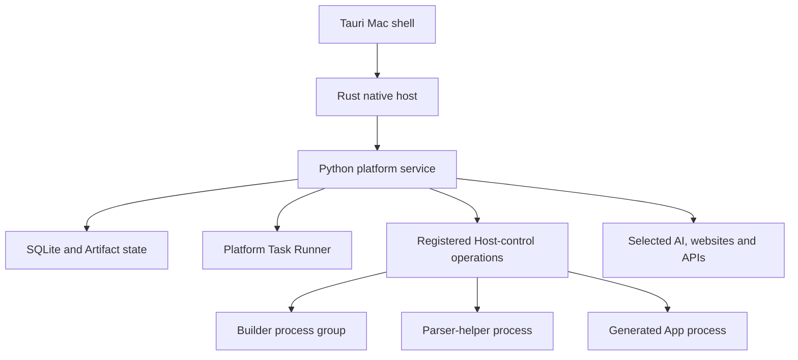

# Deployment and Execution Architecture

Status: Canonical
Last updated: 21 September 2026

## Decision

Expose two deployment choices per App:

1. `On this Mac`
2. `Always available`

Both execute real generated code and use the same portable App Version. A Release binds that Version to one deployment target and its concrete storage, runtime, schedules, secrets, and Connections.

The local target is implemented first. The cloud target follows after the local creation and operating loop is validated.

One-off Tasks do not require an App Release. v0 Task Attempts execute through a platform-owned local Task Runner and persist locally, while disclosed remote model calls remain permitted. Workspace memory has an independent placement policy; it does not inherit an App's deployment target.

## Meaning of local

For an `On this Mac` Release:

- generated App code executes on the Mac;
- App databases, files, configuration, secrets, logs, Run history, and evidence persist on the Mac or in storage explicitly selected by the user;
- the product does not silently persist operational App data in its cloud;
- remote AI models, websites, APIs, email providers, and other selected services may still receive data required for an operation;
- scheduled work depends on the local runtime being available.

Local is therefore a deployment and persistence boundary, not a promise that no network request occurs.

For a v0 Task Attempt, `On this Mac` has the same plain-language meaning for execution history, selected inputs, and output persistence, but the executable is the trusted Task Runner rather than generated App code. A named remote model may process the selected content. No platform cloud silently becomes the Task or memory store.

## Meaning of cloud

For an `Always available` Release:

- generated code executes in cloud;
- App databases, files, configuration, secrets, logs, Run history, and evidence persist in cloud;
- schedules continue when the Mac is unavailable;
- supported web or companion clients can reach the App remotely;
- cloud compute, storage, network, and model use are metered and limited.

A cloud App cannot access an offline Mac. A device-dependent step must wait for a later Device Bridge or be redesigned around a cloud-accessible Resource.

## Portable Release model

The App Version contains:

- Source and Resolved Manifests;
- generated source and compiled assets;
- dependency locks;
- Resource schemas and migration plans;
- interfaces and Entrypoints;
- tests and non-sensitive fixtures;
- requested Capabilities and service requirements;
- package index and integrity metadata.

It excludes:

- user data;
- credentials and authenticated sessions;
- absolute paths;
- local ports;
- cloud account, region, network, database, bucket, or worker identifiers;
- active schedule ownership.

The Release Resolution Record supplies those bindings and declares:

- target: `local` or `cloud`;
- persistent-state location: `device` or `cloud`;
- default execution location: `device` or `cloud`;
- schedule authority: `device` or `cloud`;
- availability: `while-device-runtime-available` or `managed-always-on`;
- concrete Resource, Connection, runtime, model, and policy providers.

## On this Mac topology

### Trusted shell

Uses Tauri 2 with React, TypeScript, and Vite. It owns the human session, navigation, isolated generated surfaces, trusted consent, file selection, App UI Bridge mediation, update, and recovery flows. Generated interfaces receive no Tauri capability.

### Trusted local core

The trusted local core has two implementation parts. A narrow Rust host owns native access, Keychain mediation, top-level service lifecycle, operating-system worker supervision, and the only browser-facing Tauri commands. A bundled Python 3.13 platform service owns Assistant request disposition, Task and App lifecycles, desired worker lifecycle, policy, Resources, Connections, execution evidence, model routing, validation, and Build coordination. The host reaches Core through one private Unix-domain surface, and Core reaches a second private Host-control surface. Core IPC, Host-control, and worker bootstrap share one atomically shipped `local-platform-protocol` bundle version in v0. Core may request only registered `builder`, `parser-helper`, `app-runtime`, or `browser-runtime` profiles with validated bounded launch data; it cannot supply an arbitrary executable path.

### Local state

Use a SQLite control ledger, separately owned per-App SQLite Resource stores, and a content-addressed platform file area for packages and Artifacts. The v0 Resource profile is limited to App-scoped table CRUD with optimistic revisions, declared filters, stable cursors, and Artifact-backed files; broader aggregation, reference-expansion, transaction-domain, migration-platform, and cloud-provider abstractions remain inactive. SQLAlchemy 2 and Alembic provide the initial repository and control-schema migration implementation. Keep durable provider credentials and encryption-wrapping keys in Keychain. SQLCipher-compatible database encryption and encrypted Artifact payloads are required before external testing; internal builds use non-sensitive fixtures until that gate passes. Task outputs use Artifact handles, and Apps use logical Resource handles rather than paths or raw database access.

### Managed toolchains

The supported profile uses Python 3.13 SDK-declared Entrypoints with `uv` and `uv.lock`, hosted by the platform App runtime (FastAPI, Pydantic 2, Uvicorn); optional generated interfaces use React, TypeScript, Vite, a qualified Node.js LTS, pnpm, and `pnpm-lock.yaml`. External test packages include or install these architecture-specific runtimes through a signed, hash-verified product flow. Users do not install developer tools.

The initial Task model loop may use Pydantic AI core behind a platform-owned provider and tool interface. The first Builder candidate is DeepSeek Harness behind `BuilderHarness`; OpenCode is the mandatory second-adapter benchmark and fallback. Neither framework owns Task, Build, Version, Release, Run, approval, or persistence truth.

### Local Task Attempt lifecycle

1. Create an immutable Task Revision from the confirmed request and deliberately selected inputs.
2. Resolve a Task execution snapshot with the local execution profile, named model route, fixed tool allowlist, classification, budgets, output policy, and authority.
3. Start one attributable Attempt and show a concise plan, location, route, and cancellation control.
4. Supply only the exact selected inputs to platform-owned tools or the disclosed model route. Non-trivial PDF, Office, archive, image, native-library, decompression, or conversion work runs in a disposable, resource-limited parser-helper process with no network, shell, Keychain, or ambient file access.
5. Record ordered state, human-input waits, protected operations, usage, outputs, evidence, errors, and terminal outcome.
6. Store outputs as Artifacts and keep Task history local.
7. Create a new Attempt for retry or a new Task Revision for changed intent or inputs.
8. If the user chooses reuse, seed a normal App Build without carrying Task authority into the Release.

The v0 Task Runner does not provide a general shell, execute arbitrary generated code, schedule work, browse or control the desktop, or write to external systems. These limits keep `Do once` materially smaller than `Make reusable`.

### Per-App workspace

Each App receives distinct source, Build, Version, Resource, runtime, temporary, and technical-log areas. The Core owns their logical lifecycle; the Rust host enforces registered launch roots and process identities so Apps do not collide accidentally.

`Implementation Blueprint.md` is the sole authority for exact v0 macOS paths. This document requires only these stable logical separations:

| Logical area | Required boundary |
|---|---|
| Control and Artifact state | Platform-owned; never an App working directory |
| App source | Editable only through the Build lifecycle |
| Per-Build home and evidence | Disposable construction authority isolated from released runtime state |
| Immutable Versions | Sealed package and compiled interface addressed by identity and digest |
| Mutable Resources | App-owned data outside immutable Versions |
| Runtime metadata and logs | Platform-owned leases, process evidence, and cleanup state |

Selected external files are copied or exposed through exact scoped handles; they are not silently absorbed into the App workspace. Builder homes and adapter credentials are separate from released-App runtime homes.

### Generated process

The first prototype permits the Builder and generated code to execute as supervised local child-process groups after approval of a visible bounded Build plan and command policy. Routine commands inside that envelope remain inspectable and cancellable; the product asks again when executable family, network destination, external file scope, credential, privilege, or material risk expands. These workers may use ordinary user-level permissions available to the signed-in user, so separate directories, Python environments, and process IDs must not be described as hostile-code containment.

Risk controls for the initial trusted-code model are:

- distinct App workspaces;
- one supported runtime and dependency toolchain;
- bounded Build-plan review, command visibility, cancellation, risk-scope re-approval, and audit;
- no automatic injection of durable secrets;
- explicit scoped file and Connection grants;
- environment allowlists;
- process ownership, health checks, timeouts, and termination;
- separate process groups, environment allowlists, runtime homes, leases, and orphan reconciliation;
- network and cost policy where technically enforceable;
- signed product updates;
- immutable Versions, backups, and rollback.

Internal synthetic experiments may use the documented same-user boundary. A qualified local generated-code and browser-session boundary is required before the first external local release. Remote microVM execution remains a possible later explicit deployment choice, not an implicit fallback. Shared Apps and future cloud routes require their own qualification.

## Local build and Run lifecycle

1. Create or resume the App workspace.
2. Materialize the selected supported runtime.
3. Give the Builder only the required intent, selected files, examples, and approved Connection metadata.
4. Show and record the bounded Build plan and material shell commands; pause only when the approved command/risk envelope expands.
5. Install dependencies into the App environment.
6. Run formatting, type, contract, unit, and smoke checks.
7. Launch the generated backend lazily on a private Unix-domain socket and surface the single v0 React/Vite interface profile through Rust's isolated loopback session; use the trusted fallback when no Surface exists.
8. Validate the generated UI through the App UI Bridge.
9. Seal a Version only after successful required checks.
10. Resolve and activate a local Release.
11. Start production App processes with narrower runtime configuration than the Builder; stop them after the bounded idle period when no Run, wait, or Surface remains active.
12. Record Runs, logs, outputs, errors, and resource usage.

## Local scheduling

Local scheduling is required for the first usable release. The internal v0.0 manual lifecycle may precede it. See `../specifications/Local_Automation_and_Platform_Extension_Profile.md`.

Schedules are durable local records. Closing the main window leaves the background runtime, active automation, and scheduler running. Reopening reconnects to that runtime without a duplicate scheduler. Explicit runtime quit stops local work. Automatic login startup is a separate preference, not implied by window-close behavior.

The device is unavailable when it is asleep, logged out, shut down, or the runtime is quit. On return, the scheduler records missed occurrences with intended time and reason and exposes a user-initiated retrigger action. It does not automatically catch up or replay missed work. Future eligible occurrences continue normally. Each retrigger is admitted through the ordinary Run path under current authority, with deduplication and a link to the missed occurrence; history preserves the missed status and the subsequent outcome.

Complete timezone/DST, overlap/offline handling, and retrigger payload/Release/input semantics before activation. Distinguish genuinely missed occurrences from interrupted Runs and uncertain external effects; do not blindly resubmit the latter. Background status and pause/stop/quit controls must remain accessible without the main window.

## Always available topology

### Shared control plane

Owns identity, Apps, Versions, Releases, schedules, Run state, policy, metering, and client APIs. Start with a modular service rather than a fleet of fine-grained microservices.

### State

Use a tenant-aware relational store for authoritative metadata and structured Resources, object storage for packages and Artifacts, and a managed secrets facility. Derived search or analytics stores remain rebuildable.

### Scheduling and queues

A managed scheduler creates durable occurrences. A queue provides retries, backoff, deduplication, retention, and dead-letter handling. Schedule acceptance is distinct from successful Run completion.

### Workers

Platform-owned bounded operations may use shared worker pools. Generated code and browser jobs use per-Run or strongly isolated workers with finite CPU, memory, time, temporary storage, network, and cost.

Do not assign one always-running VM to every App unless a measured interactive or stateful requirement justifies it.

## Native platform extension

macOS is the first implementation of native services; Windows follows through the same logical host interfaces. Core scheduling semantics, App lifecycle, browser-provider requests, and logical data/secret references must not depend on UDS, POSIX process groups, shell syntax, Mac paths, or Keychain. Runtime and browser artifacts are qualified per OS/architecture. Windows shared-code tests begin early; native IPC, supervision, isolation, credentials, sleep/wake, installer, and updates require separate later qualification.

## First-release browser profile

Use a registered local Playwright/Chromium BrowserProvider with general navigation, extraction, selectors, forms, clicks, selected uploads, downloads, and approved effects. Dedicated profiles support user sign-in and takeover. Session state remains protected local Connection state and is unavailable to generated code. Prefer suitable APIs without requiring a connector for every website. Exact payloads, profile sharing/locking, runtime versions, recovery, and isolation are gates in the Local Automation and Platform Extension Profile. Harness-native browser plugins remain separately disabled unless explicitly qualified.

## Browser execution

Integration and computer-use capability has six levels:

1. API or feed;
2. direct HTTP fetch and parse;
3. supported service connector;
4. deterministic browser automation;
5. scoped operating-system accessibility or application automation;
6. visual agentic computer use.

Each browser profile is a protected Resource. Authentication state is encrypted and never bundled into an App Version. A local browser profile remains on the device. A cloud browser profile requires explicit cloud persistence of session material and stronger account-recovery controls.

Browser executions record destination, read/write classification, downloads, uploads, external effects, policy outcome, and evidence. Captchas, MFA, site changes, access limits, and prohibited automation produce understandable blocked or failed states rather than covert bypasses.

General browser automation is required for the first usable App release; the internal manual milestone may precede it. Desktop automation remains a later action provider. Screen or accessibility observation and Computer Action authority remain separate.

## Secrets and Connections

Local secrets use Keychain or an equivalent trusted local adapter. Cloud secrets use a managed cloud secret store. A Connection record contains identity, scopes, health, ownership, and a reference to secret material; it does not contain the secret in ordinary control data.

Generated UI never receives durable credentials. Generated code uses brokered operations where practical and otherwise receives the narrowest feasible short-lived material for the specific provider and Run.

## AI routes

Assistant Task, Builder, and published App runtime routes are separately configured. The product may initially use remote models for local Tasks and both local and cloud Apps. The user sees provider, purpose, credential/billing owner, and relevant data category at the point a materially new route is introduced.

No provider switch, billing-owner change, or materially broader data transfer occurs silently. Local models can be added behind the same interface when their quality and hardware requirements are practical.

## Migration and remote access

The first product does not provide active-active local/cloud synchronization.

### Local to cloud

1. Check Version and capability compatibility.
2. Identify local-only Resources or device dependencies.
3. Explain code, data, secret, and schedule transfer.
4. Upload the Version and selected state.
5. Rebind cloud Resources and Connections.
6. Validate a preview cloud Release.
7. Transfer schedule authority deliberately.
8. Activate cloud and optionally retain a stopped local copy.

### Cloud to local

Export the portable Version and selected data, bind local providers, validate compatibility, and explicitly deactivate or retain the cloud Release. Cloud deletion is a separate confirmed operation.

Phone or browser access initially applies to cloud Apps. Remote access to local Apps may later use a secure relay while the Mac is online, but it does not create always-on behavior.

## Economics

The local profile has negligible platform compute cost apart from optional model credits or relay services. The cloud profile should minimize fixed cost through shared control services and usage-driven workers.

Track cost by Workspace, Task, Task Attempt, App, Release, Run, provider, and capability. Enforce hard limits for model tokens, runtime duration, browser duration, storage, network, retries, and schedule frequency before offering general cloud deployment.

## Implementation sequence

1. Local shell, Assistant request disposition, and trusted core.
2. Bounded local Task Runner, Task execution snapshot, Attempt evidence, retry, and promotion lineage.
3. Managed App workspaces and one supported generated stack.
4. Local Build, preview, Release, process supervision, Activity, correction, and rollback.
5. Encryption, backup, updates, and external-test hardening.
6. Progress independently according to evidence: local automation adapters, local Context and memory, and cloud availability.
7. Within automation, add scheduling, expand beyond the narrow v0 HTTP fixture, add Connections, deterministic browser automation, then scoped Computer Action.
8. Within cloud, add control plane, state, scheduler, queue, workers, explicit migration, and remote clients.
9. Add a Device Bridge only when proven cloud work needs scoped local capabilities.
