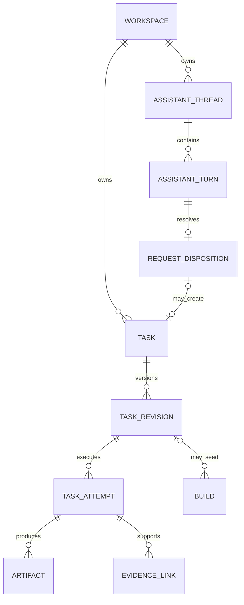
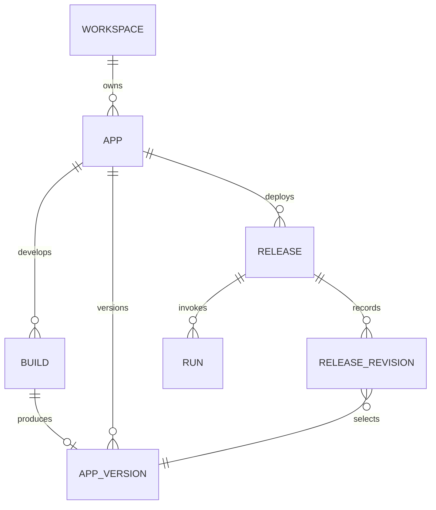
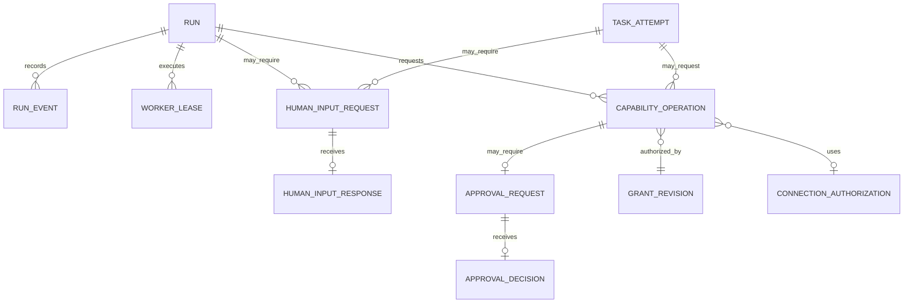
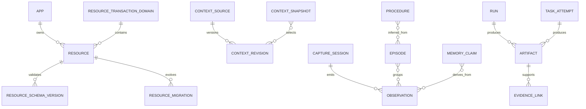

# Canonical Domain and Persistence Model

Status: Canonical logical catalogue; physical v0 is the explicit subset in the Implementation Blueprint
Last updated: 21 September 2026
Governing decisions: `Current Architecture Decisions.md`

## Purpose

This document defines the canonical domain entities and persistence semantics of the platform. It specifies what is authoritative, which logical owner may write it, how identity and tenancy work, which records are immutable or mutable, how revisions and ledgers relate, and how Task and App data, observations, memory, evidence, and execution history are retained, migrated, exported, deleted, backed up, and rebuilt.

It refines the accepted `System Architecture.md`. It does not choose a cloud vendor, event broker, search engine, cloud object store, vault vendor, or isolation technology. `Implementation Blueprint.md` selects the v0 physical projection: one local SQLite control ledger, separately owned per-App SQLite Resource stores, content-addressed local packages and Artifacts, and Keychain-held credentials. An `Always available` Release later uses tenant-aware cloud adapters without changing App Version identity or logical ownership.

The central persistence rule is:

> Mutable control state, immutable history, Task inputs and outputs, user-created App data, secret material, and derived projections are different persistence classes. They may share physical infrastructure initially, but they never share authority or lifecycle semantics.

## Scope and non-goals

This baseline covers:

- canonical identifiers and references;
- Workspace tenancy and per-Release deployment-placement metadata;
- every core control-plane entity and its logical owner;
- Assistant-created Task, Task Revision, and Task Attempt identity and lineage;
- immutable revisions, mutable pointers, lifecycle dispositions, and ledgers;
- Resource tables and file stores used by the three reference Apps;
- Context sources, revisions, provenance, selection, and revocation;
- phase-gated Observation, Episode, Memory Claim, and Procedure identities needed by later input and second-brain capabilities;
- Build workspaces, checkpoints, packages, Artifacts, and evidence;
- transaction, concurrency, idempotency, and indexing rules;
- retention, export, deletion, legal hold, backup, restore, and projection rebuild;
- evolution rules for control-plane schemas and App-managed Resource schemas.

This baseline does not yet define:

- exact SQL DDL or database engine;
- the Task Attempt wire format and ledger schema, which must be defined before v0 one-off execution is implementation-ready;
- the Resource SDK or migration wire contract;
- the Context retrieval wire contract;
- cross-App dataset and action contracts;
- encryption key topology or vault implementation;
- exact RPO, RTO, geographic replication, or storage-class values;
- analytics warehouse schemas;
- public multi-tenant Apps or cross-Workspace sharing;
- an exact screen, audio, accessibility, or connected-source payload schema;
- a production memory graph, procedure-mining algorithm, or ambient capture store.

### Implementation projection

This catalogue is a logical correctness model, not a requirement to implement every entity, table, registry, ledger, retention workflow, or migration mechanism before the first walking slice.

The prototype implementation projects only the records required for Assistant Thread/Turn and request disposition; Task, Task Revision, Task Attempt and events; Artifact; App, Build, immutable Version, Release, Run and events; approval and structured human input; local Schedule, Schedule Revision and Trigger Occurrence; browser Connection/session metadata and exact access decisions; the minimal table/file Resource profile; model calls; durable operations; evidence; rollback; backup; restore; and deletion. It implements no shared Context read path, Resource Transaction Domain, aggregation/search service, webhook store, Observation table, memory graph, Procedure store, general migration platform, legal-hold administration, inter-App sharing, or regional movement. Typed intent and deliberately attached files remain represented by Task or Build, Artifact, and provenance records. Several required roots and revisions may share one encrypted SQLite table or versioned JSON record when ownership, integrity, history, and indexing remain clear. `Implementation Blueprint.md` is authoritative if this long-horizon catalogue contains a future entity not named in that physical projection.

## Design principles

1. Every authoritative entity has one logical writer.
2. Every tenant-owned authoritative row carries a non-null `workspace_id`.
3. Cross-Workspace references are rejected in v0.
4. Immutable records are never updated in place; correction creates a new record or revision.
5. Mutable roots and pointers use optimistic concurrency.
6. Authority-bearing configuration is versioned and referenced by exact revision or digest.
7. Large or sensitive payloads are stored as immutable content and referenced by digest.
8. App Version rollback changes executable selection; it does not reverse mutable Resource data.
9. Search indexes, caches, summaries, and UI projections never authorize an action.
10. Raw credentials, tokens, cookies, and private keys are not stored in the ordinary control-plane database, package, Artifact metadata, Event ledger, or model context.
11. Deletion removes content according to policy without rewriting historical facts that must remain attributable.
12. Storage choices remain replaceable behind the owning service interface.
13. Raw observation, derived interpretation, user-confirmed Context, and authoritative Resource state are separate persistence classes even when one physical store hosts them.
14. Capture permission never grants memory-write, Task Attempt, Build, Release, Run, or Capability authority.
15. A Task Attempt and an App Run have exact but different authority roots; common execution mechanics do not erase that distinction.
16. Workspace-memory placement is explicit and does not inherit the deployment target of an unrelated App.

## Persistence classes

| Class | Examples | Authority and mutation model | Expected physical character |
|---|---|---|---|
| Transactional control state | Workspace, Task, Task Attempt state, App, Build, Release pointer, Run state, approval request | Authoritative mutable rows, owner-only writes, optimistic concurrency | Relational transactional store |
| Immutable revisions | Task Revision, App Version, Release revision, policy revision, Grant revision, configuration revision | Append-only; selected by mutable pointers or exact references | Relational metadata plus canonical record bytes |
| Product ledgers | Task Attempt events, Run Events, audit records, usage entries, immutable decisions | Append-only, idempotent ingestion, ordered where required | Partitionable append store |
| Immutable content | Packages, reports, screenshots, snapshots, evidence, large inputs and outputs | Content-addressed bytes; mutable retention metadata kept separately | Object or blob store behind Artifact service |
| Managed App state | Table records, file namespaces, future queues and indexes | Mutable through Resource service; schema-versioned | Resource-specific stores |
| Secret material | OAuth refresh tokens, API keys, cookies, private keys | Vault-owned, versioned generations, never returned to App code | Dedicated secret store |
| Derived projections | Home, search, Run summary, cost views | Disposable and rebuildable; never used as authority | Search, cache, or read-optimized store |
| Ephemeral coordination | Worker leases, locks, queue visibility, transient tokens | Time-bounded; loss triggers recovery from authoritative state | Cache, queue, or lease store |
| Operational telemetry | Logs, metrics, traces | Non-authoritative operational evidence | Telemetry backend |
| Phase-gated observations | Capture sessions, Observation envelopes, selected evidence frames, transcripts | Immutable or append-only evidence with source-specific retention, correction, revocation, and deletion linkage | Encrypted local content plus relational metadata when the phase is implemented |
| Derived knowledge and procedure | Episodes, Memory Claims, Procedures, embeddings, summaries | Versioned derivations with provenance; claims remain distinguishable from user assertions and executable artifacts | Relational metadata plus immutable content; projections remain rebuildable |

The logical model requires relational transaction semantics for control-plane state, but does not require one database cluster or one schema per deployable. Managed App state may use different physical engines while preserving the Resource contract.

## Canonical identity and reference rules

### Entity identifiers

- API-visible entity identifiers are opaque, globally unique, non-reusable, and stable for the entity lifetime.
- The recommended representation is a time-sortable 128-bit identifier such as UUIDv7. The exact encoding is a physical implementation choice.
- An identifier never grants access and must not contain Workspace, user, provider, region, or business meaning.
- Human names and slugs are mutable display or lookup attributes, never foreign keys.
- Every tenant-owned foreign key is validated together with `workspace_id`. A child cannot reference a parent in another Workspace even when an identifier is known.
- Platform-global registry identities live in platform-scoped tables rather than tenant tables with a nullable `workspace_id`.

### Revisions and digests

- Mutable roots use a monotonically increasing `row_revision` for compare-and-swap updates.
- Authority-bearing changes create immutable revision identities such as `release_revision_id`, `grant_revision_id`, or `authorization_revision_id`.
- Canonical documents use Unicode NFC and RFC 8785 canonical JSON before digest calculation.
- Content and canonical record digests use lowercase SHA-256 with the `sha256:` prefix.
- A digest proves byte identity; it is not an access-control decision or a substitute for entity identity.
- Logical references inside App packages, such as `resourceRef`, remain portable names scoped to the App Version. Release resolution maps them to platform identities.

### Time, amounts, and ordering

- Stored timestamps are UTC instants generated or validated by the authoritative owner.
- A ledger sequence or owner revision, not timestamp, determines ordering when concurrency matters.
- Money uses integer `cost_microusd`; sizes use integer bytes; duration uses integer milliseconds or seconds as specified by the contract.
- `created_at` is immutable. Mutable roots use `updated_at` only as display metadata, never for conflict detection.

### Common provenance envelope

Every authoritative mutation records or can resolve:

- `workspace_id` when tenant-owned;
- initiating and effective Principal identities;
- request and correlation identities;
- owning service identity;
- creation or decision timestamp;
- source Task Revision, Task Attempt, Run, Build, Release, operation, or Event reference where applicable;
- classification and retention class where content is involved.

## Tenancy, placement, and classification

### Workspace boundary

The Workspace is the v0 tenant boundary. In the current physical projection it owns or scopes Assistant Turns, Tasks and Attempts, Apps, Builds, Versions, Releases, Runs, minimal Resources, Connections, local schedules/occurrences, browser-session metadata, Grants/approvals, budgets, Artifacts, durable operations, audit, and user-facing projections. Logical future Context Sources, Capture Sessions, Observations, Episodes, Memory Claims, and Procedures inherit the same non-null Workspace boundary only when their tracks create them.

Rules:

- Tenant-owned authoritative tables require `workspace_id NOT NULL` in the logical model.
- Primary or unique access paths include `workspace_id` unless the identifier is globally enforced by the owner.
- Composite referential checks include `workspace_id` for every tenant relationship.
- Service-to-service requests carry authenticated Workspace context; callers cannot select a different tenant through payload fields.
- App-generated SQL or code never receives control-plane database access.
- Cross-Workspace Tasks, Task Attempts, Runs, Resource bindings, Context selections, approval bindings, and execution relationships are invalid in v0.

### Deployment placement

Deployment is selected per Release, not once for the entire user or Workspace. A deployment binding records `local` or `cloud`, its placement identity, persistent-state location, default execution location, schedule authority, availability class, provider bindings, and residency metadata where applicable.

An `On this Mac` Release identifies the owning installation and has no cloud home region. An `Always available` Release identifies the cloud placement and may later include one authoritative home region and a residency-policy revision. The same Workspace may contain both kinds of Release, but one Resource has one authoritative placement at a time.

Changing authoritative placement is an explicit migration with write fencing, copy verification, compatibility checks, schedule-authority transfer, pointer switch, and reconciliation. It is never a normal metadata edit. Live active-active local/cloud writes and transparent cross-placement transactions remain deferred.

### Classification

Content-bearing entities carry one of four platform enforcement classifications: `public`, `internal`, `confidential`, or `restricted`. A Workspace may define display aliases or additional labels only when each maps to one of those enforcement levels. Classification propagates restrictively: derived content cannot be less restrictive than its sources without an explicit declassification decision. Classification affects access, model/provider eligibility, region, retention, export, and evidence visibility.

## High-level entity relationships

### Assistant and Task lifecycle

### App lifecycle graph

### Governed execution

### Data and knowledge

These diagrams show ownership and durable relationships, not database joins available to generated Apps.

## Canonical owner namespaces

The namespace is a logical persistence boundary. Several namespaces may initially share a database cluster, but only the owning module can write its tables.

| Logical owner | Namespace | Authoritative entities |
|---|---|---|
| Experience Gateway | none | No authoritative product data; sessions and response caches are ephemeral |
| Identity and Workspace | `identity` | Workspace, Principal registration, Agent profile, Membership, service identity, residency selection |
| Assistant Interaction | `assistant` | Assistant Thread, immutable Turn, Request Disposition, clarification and handoff references |
| App Registry | `apps` | App, App Version envelope, Version lineage, Version disposition |
| Package and Validation | `packages` | compilation record, resolved manifest, package index, validation set |
| Release | `releases` | Release, immutable Release revisions, configuration revisions, active pointer |
| Build Orchestrator | `builds` | Build, Build Brief revision, workspace reference, checkpoint, Builder session reference, Build history |
| Trigger and Scheduler | `triggers` | schedule, schedule revision, webhook binding, verification-profile reference, occurrence, delivery attempt |
| Run Control | `runs` | Run immutable inputs, current execution state, relationships, cancellation and resume intent |
| Runner Manager | `runner` | worker lease, fencing token, execution assignment |
| Model Gateway | `models` | model call, route decision, usage and provider receipt references |
| Outcome Evaluation | `outcomes` | evaluation, evaluator attempt, outcome decision |
| Policy and Authorization | `policy` | policy, policy revision, Grant, Grant revision, revocation, policy decision |
| Capability Broker | `capabilities` | Capability operation, effect identity, idempotency record, immutable receipt |
| Work and Approval | `work` | Task, Task revision, Task Attempt, attempt history, approval request, approval decision, human-input request, human-input response, and promotion lineage |
| Connection | `connections` | Connection, authorization revision, scope set, credential-generation audit reference |
| Budget and Usage | `usage` | budget account, limit revision, reservation, charge, settlement, usage entry |
| Control-Plane Audit | `audit` | append-only audit record and authenticated ingestion metadata |
| Resource | `resources` | Resource and binding/schema revisions, record metadata, and file namespace; transaction domains, general migrations, snapshots, aggregation and search are later-profile catalogue entries |
| Input and Context | `context` | Future Adapter definition, capture session, Observation, Episode, Memory Claim, Procedure, Context Source, item/reference, immutable revision, provenance edge, revocation, and snapshot; v0 creates none of these physical entities and uses existing Turn/Task/Build/Artifact provenance for text and files |
| Artifact and Evidence | `artifacts` | Artifact metadata, content identity, retention state, legal hold, Evidence Link |
| Search and Projection | `projection` | disposable projection, index checkpoint, freshness watermark |
| Definition and Provider Registry | `registry` | definition, definition version, HTTP Action Profile, provider, support envelope, compatibility record |
| Run Ledger and Projection | `run_ledger` | Run Event and authoritative ledger sequence; derived Run views remain projections |
| Platform Operations | `operations` | health observation, incident, maintenance state, kill switch, SLO and telemetry configuration metadata |

## Canonical entity catalogue

### Identity and Workspace

#### Workspace

Stable tenant root.

Key fields:

- `workspace_id`, display name, stable slug;
- lifecycle state: `active | suspended | deletion-pending | deleted`;
- deployment-profile and placement identity, optional future `home_region`, residency-policy revision, and default classification-policy revision;
- current billing and budget-account references;
- `row_revision`, created and updated provenance.

Deletion state is mutable, but historical identity is represented by a minimal tombstone after content erasure.

#### Principal

Stable platform identity used in authorization and attribution. Principal kinds are `user | app | agent | service`. Authentication-provider identities are linked records and may change without changing the Principal.

An App or Agent Principal is Workspace-scoped. Platform service Principals are platform-scoped and cannot be impersonated by tenant input.

#### Agent Profile

Optional persistent actor profile bound one-to-one to an Agent Principal. Identity and Workspace owns its name, role description, lifecycle state, and allowed App assignments. Work service owns Task assignment projections, Context service owns scoped memory, and Policy service owns its authority. An App Version `agent` Component is executable package content and does not automatically create a persistent Agent Principal.

#### Membership and Membership Revision

Membership is the stable relation between a user Principal and Workspace. Each authority-changing edit creates an immutable revision containing role or group assignments, status, validity window, and provenance. A mutable pointer selects the current revision. Historical Runs refer to the policy snapshot and effective Principal rather than querying current membership.

### Assistant interaction

#### Assistant Thread

Stable local container for an Assistant conversation. It records Workspace, initiating Principal, display title, lifecycle state, created and last-activity times, and retention-policy class. It grants no execution or Resource authority. Archiving or deleting a Thread does not delete a referenced Task, App, Build, Version, Release, Run, Artifact, or audit fact owned elsewhere.

#### Assistant Turn

Immutable user, Assistant, or trusted-system contribution inside one Thread. It records actor, role, content or protected Artifact reference, classification, model-route disclosure where applicable, creation time, and correlation identity. Correction creates a new Turn and relationship rather than overwriting prior content. Large or sensitive bodies may be stored as Artifacts while the Turn retains only safe display metadata and the exact content digest.

#### Request Disposition

Immutable resolution of one user request to `answer | task | app`, including the material rationale shown to the user, clarification references, accepted user choice, and the exact resulting saved Artifact, Task, or App/Build handoff when one is created. A disposition is routing evidence, not execution authority. Task Attempt and App Release authority are created only by their normal owners and contracts.

Assistant history is not Workspace memory. v0 does not automatically promote a Turn, answer, selected file, Task output, or App result into durable Context or a Memory Claim.

### App lifecycle

#### App

Stable user-facing capability identity. Mutable fields are name, description, icon, archive state, ownership metadata, and current support summary. The App never contains code, credentials, mutable user data, or an active-version field.

Logical uniqueness:

- `(workspace_id, app_slug)` among non-deleted Apps;
- App identity remains stable across rename, modification, repair, and rollback.

#### Build

Mutable, resumable construction root owned by the Build Orchestrator.

Immutable inputs include:

- App and optional parent App Version;
- initiating Principal and initial intent identity;
- optional Task-promotion lineage identity and selected source evidence;
- selected Builder Harness implementation and compatibility version;
- Build authority profile and initial budget ceiling.

Mutable state includes:

- lifecycle state and current phase;
- latest Build Brief revision;
- current workspace and checkpoint references;
- accumulated usage, cancellation request, failure summary, and candidate output reference;
- `row_revision` for command gating.

The accepted lifecycle states are:

`queued | running | awaiting-input | validating | succeeded | failed | cancelled`

The current Build phase is stored separately as `understand | design | implement | test | package`.

The exact Build event schema remains deferred. State changes append owner history in the same transaction; an outbox fact is added only when a real asynchronous consumer must react after commit.

#### Build Brief Revision

Immutable, user-readable statement of intended outcome, interface, data, automations, connections, access, acceptance criteria, and known limitations. User corrections create another revision; they do not overwrite the prior brief.

#### Build Workspace

Metadata for one isolated development filesystem. It records sandbox identity, current generation, region, creation and expiry, state, and latest checkpoint. Filesystem bytes do not live in the control database.

Workspace states are `provisioning | ready | suspended | disposing | disposed | failed`. Production Resources and credentials cannot be mounted into a Build workspace.

#### Build Checkpoint

Immutable checkpoint manifest containing:

- parent checkpoint and Build references;
- filesystem snapshot Artifact;
- normalized Builder adapter checkpoint or session reference;
- source-tree digest, dependency-lock digests, and relevant tool configuration digests;
- creation reason and compatibility version.

Checkpoints are resumable evidence, not App Versions. Expiry follows Build retention policy unless a checkpoint is referenced by a published Version or protected diagnostic record.

#### App Version

Immutable envelope registered only after package validation. It contains the accepted App Contract fields, exact content digests, parent lineage, compiler and registry identities, validation set, creator Build and Principal, and creation time.

App Version bytes and declarations never change. Operational disposition is a separate mutable record:

`candidate | available | quarantined | deprecated | withdrawn`

Quarantine affects new Releases and Runs without rewriting the Version.

#### Version-scoped declarations

Components, Surfaces, Entrypoints, logical Triggers, Resource requirements, Connection requirements, Capability requirements, Context requests, tests, and execution closures are immutable declarations inside one App Version's resolved manifest. Their logical identifiers are unique within that Version and are addressed together with `app_version_id`; they are not mutable Workspace roots.

A Release Revision binds these declarations to Workspace authority and providers. A Run records the exact Version-scoped Entrypoint and execution closure it invoked. Changing an Entrypoint signature, Component, Surface, or declaration requires a new App Version.

#### Compilation and Validation Set

Compilation records exact source package, compiler, registry snapshot, output manifest, package index, and result digests. A Validation Set is immutable and contains named validator/test results, status, evidence, and tool versions. Revalidation creates a new set rather than changing the historical set attached to a Version.

#### Release

Stable identity for one App and environment, unique by `(workspace_id, app_id, environment)`.

It owns:

- mutable lifecycle state: `draft | ready | active | paused | blocked | retired`;
- compare-and-swap pointer to the selected immutable Release revision;
- pointer history and activation provenance;
- `row_revision`.

The Release root does not embed mutable binding details.

#### Release Revision

Immutable canonical Release Resolution Record. It selects one App Version and exact configuration, policy, provider, Resource, Connection authorization, Context, Capability, schedule, budget, and execution bindings.

The complete canonical record is the authority and is stored as immutable content. Relational binding rows are an owner-managed immutable projection used for integrity, activation checks, health, revocation, and impact analysis. Canonical bytes and projected rows share one digest and are created as one owner operation; any mismatch quarantines the revision rather than choosing one representation silently.

Activation atomically changes the Release pointer only after all checks pass. Rollback selects an earlier compatible Release revision and does not mutate App Version or Resource data.

#### Configuration Revision

Immutable values document validated against the App Version configuration schema. Secret-shaped values are rejected. A configuration change creates a new configuration revision and therefore a new Release revision before production use.

### Triggers, Runs, and execution

#### Schedule and Schedule Revision

Schedule is a stable mutable root tied to one Release and logical Trigger. Cron or interval settings, timezone, enabled state, and policy are immutable revision fields. The root selects the current revision.

#### Webhook Binding

Stable mutable root tied to one Release and logical webhook Trigger. Its immutable revision records the verification-profile digest, Connection authorization revision, accepted method, media type, external payload schema, Entrypoint input schema, normalization mode and mapping digest, at-least-once delivery semantics, source, payload-size, timestamp, replay, rate, quarantine, and Entrypoint constraints. The root selects the current revision. The opaque endpoint handle may rotate without changing the App Version; changing authority, normalization, or verification semantics creates a new Release revision.

#### Trigger Occurrence

Durable identity for one accepted Trigger event. A schedule occurrence is unique by schedule revision and intended occurrence time. A webhook occurrence is unique by webhook-binding revision plus the verified provider delivery identity, nonce, or bounded payload digest. It records authenticated sender metadata, received time, payload and normalized-input digests or Artifacts, verification result, and quarantine state. Delivery is at least once; retries reuse the occurrence identity when deduplication succeeds, but exactly-once execution is not promised. Skipped, coalesced, delayed, replayed, quarantined, or failed occurrences remain visible.

#### Run

One execution of one Entrypoint. Immutable creation fields include:

- Workspace, App, App Version, Release, Release revision and resolution digest;
- Entrypoint, execution-closure digest and Run projection digest;
- initiating and effective Principals;
- trigger identity and invocation idempotency identity;
- input digest and input Artifact references;
- initial Context and policy selection references when resolved at creation.

Mutable Run Control fields include:

- current execution state;
- current attempt and active worker-lease reference;
- cancellation request and terminal reason;
- next-action or resume eligibility;
- outcome-evaluation status pointer;
- active human-input request reference when awaiting a response;
- `row_revision`.

Accepted execution states remain:

`queued | running | awaiting-approval | awaiting-input | succeeded | failed | cancelled | timed-out`

Run Control commits a state transition and outbox fact atomically. The Run Ledger owns immutable event history. A terminal Run is fully finalized only after the terminal fact is durably accepted by the ledger.

#### Run Relationship

Immutable edge with relation `child-of | retry-of | replay-of | repair-of`. Both Runs must be in the same Workspace. Retry, replay, and repair always create new Runs.

#### Worker Lease

Mutable, time-bounded execution authority with fencing token, worker identity, substrate, acquisition and expiry, heartbeat, release reason, and Run attempt. A stale worker cannot commit authority-bearing results after a newer fencing token exists.

#### Run Event

Canonical append-only bytes defined by `../specifications/contracts/Run Event Kernel.md`. Unique constraints are:

- `(run_id, sequence)`;
- `(workspace_id, source_service, source_event_id)`.

The Run Ledger assigns `event_id`, sequence, and recorded time. Event payloads contain safe typed facts and references, not secrets or unrestricted content.

#### Outcome Evaluation

Mutable evaluation root tied to a Run and evaluator definition. Each attempt is immutable. Outcome state is `not-evaluated | passed | failed | needs-review`. A decision fact selects a terminal or review state, references evidence, and may be appended after technical Run termination. Execution success never implies outcome success.

### Governance and protected operations

#### Policy and Policy Revision

Policy is a stable scope-bound root. Revisions are immutable canonical rules with effective window, author, reason, compatibility version, and digest. A pointer selects the current revision. Historical decisions reference exact policy revisions or a policy snapshot digest.

#### Grant and Grant Revision

Grant is stable authority intent connecting a subject and exact execution scope—Task Attempt snapshot or App, Version, and Release—to a Capability, Resource or Connection target, environment, and conditions. Each change creates an immutable Grant revision. Revocation is an immediate owner fact that runtime checks at the point of effect; it does not rewrite prior revisions.

#### Policy Decision

Immutable receipt containing request digest, subject and target references, exact policy and Grant revisions, result, reduced constraints, reasons, decision engine identity, and time. Decisions are evidence of an evaluation, not reusable bearer tokens.

#### Capability Operation

Durable operation root for one brokered request. It stores request identity, exact execution-authority references, current lifecycle state, authorization and effect digests, idempotency identity, approval and Connection references, budget reservation, provider attempt, result digest, and immutable terminal receipt. App operations reference the exact Release authority. Task operations reference the exact Task Attempt execution snapshot and are valid only for operation families allowed by the Task execution profile.

Authoritative durable operation states are:

`validating | waiting-approval | authorized | executing | completed | denied | failed | cancelled`

`completed`, `denied`, `failed`, and `cancelled` are terminal. A replayed request returns the existing operation and receipt; `replayed` is evidence about idempotency, not a new authoritative operation state.

Effect deduplication is enforced by the Capability Broker within the registry-defined scope and window. Replayed calls return the original terminal result or pending operation identity.

#### Approval Request and Decision

Approval Request is a durable mutable root bound to exact operation, authorization digest, effect digest, material facts, requested scope, expiry, and current status.

Statuses are `pending | approved | denied | expired | cancelled`.

Approval Decision is immutable, created once for the request's valid decision identity, and records approver, decision, exact digests, scope, reason, and time. An approval cannot execute an effect or widen the Task Attempt or Release authority baseline.

#### Human Input Request and Response

Human Input Request is a durable mutable root owned by Work and Approval and bound to one execution subject: an App Run or a Task Attempt. It records the requesting Component or Task step, safe explanation, pinned response-schema digest, expiry, current status, and authorized responder scope. v0 permits one active request per execution subject. Status is `pending | answered | expired | cancelled`.

Human Input Response is immutable and records the responding Principal, validated response digest, authorized Artifact references, and receipt time. It cannot grant authority, approve a Capability, widen a budget, change a Task Revision or Release, or bypass policy. The owning App Run or Task Attempt coordinator alone resumes execution after receiving the accepted response fact.

#### Task

Stable durable identity for one bounded requested outcome. A Task belongs to one Workspace and records its initiating Principal, user-facing purpose, current-revision pointer, lifecycle disposition, optional assignee and due time for later coordination use, latest-attempt projection, promotion lineage, and `row_revision`.

A Task is not an App, and it does not own an App Version, Release, Entrypoint, generated interface, schedule, or mutable App Resource. Its latest visible execution state is a projection of the latest Attempt rather than an independent source of execution truth.

Task lifecycle dispositions are `draft | active | completed | cancelled | archived`. Changed intent or inputs create a new Task Revision; retrying the same revision creates a new Task Attempt.

#### Task Revision

Immutable user-readable and machine-resolvable statement of one Task request. It records:

- Task, author, parent revision, and creation provenance;
- normalized instructions, constraints, expected output, and acceptance notes;
- deliberately selected input Artifact or Context references and their digests;
- input classification, output policy, and retention class;
- requested operation families, if any, without granting them;
- disclosed processing requirements and known limits.

A revision contains no credential, ambient path, reusable permission, or mutable execution state.

#### Task Attempt

One attributable execution of one exact Task Revision. Immutable creation fields include:

- Workspace, Task, Task Revision, initiating and effective Principals;
- input digest and exact input Artifact or Context references;
- Task execution-profile identity and version;
- execution and persistence placement;
- model and provider route selection;
- platform tool allowlist, policy snapshot, authority snapshot, budgets, and retention policy;
- correlation and retry or replay lineage.

Mutable coordination fields include current state, cancellation request, active worker lease where used, active human-input or approval reference, accumulated usage, and terminal outcome reference. Accepted states align with the execution kernel:

`queued | running | awaiting-approval | awaiting-input | succeeded | failed | cancelled | timed-out`

Ordered Attempt events, outputs, protected-operation receipts, cost, and errors are append-only evidence. Retry creates a new Attempt; changed instructions or inputs require a new Task Revision. v0 uses a platform-owned local Task Runner and does not run arbitrary generated code, schedule future work, browse or control the desktop, or perform consequential external writes.

Promotion creates an immutable lineage edge from the Task Revision and selected Attempt evidence to a new Build, Procedure, Workflow, App, or Agent candidate. It never transfers a file grant, model disclosure, approval, Connection, or execution authority into the promoted object.

#### Promotion Lineage

Immutable cross-owner provenance record linking one Task Revision and optional selected Task Attempt, Artifact, or Evidence references to one newly created target root or candidate. It records target kind and identity, initiating Principal, creation time, transformation summary, and source and target digests where available. The target owner validates and records the lineage identity during creation; the lineage record carries no permission, approval, secret, budget, or activation state.

#### Connection and Authorization Revision

Connection is a stable reference to an external account or authenticated browser identity. It contains connector identity, owner scope, display metadata, lifecycle, health summary, and current authorization-revision pointer.

Authorization Revision is immutable and records external account identity, granted scopes, consent provenance, validity bounds, policy, and connector version. It references but never contains a secret generation.

Credential generations live in the secret store. The control plane stores only opaque audit references, generation state, rotation time, and revocation facts. Rotation within the same authorization does not require a Release revision; account identity, connector, scope, or authorization-policy changes do.

#### Budget and Usage

Budget Account is the stable scope for limits. Limit changes create immutable revisions. Reservation is mutable until settled or released and uses an idempotency identity. Usage entries and charges are immutable and reference the authoritative Capability, model, browser, or runtime receipt.

Counters may be cached, but admission uses authoritative reservation and settled-usage state. Amounts cannot become negative and settlement cannot exceed the permitted reservation plus declared adjustment policy.

#### Control-plane Audit Record

Append-only authenticated fact for human or service control-plane actions. It records actor, effective actor, action, subject, before and after digests where safe, request and correlation identities, policy decision, outcome, visibility, and time. User-controlled App output cannot become trusted audit prose.

### Resource model

#### Resource

Stable managed state identity owned by the Resource service. It records Workspace, App scope, kind, classification, lifecycle, region, an optional future transaction-domain reference, current schema version, current binding revision, retention policy, and `row_revision`.

v0 Resource kinds are:

- `table` — schema-validated records;
- `file-store` — mutable logical namespace pointing to immutable blobs.

Future kinds such as queue, index, key-value, stream, or browser profile require an explicit contract revision but reuse the Resource root.

Lifecycle states are:

`provisioning | active | migrating | degraded | read-only | retiring | deleted`

#### Future Resource Transaction Domain — inactive in v0

Stable Resource Service identity defining one atomic commit boundary across compatible table Resources. It records Workspace, App and environment scope, authoritative placement, optional hosted-region metadata, classification envelope, provider binding, lifecycle, membership revision, and transaction policy.

This is reserved internal Resource Service placement metadata. v0 creates no such object and exposes no transaction handle. Ordinary users and Builders work with the minimal record/file operations and never select or administer transaction domains.

When a later profile activates this seam:

- only managed table Resources may join a transaction domain;
- every table Resource belongs to exactly one domain;
- the platform may create one default domain per App and environment unless an administrative or placement constraint requires separation;
- all members use the same transactional provider instance, region, isolation policy, and compatible classification envelope;
- Release resolution records the exact domain and membership revision for every bound table Resource;
- generated code sees a Resource SDK transaction handle, not database credentials or unrestricted SQL.

Moving a Resource between domains would be a durable migration with write fencing and validation. A domain is not an authorization boundary: Grants and Resource access modes are still checked for every member operation.

#### Resource Binding Revision

Immutable record mapping the Resource interface to an approved storage provider and placement profile. A later transaction profile may also identify the exact transaction domain and membership revision. It contains no mutable endpoint, credential, or lease. A Release refers to an exact binding revision.

#### Resource Schema Version

Immutable schema identity containing logical kind, JSON Schema or equivalent canonical schema, digest, compatibility classification, declared indexes, classification rules, and creator App Version or migration.

Schema versions are monotonically ordered within a Resource. App packages may declare a logical schema version; the Resource service maps that requirement to the managed Resource's exact schema identity during Release resolution.

#### Standard table-record envelope

Every logical table record has owner-managed metadata independent of the App payload:

| Field | Purpose |
|---|---|
| `record_id` | Stable record identity |
| `workspace_id` and `resource_id` | Tenant and Resource boundary |
| `schema_version_id` | Schema used to validate the stored payload |
| `record_revision` | Optimistic concurrency token |
| `created_at`, `created_by` | Immutable creation provenance |
| `updated_at`, `updated_by` | Latest accepted mutation provenance |
| `deleted_at`, `deleted_by` | Tombstone when logical deletion is enabled |
| `source_ref` | Optional Run, import, Capability receipt, or user action |
| `classification` | Effective record classification when different from Resource default |
| `payload` | Schema-validated App fields |

The envelope is the logical contract, not a requirement to store every payload as JSON. A physical provider may compile fields into typed columns or use a document representation, provided validation, indexes, isolation, concurrency, and migration semantics remain identical.

Generated Apps access records through the Resource SDK. They cannot issue unrestricted SQL, create arbitrary indexes, bypass classification, or access another Resource by guessing its identifier.

#### Table transactions

- A transaction is scoped to one Resource Transaction Domain and one Workspace.
- Single-record, bounded batch, and multi-table writes across member Resources may be atomic.
- Every participating Resource must be declared in the Entrypoint execution closure and authorized independently.
- The Resource SDK validates that all participants belong to the exact domain and membership revision bound by the Release.
- File stores, Resources in another domain, and external effects cannot join the transaction; those operations use a durable workflow and idempotent receipts.
- Writes require an expected record revision unless the operation is an explicit create or approved unconditional mode.
- Every accepted operation receives a stable `resource_operation_id` and safe change summary.
- Full before/after payload capture is optional and classification-aware; evidence-sensitive changes use an immutable change Artifact.

#### File-store model

A file-store Resource owns a mutable namespace of logical paths. Each path entry points to an immutable content blob and carries revision, media type, size, classification, provenance, and optional deletion tombstone. Replacing a path creates a new path revision and blob reference. It never mutates blob bytes.

An Artifact and a Resource file may reference the same content digest, but their semantics differ: an Artifact is immutable evidence or output; a Resource file is mutable App state through its namespace.

#### Resource Migration

Migration is a durable operation with:

- source and target schema versions;
- owning App Version and migration declaration;
- compatibility and reversibility assessment;
- rehearsal result and representative-data evidence;
- affected Resource, expected binding and schema revisions;
- progress checkpoint, failure policy, and output evidence;
- activation and rollback eligibility.

Rules:

1. Schema registration is separate from data migration.
2. Additive compatible changes may activate without rewriting old records when the provider can read both versions safely.
3. Transforming or destructive changes run as explicit migrations, preferably through shadow data or copy-and-switch.
4. Release activation does not implicitly run an unbounded migration.
5. Code rollback is allowed only when the earlier Version is compatible with the current Resource schema.
6. Data rollback requires an explicit reverse migration or restore operation; it is never implied by Release rollback.
7. A failed migration leaves the prior binding authoritative unless an explicit cutover occurred.

#### Resource Snapshot

Immutable snapshot manifest referencing provider snapshot identity, schema version, consistency point, content digest or manifest digest, classification, region, and expiry. Snapshots support rehearsal, export, recovery, and evidence but are not ordinary query surfaces.

### Observation and procedure model

These entities reserve stable semantics for later product phases. Except for text and file provenance projected through existing records, they are not required physical tables in v0.

#### Adapter Definition

Versioned trusted-platform definition of one input source. It records source kind, one-shot or session behavior, required operating-system and product permissions, eligible processing locations, raw-retention options, supported redaction, compatibility version, and health contract. Generated App code cannot register an Adapter Definition in v0.

#### Capture Session

Stable record of an explicit bounded acquisition session. It records initiating user, Workspace, adapter, declared purpose, scope hint, consent and operating-system permission references, start and stop times, visible-state acknowledgement, exclusions, processing route, and terminal disposition.

One-shot text, file, screen, or voice input may use an implicit single-observation session. A future watch-and-learn session requires an explicit start and stop boundary. A Capture Session contains no execution authority.

#### Observation

Immutable or append-only record of one acquired signal. It records Workspace, adapter and source kind, capture time, optional session and scope hint, protected content or Artifact reference, digest, classification, sensitivity, provenance, consent reference, processing route, raw-retention class, and lifecycle disposition.

An Observation is evidence rather than an instruction, fact, Resource mutation, or permission. Correction creates a linked annotation or derived revision; it does not rewrite retained source evidence. Deletion may remove raw content while preserving the minimum lawful tombstone and dependency facts needed to remove or invalidate derivatives.

#### Episode

Versioned bounded grouping of Observations that may represent one task, event, meeting, or work session. It records grouping method, time bounds, member identities, scope, summary Artifact where retained, classification, and provenance. Automatic grouping remains a hypothesis and must be reviewable.

#### Memory Claim

Versioned derived assertion such as a preference, fact, relationship, unfinished task, or recurring-work hypothesis. It records exact evidence edges, derivation method and model route, confidence, assertion status, classification, valid time where applicable, correction history, and user or policy review state.

A Memory Claim does not become a trusted user fact merely because it was repeatedly inferred. Promotion to durable Context creates or updates a Context Item through the Context owner's normal review, policy, and provenance path.

#### Procedure

Versioned semantic description of how a goal is achieved. It may reference steps, inputs, applications, alternatives, decision points, expected outcomes, exceptions, Evidence Links, and confidence. A Procedure is not executable authority. Compilation may produce a guide, checklist, Workflow, Agent definition, Build request, or App candidate, each of which follows its own validation and activation lifecycle.

### Context model

#### Context Source

Future stable permissioned knowledge-source identity. Its initial profile may record scope (`user | workspace | app`), owner, source kind, classification, retrieval interface, region, freshness policy, retention policy, compatibility version, lifecycle, and current revision pointer. v0 creates no Context Source row.

Lifecycle states are `active | stale | suspended | revoked | deleting | deleted`.

#### Context Item and Revision

Context Item is a stable addressable unit such as a preference, instruction, document, rule, or extracted claim. Each content change creates an immutable Context Revision with:

- source and item identities;
- canonical content or Artifact reference and digest;
- author or producing Run;
- valid and recorded times;
- compatibility version and classification;
- confidence when derived rather than asserted;
- superseded revision and correction reason;
- provenance references.

Assertions, derivations, and user corrections remain distinguishable. A derived claim does not become authoritative merely because it is frequently selected.

#### Provenance Edge

Immutable typed link from a derived Context revision to source Context revisions, Artifacts, Resource records, user actions, or Runs. It records derivation method, tool/model identity where relevant, and evidence digest.

#### Context Revocation

Immediate authority fact preventing new retrieval or selection. Revocation is separate from content deletion: historical Runs retain the exact revision and digest reference, while content visibility follows retention, classification, incident, and legal-hold policy.

#### Context Snapshot

Immutable manifest assembled for one Build or Run. It contains:

- exact Context binding and selector;
- selected source, item, and revision identities;
- content digests and classification;
- retrieval time and freshness evaluation;
- policy decision and purpose;
- derived prompt/context Artifact reference when retained.

Snapshots contain references and safe metadata. Large or sensitive assembled content remains an Artifact or protected evidence. A Run never resolves `latest-compatible` Context retrospectively; it records the exact revisions selected at execution time.

### Artifacts and evidence

#### Content Blob

Immutable bytes addressed by digest. Physical deduplication is allowed only when encryption, region, classification, and tenant-isolation policy permit it. Knowledge of a digest never grants access.

#### Artifact

Stable metadata identity for immutable content. It records Workspace, content digest, media type, size, role, producer, classification, retention class, region, encryption reference, availability state, and creation provenance.

Artifact content never changes. Mutable metadata is restricted to lifecycle disposition:

`available | quarantined | deletion-pending | deleted`

Deletion may remove bytes while retaining a minimal tombstone containing identity, digest, producer, reason, and deletion time when required for ledger integrity.

#### Evidence Link

Immutable claim that an Artifact or digest supports a subject such as a Run, decision, operation, Resource change, validation, outcome, or error. It records evidence kind, subject, claimant service, creation time, and optional strength or verification status. The link does not expand access to the content.

### Registries and derived state

#### Definition Version

Capabilities, connectors, service interfaces, component kinds, runtime profiles, provider profiles, and support envelopes use stable definition roots and immutable versions. Release and package resolution refer to exact definition digests.

#### HTTP Action Profile

Immutable non-executable registry record scoped to one Workspace, App, and logical Capability. The portable App Version carries only a trusted compiler-derived candidate digest. The approved record identifies that candidate plus the generic HTTP definition, exact destination and path template, method, request and response schema digests, material target and effect fields, idempotency or reconciliation rule, Connection and classification ceiling, volume and time limits, reversibility metadata, approval minimum and threshold rules, source App Version, validating service, approving Principal, and canonical digest. A Release binds the exact profile and candidate digests. Modification creates a new profile revision and Release revision; revocation blocks new matching operations without rewriting historical receipts.

#### Provider and Deployment Observation

Provider compatibility, policy profile, and deployment profile are versioned registry facts. Mutable health, address, capacity, and lease observations remain operational state and are excluded from App Version and Release canonical records.

#### Operational Incident, Maintenance State, and Kill Switch

Platform Operations stores incident identity, severity, lifecycle, affected service or provider references, maintenance windows, kill-switch state, SLO and telemetry configuration revisions, deployment observations, and protected forensic Artifact references. High-volume logs, metrics, and traces remain in telemetry backends.

Operations may trigger quarantine, restrictive overlays, or circuit breakers through the authoritative Registry, Policy, Release, Run, or Connection owner. It does not rewrite their state directly.

#### Projection and Index Checkpoint

Every projection records:

- projection kind and version;
- Workspace or global scope;
- source owner and last applied owner revision, Event sequence, or event position;
- rebuild generation and freshness timestamp;
- degraded or rebuilding state.

Projection rows may be replaced or dropped. A stale projection may affect display and search, but never permission, revocation, budget, approval, Release activation, or external effects.

## Root, revision, pointer, and disposition pattern

Authority-bearing objects use four distinct concepts:

| Concept | Purpose | Mutation rule |
|---|---|---|
| Root | Stable identity and scope | Mutable only for limited metadata and lifecycle using CAS |
| Revision | Exact immutable configuration or authority | Insert-only |
| Pointer | Selects the current or active revision | Atomic CAS update with history |
| Disposition | Operational status without mutating immutable content | Mutable owner state with audit and reason |

Examples:

- App is a root; App Version is immutable; Version disposition may quarantine it.
- Release is a root; Release Revision is immutable; active pointer selects a revision.
- Connection is a root; Authorization Revision is immutable; credential generation changes separately.
- Policy and Grant are roots; revisions are immutable; revocation is an immediate disposition fact.
- Resource is a root; schemas and bindings are immutable revisions; lifecycle controls availability.

This pattern is used only where historical reproducibility or authority requires it. Ordinary low-risk display metadata does not require a new immutable revision.

## Transaction and consistency model

### Owner-local transaction

One local transaction may atomically:

1. validate expected owner revision and tenant scope;
2. update only owner-controlled authoritative rows;
3. insert immutable revision, history, decision, or receipt rows;
4. insert an outbox fact with the same commit only when a real asynchronous consumer exists;
5. return the authoritative result or a durable operation identity when durability beyond the transaction is required.

No transaction writes another owner's namespace. Foreign owner state is referenced by immutable identity, digest, or validated current revision.

### Cross-owner workflow

Long-running or multi-step work uses a durable operation only when it crosses a process boundary, waits for a human or provider, must resume after commit, or performs an external effect. Each durable step records command identity, expected input revision, accepted result, retry state, timeout, and compensation or reconciliation rule. Synchronous owner-local or same-database service calls use direct transactions.

### Outbox, delivery, and consumer inbox

An owner uses an outbox only when a genuine asynchronous consumer needs an accepted domain fact after commit. The authoritative state change and immutable outbox fact then commit in one local transaction. The fact records event identity and version, Workspace, aggregate identity and revision, safe payload or payload digest, correlation and causation identities, and creation time.

Dispatch status and retry counters are mutable delivery metadata, not part of the accepted fact. Where this path exists, transport is at-least-once and consumers persist either an inbox identity or a source checkpoint before applying a fact so redelivery cannot duplicate a logical mutation. Domain-event transport retention does not replace owner state, Run evidence, or audit retention. Synchronous module reactions do not create outbox/inbox records merely for architectural symmetry.

### Idempotency

- Every retriable mutation accepts an idempotency key scoped by owner and operation.
- Reuse with canonically identical input returns the prior result.
- Reuse with different input fails explicitly.
- Provider effects use an effect digest and registry-defined deduplication window.
- Idempotency records outlive the maximum retry and uncertainty window of the operation.

### Concurrency

- Mutable roots use compare-and-swap on `row_revision`.
- Immutable revision creation uses unique root-plus-revision or digest constraints.
- Release activation uses expected active revision.
- Worker authority uses fencing tokens.
- Resource records use expected record revision.
- Ledger appends use producer idempotency and owner-assigned sequence.
- Task Attempt invocation, schedule occurrence, and Run invocation identities are unique and retry-safe.

### Eventual consistency

UI and search projections are eventually consistent. Commands return owner state or an operation identity rather than pretending all projections are current. User interfaces show pending or processing states when a cross-owner workflow is incomplete.

Authority, revocation, approval, budget, and credential validity are evaluated against authoritative owners at the point of effect.

## Required logical indexes and constraints

These are long-horizon access-path requirements rather than engine-specific DDL. v0 implements only rows for the physical inventory named in `Implementation Blueprint.md`; Schedule, Resource Transaction Domain, Context, and other future rows below are dormant catalogue requirements.

| Entity | Required constraints and access paths |
|---|---|
| Workspace | unique Workspace id and active slug |
| Membership | unique `(workspace_id, principal_id)` root; current status and group lookup |
| Assistant Thread | list by Workspace/lifecycle/last activity; initiating Principal and retention lookup |
| Assistant Turn | unique `(thread_id, sequence)`; actor, created time, correction lineage, and correlation lookup |
| Request Disposition | unique accepted disposition per resolved user Turn; resulting Artifact, Task, App, or Build reference |
| Task | list by Workspace/disposition/updated time; exact current revision; promotion lineage |
| Task Revision | unique revision sequence or digest within Task; parent lineage; input and instruction digests |
| Task Attempt | unique invocation identity; list by Workspace/Task/created time, state, next action, and execution profile |
| App | unique active `(workspace_id, app_slug)`; list by updated time and archive state |
| App Version | unique package digest within App; parent lineage; created order; disposition lookup |
| Build | list by Workspace/App/status/updated time; exact parent Version; candidate output |
| Release | unique `(workspace_id, app_id, environment)`; active revision CAS |
| Schedule | due-time index by enabled state and authoritative placement; unique occurrence identity |
| Run | unique invocation identity; list by Workspace/App/created time, state, next action, and Release revision |
| Run Event | unique `(run_id, sequence)` and producer source identity; partition/prune by Workspace and recorded time |
| Worker Lease | active lease by Run and fencing token; expiry scan |
| Capability Operation | unique call identity and effect-deduplication identity; lookup by App Run or Task Attempt and non-terminal state |
| Approval | pending by Workspace/assignee/expiry; unique immutable decision identity |
| Human Input | one active request per App Run or Task Attempt; pending by Workspace/responder/expiry; unique immutable response identity |
| Connection | Workspace/connector/account lookup; active authorization revision and status |
| Grant | subject/Capability/target/environment lookup; active revision and revocation |
| Budget | scope and period; open reservations; immutable usage by basis receipt |
| Resource | Workspace/App/kind/state; transaction domain; exact binding and schema revision |
| Resource Transaction Domain | Workspace/App/environment; exact membership revision; provider and region |
| Resource Record | unique record identity within Resource; schema-declared indexes; updated and deletion scans |
| Context | scope/owner/source/status; exact revision and digest; selector-specific indexes |
| Artifact | Workspace/content digest/classification; producer; retention and deletion queue |
| Evidence Link | subject and Artifact; evidence kind and creation order |
| Audit | Workspace/actor/subject/action/time and correlation identity |
| Projection | source checkpoint, Workspace, projection kind, rebuild generation |

Indexes that expose Resource or Context content remain classification-aware and tenant-scoped.

## Retention, export, deletion, and legal hold

### Retention classes

Every content or ledger entity resolves to a versioned retention-policy class rather than embedding a hard-coded duration. Minimum classes are:

- `ephemeral` — leases, transient workspaces, temporary previews;
- `operational` — routine Task Attempts, Runs, Build checkpoints, ordinary logs;
- `business-record` — published outputs, approvals, Resource changes;
- `security-audit` — control-plane audit, revocation, protected operations;
- `user-managed` — mutable App data governed by Workspace and App policy.

Platform defaults and plan limits are resolved later, but every class must define retention start, minimum and maximum where applicable, delete mode, export eligibility, legal-hold behavior, and tombstone requirement.

A legal hold is a separate restrictive overlay on any retention class; it is not itself a retention class.

### Deletion rules

- Deletion is an owner-coordinated saga, not a cross-schema cascade issued by one service.
- Identity and Workspace owns Workspace deletion orchestration. Every owner reports completion, hold, or failure.
- Work owns Task deletion orchestration. Deletion fences new revisions and Attempts, cancels safely cancellable work, and delegates Task-owned Artifact and evidence cleanup under retention policy without deleting source files outside platform storage.
- App Registry owns App deletion orchestration. Confirmation fences new Builds, Releases, Triggers, Runs, Surface sessions, effects, and App Resource writes before cleanup begins.
- App deletion deactivates Releases and Triggers, revokes App and Surface authority, requests safe Run cancellation or effect reconciliation, hides ordinary projections, and delegates App-owned content cleanup to each authoritative owner under retention policy.
- App deletion does not delete Workspace-owned Connections, user Context, or source files that never entered platform storage.
- New Task Attempts, Builds, Releases, Runs, effects, and writes are fenced once Workspace deletion enters its irreversible phase.
- Mutable Resource content is physically deleted or cryptographically erased according to policy after export and hold checks.
- Secret material is revoked first and destroyed according to vault policy.
- Search, cache, and UI projections are deleted and later prove absence by checkpoint.
- Immutable ledgers retain only the minimum lawful tombstone and digests required for attribution when content must be erased.
- Artifact byte deletion does not rewrite a Run Event; the reference resolves to a deletion tombstone.
- User deletion may pseudonymize historical Principal attribution while retaining a stable non-identifying tombstone when audit obligations require it.

### Legal hold

A legal hold is an immutable scope-and-reason record with authority, effective time, subject selectors, and release decision. Owners evaluate holds before deletion or storage-tier transition. A hold prevents deletion but does not grant additional read access.

### Export

Export is a durable operation producing an immutable manifest and Artifacts. It records scope, requester, policy decision, schema versions, included and excluded objects, content digests, classification, encryption method, and completion status. Export reads authoritative stores rather than search projections.

## Cache, search, and projection derivation

Derived stores follow these rules:

1. Every record identifies the authoritative source and source revision or Event position.
2. Consumers process at least once and deduplicate by source identity.
3. Rebuild creates a new projection generation before atomic cutover where continuity matters.
4. Freshness is visible to the user when delay affects decisions.
5. Deletion and revocation facts receive priority over ordinary indexing updates.
6. A projection outage degrades browsing or search, not authorization or protected execution.
7. Search results are re-authorized against owner state before protected detail is returned.
8. Embedding or vector indexes retain source revision, model identity, classification, and deletion linkage.

## Backup, restore, and deployment recovery assumptions

### Authoritative stores

- Transactional control state and ledgers require encrypted point-in-time recovery and periodic immutable backups.
- Artifact and Resource content require versioned or snapshot-backed recovery appropriate to their retention class.
- Backup catalog entries include Workspace, region, encryption reference, schema version, consistency point, and restore test evidence.
- Secret-store recovery is separate from ordinary database restore and must preserve revocation and rotation guarantees.

### Restore order

The logical restore sequence is:

1. registry definitions and platform compatibility metadata;
2. identity, Workspace, policy, and Connection metadata;
3. Tasks, Task revisions, Apps, Versions, Releases, configuration, and bindings;
4. Resource metadata and content;
5. Task Attempts, Runs, capability operations, approvals, budgets, ledgers, Artifacts, and evidence;
6. outbox reconciliation and stuck-workflow repair;
7. rebuild disposable projections and search indexes;
8. validate active Releases before schedules and effects are re-enabled.

Restoring a database alone never silently resumes external effects. Effect reconciliation compares immutable receipts and provider state before retry.

### Hosted regional recovery

Regional failover is not part of the local-first prototype. A future hosted profile may assign one write-authoritative home region. Moving that authority requires fencing the prior writer, proving backup or replica consistency, activating the new placement, rotating affected short-lived authority, reconciling external effects, and only then re-enabling schedules. Exact RPO, RTO, replication mode, and regional topology remain future-profile decisions.

## Schema evolution

### Control-plane schema

- Migrations are expand-and-contract by default.
- Code must tolerate the prior and next compatible schema during rolling deployment.
- Destructive changes require evidence of backfill completion and old-reader retirement.
- Immutable canonical bytes remain readable by their original API version.
- New fields do not retroactively change a historical digest.
- Owner APIs version semantic changes even when physical tables remain compatible.

### App package and contract schema

Task execution snapshots and Attempt events, Source Manifest, Resolved Manifest, Release Resolution, Capability Protocol, and Run Event records retain their declared API version. Compilers and readers either support the version exactly or reject it explicitly. Migration creates new canonical content; it does not reinterpret old bytes in place.

### Resource schema

Resource schema evolution follows the migration rules above and preserves exact record schema identity. Readers may support a declared compatible range, but a Run records the exact Resource schema and binding revisions it used.

## Security and privacy invariants

- No generated code, micro-frontend, or Builder receives direct database, object-store, vault, search-admin, or message-broker credentials.
- Service identities have owner-scoped write permissions; shared cluster access does not imply shared schema writes.
- Secret values are rejected from manifests, configuration revisions, Run Events, audit payloads, and ordinary logs.
- Sensitive inputs and outputs are Artifacts with classification and access checks, not oversized database columns.
- Backup and export access is separately authorized and audited.
- Operator break-glass access is time-bounded, purpose-bound, audited, and cannot alter immutable evidence without detection.
- Tenant isolation must be enforced in application and persistence layers; identifier secrecy is never a control.
- Capture sessions and operating-system grants remain outside generated code and are not reusable as Task Attempt, Run, or Capability credentials.
- Raw observations, derived claims, and embeddings follow linked deletion and revocation; a search projection may never preserve content after its authoritative source becomes unavailable.
- Remote preprocessing or inference records the named route and material disclosure without making the remote provider authoritative for Workspace memory.

The complete authorization matrix, encryption design, key ownership, incident procedures, and threat model remain in the governance and security workstream.

## Reference-App validation

### Website monitoring

- App Version defines schedule, scraper/extractor code, table schema, file evidence, and views.
- Release binds browser/network Capability, Connections, Resources, Context, and schedule settings.
- Trigger Occurrence creates a deduplicated Run.
- Results enter a table Resource using record revisions; source pages or screenshots become Artifacts and Evidence Links.
- Search projection indexes accepted records but does not own them.
- A schema change uses Resource schema registration and explicit migration rather than Version rollback mutating data.

### Authenticated external event

- App Version declares one revision-5 webhook Trigger and job Entrypoint, with exact verifier, normalization, delivery, and ingress requirements in the revision-4 Resolved App Manifest.
- Release binds the verification profile, Connection authorization, payload and input schemas, normalization, constraints, and active endpoint handle.
- Trusted ingress authenticates, validates, and safely normalizes the request before persisting a deduplicated Trigger Occurrence.
- Payload bytes become a classified Artifact or bounded validated Run input; they are never written into control-plane rows without limits.
- Run Control creates a normal Run from the occurrence. At-least-once delivery and handler idempotency remain the correctness model even when deduplication suppresses ordinary retries.

### File or invoice reconciliation

- Uploaded files enter a file-store Resource or immutable input Artifact according to user intent.
- Run records exact input digests, Version, Release, Context, and outputs.
- Reconciliation rows and exceptions use table Resources with optimistic concurrency for user corrections.
- Related reconciliation tables may commit atomically when they share the App's Resource Transaction Domain.
- Reports are immutable Artifacts; current case state remains a Resource.
- Retrying or repairing creates related Runs and never rewrites the failed Run.

### Assisted outreach

- Prospect data and drafts remain Resources; research and message evidence are Artifacts.
- Context Snapshot records exact guidance and evidence used for drafting.
- Email send is a durable Capability Operation bound to exact Grant, Connection authorization, approval decision, effect digest, and receipt.
- Approval waits without retaining a worker lease.
- Connection credential rotation does not rewrite the Release; scope or account changes do.
- Audit, Run evidence, and operational telemetry remain distinct.

No core table contains website-, invoice-, company-, prospect-, or email-specific product logic.

## Decisions accepted for this document

### Accepted: relational canonical control plane with owner-scoped persistence

Use relational transaction semantics for canonical control state and immutable revision metadata. Permit Resource, Artifact, ledger, search, secret, and telemetry stores to use specialized engines behind owner interfaces. Logical namespaces and write ownership remain explicit even when infrastructure is shared.

### Accepted: mandatory Workspace tenancy key

Every tenant-owned authoritative record carries a non-null Workspace identity, and referential integrity validates the Workspace together with entity identity. Cross-Workspace references remain invalid in v0.

### Accepted: roots, immutable revisions, mutable pointers, and dispositions are separate

Use immutable revisions for reproducible configuration and authority, atomic pointers for activation, and separate dispositions for quarantine, revocation, or retirement. Do not mutate canonical historical content to express operational state.

### Accepted: immutable content with mutable namespaces

Store packages, checkpoints, evidence, and large outputs as immutable content-addressed blobs. Model file-store Resource paths as mutable versioned namespace entries pointing to immutable content.

### Accepted: versioned Resource schemas and explicit durable migrations

Give every table record an exact schema identity and optimistic revision. Treat transforming or destructive migrations as durable rehearsed operations. Release rollback never implies data rollback.

### Accepted: derived stores never carry authority

Caches, search indexes, Home views, summaries, embeddings, and analytics are rebuildable projections. They cannot authorize, approve, revoke, charge, activate, or execute an external effect.

### Accepted: policy-class retention and owner-coordinated deletion

Resolve retention through versioned policy classes and coordinate Workspace deletion across data owners. v0 implements a small policy vocabulary, revocation, deletion, and owner cleanup hooks. General legal-hold and enterprise-export administration remain deferred.

### Preserved future seam: Resource Transaction Domains may define atomic multi-table boundaries

v0 does not create this object or expose a transaction handle. If a later acceptance fixture proves the need, allow bounded atomic operations across compatible table Resources inside one internal transaction domain and bind membership through a profile revision. Keep the concept out of the ordinary user and Builder model; file stores, other domains, and external effects remain outside the transaction.

### Cloud profile rule: one write-authoritative placement initially

When a cloud-managed Release assigns a home region, keep one write authority, defer cross-region active-active writes, and treat region movement and failover as fenced, verified operational workflows rather than ordinary metadata changes.

### Accepted: Tasks are first-class one-off work, not hidden Apps

Store Task intent as immutable revisions and each execution as a separate Task Attempt with an exact execution snapshot. Preserve promotion lineage into a Build or later reusable object without copying authority. Keep the accepted App Run contracts Release-bound until an exercised shared execution kernel can replace both paths safely.

### Accepted future rule: Workspace memory has independent placement

When the memory track begins, store Context and later memory under an explicit Workspace-level placement and routing policy. A local App, cloud App, and local Workspace memory may coexist. Moving or releasing an App never moves, uploads, or grants access to Workspace memory implicitly. v0 has no shared Context store or SDK.

### Accepted: reserve observation and procedure identities without implementing the later memory subsystem

Treat Observation, Episode, Memory Claim, and Procedure as distinct later-phase concepts with provenance and lifecycle boundaries. Project v0 text and file inputs through existing Task or Build and Artifact records. Do not create an adapter registry, ambient capture store, memory graph, or procedure miner before an exercised product phase requires it.

### Accepted: keep capture, memory promotion, and action authority separate

An adapter can acquire evidence only under its capture scope. The Context owner decides whether a reviewed claim becomes durable Context. Task, Build, Release, Run, and Capability owners separately authorize execution, construction, and action. No token or consent silently crosses those boundaries.

### Accepted: project v0 into a single control ledger and per-App Resource stores

The trusted Python service physically stores the explicit v0 control modules and append-only Task/Run facts in one migrated SQLite control database while preserving owner-specific repositories, table prefixes, and transaction boundaries. Outbox/inbox identities exist only for actual asynchronous consumers. Each App receives a platform-owned SQLite Resource database implementing the minimal CRUD/filter/cursor profile plus file namespaces backed by the Artifact store. Generated code receives only Resource and Artifact handles. Local scheduling records and protected browser Connection/session metadata are in the physical projection; session secrets remain outside generated code and ordinary ledger payloads. No Context, webhook, Observation, memory, Procedure, Resource Transaction Domain, aggregation/search, or general Resource-migration module is created. The exact repository tree, local paths, process access, migration tooling, and backup boundary are defined by `Implementation Blueprint.md`.

## Local automation projection

`../specifications/Local_Automation_and_Platform_Extension_Profile.md` activates the existing Schedule/Revision/Occurrence concepts in the first usable release. The `scheduling` module implements the logical Trigger owner. Missed occurrences retain their intended time, reason, and history and are retriggered only at the user's request; they are never automatically replayed on return. Retrigger requests and resulting Runs retain a durable link to the missed occurrence and deduplicate repeated delivery without rewriting that occurrence as on-time. Exact cadence, timezone/DST, overlap/offline, retry, retrigger payloads, Release selection after changes, and historical-input handling remain contract gates; existing examples are not policy selections. Execution references an exact Release and normal Run and rechecks current authority.

Browser identity uses Connection/Authorization Revision and protected provider-owned session metadata. No browser-profile Resource kind is added to the App manifest. Profile sharing, lock ownership, expiry, deletion, and takeover require exact provider contracts. Shared Core persistence uses logical native secret/data handles; Mac-specific paths and Keychain do not become Windows requirements.

## Open questions carried forward

1. What exact Task execution snapshot, Attempt-event, and promotion-lineage wire schemas implement the accepted Task model?
2. Which Resource schema changes qualify as compatible without data rewrite?
3. What default retention periods apply to each plan and classification?
4. Which Artifact classes receive cross-region copies by default?
5. What exact RPO and RTO targets apply to control state, ledgers, Resources, and Artifacts?
6. Which encryption-key hierarchy isolates Workspace, region, classification, backup, and export data?
7. How are Context items chunked, embedded, corrected, and ranked in the Context Reference Contract?
8. Which cloud control-plane entities require database-enforced row-level security in addition to service isolation?
9. What maximum transaction-domain size, transaction duration, record count, and payload volume are permitted?
10. Which exact Observation payloads and local preprocessing outputs are retained for the first on-demand screen and voice adapters?
11. What correction and deletion policy should invalidate Memory Claims and Procedures when some source evidence is removed?

These questions belong to the Resource, Context, security, physical deployment, reliability, and economics workstreams. They do not require reopening the canonical ownership model.

## Acceptance record

The accepted baseline satisfies the following criteria:

- every core object has an authoritative owner and tenancy key;
- immutable and mutable state are clearly separated;
- exact historical Task Attempts remain reconstructable without inventing an App Release or consulting mutable current configuration;
- exact historical Runs remain reconstructable without consulting mutable current configuration;
- App Version rollback cannot silently reverse or corrupt Resource data;
- secret material has no ordinary control-plane persistence path;
- Resource and Context evolution preserve provenance and access control;
- later input sources can preserve Observation provenance without changing Task, App, Attempt, or Run identity;
- capture, derived memory, confirmed Context, and governed action remain distinct authority paths;
- v0 deletion, backup, restore, and projection rebuild have explicit semantics while advanced legal hold and export remain preserved seams;
- stable fixtures use the same generic entities without vertical schema entering the platform core;
- novel-App challenges may reduce or revise unexercised entities before implementation;
- remaining physical choices can be made without changing domain authority.
