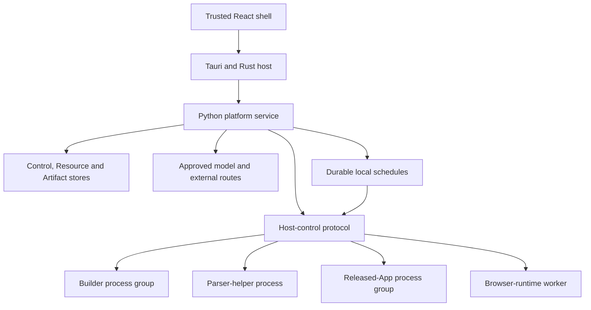

# Implementation Blueprint

Status: Accepted implementation baseline
Last updated: 21 September 2026

## Purpose

This document turns the accepted product, architecture, security, contract, and experience decisions into one buildable implementation shape. `../delivery/Prototype_Scope_and_Acceptance.md` refines its implementation phases into checkpoint exits and executable acceptance criteria; `../delivery/AI_Coding_Agent_Playbook.md` governs agents implementing those phases. It defines the current repository layout, module ownership, process boundaries, dependency direction, storage, protocols, tests, and delivery sequence. The accepted browser/scheduling expansion and future Windows target are included; unresolved execution policies and exact payload contracts remain gates before their affected code begins.

It is intentionally exact about boundaries and intentionally not exhaustive about every helper function. A good implementation plan prevents architectural drift without creating hundreds of empty files for systems that are not being built.

## What is frozen and what is not

The following are the accepted implementation baseline for the first usable local release:

- one monorepo;
- a Tauri 2/Rust Mac host and React/TypeScript/Vite trusted shell;
- one bundled Python 3.13 modular-monolith platform service;
- a private, versioned local protocol over Unix-domain sockets;
- separate supervised Builder, parser-helper, released-App, and browser-runtime workers;
- a durable local scheduler inside Core, dispatching normal Runs;
- platform interfaces for native services with a Mac implementation first and shared Windows CI;
- a platform-owned bounded Task Runner inside the trusted Python service, with non-trivial file parsing delegated to a disposable registered helper;
- a SQLite control ledger, per-App SQLite Resource stores, a content-addressed Artifact store, and Keychain secrets;
- one Python generated-App profile (SDK-declared Entrypoint functions hosted by the platform App runtime) with an optional React/Vite interface;
- contract-first boundaries, explicit Releases, evidence, cancellation, recovery, and rollback;
- the module, dependency, configuration, test, and release rules below.

The following are resolved only by implementation evidence and do not justify speculative architecture:

- exact patch versions and binary hashes, which are promoted into runtime-profile locks after clean packaging tests;
- the default Builder and model route, which are selected by the accepted DeepSeek Harness versus OpenCode qualification;
- the model-onboarding commercial choice between bring-your-own-key and product-funded credits;
- the external update endpoint and distribution channel;
- any cloud vendor, which remains deferred until the cloud track begins.

Local scheduling and public/authenticated browser automation are required for the first usable release; the smaller internal v0.0 milestone may remain manual. Cloud execution, Computer Action, observation, voice, broad memory, Procedure learning, and proactive autonomy remain future modules. `../specifications/Local_Automation_and_Platform_Extension_Profile.md` defines current automation, portability, and extension requirements and the decisions still open.

## Implementation style

v0 is a **contract-first modular monolith with process-isolated workers**.

- The trusted platform service is one deployable Python process, not a collection of local microservices.
- Domain modules own their records and expose commands and queries through explicit services.
- Cross-module work uses application workflows and durable operations rather than direct table mutation.
- Builder and generated-App code run outside the trusted service in supervised process groups.
- SQLite, local files, Keychain, model providers, Builder harnesses, and process control are adapters behind ports.
- Durable state is authoritative. In-memory queues, caches, and UI state are accelerators only.
- No Redis, Kafka, Celery, Temporal, Docker, Kubernetes, PostgreSQL, vector database, or plugin framework is introduced in v0.

This is the smallest architecture that preserves the long-term product direction. Splitting the trusted core into services now would add deployment and consistency work without creating user value; putting generated code inside the core would erase a critical trust and recovery boundary.

## Local process topology



### Process responsibilities

| Process | Trust | Owns | Must not own |
|---|---|---|---|
| Trusted shell | Trusted presentation | navigation, Assistant/App/Task surfaces, user confirmation, generated-surface host, safe local UI state | database access, raw Keychain access, arbitrary shell execution |
| Rust host | Narrow native trust boundary | windows, file/folder selection, Keychain mediation, static generated-surface server, updates, core lifecycle, worker process supervision | product domain rules, App records, model reasoning, Builder decisions |
| Python platform service | Trusted control plane | Assistant disposition, Task Runner, domain state, workflows, validation, policy, Resources, Artifacts, model routes, Build orchestration | generated interface rendering, arbitrary Builder shell authority, direct user-device capture |
| Builder worker | Temporary construction authority | one Build workspace, harness session, commands, tests, candidate Source App Package | publication, Release activation, production Resources, durable secrets, production Runs |
| Parser-helper worker | Disposable untrusted-input boundary | one exact selected input, qualified parser/converter, finite CPU/memory/time/output budget, normalized result | domain state, network, shell, Keychain, unrelated files, durable authority |
| App runtime worker | Resolved Release authority | one exact Release projection and its declared Entrypoints | Builder workspace, platform database, Keychain, undeclared Resources, other Apps |
| Browser runtime worker | Trusted provider handling untrusted pages | scoped browser operations, dedicated session, takeover, transfer/evidence limits, effect receipts | unrestricted generated-code control, platform databases, unrelated profiles, Release/grant authority |

The Rust host is the parent and final supervisor. The Core decides *what* work is required; the Host decides whether a declared worker profile may be spawned, starts the process group, records its operating-system identity, relays health, and owns forceful termination. The Core never asks the Host to execute an arbitrary binary path. It names a registered worker profile and supplies validated, bounded launch data.

The v0 Task Runner's orchestration, typed tools, policy, and model calls stay inside the trusted Core. Only bounded plain UTF-8 and JSON reads may be parsed in-process. PDF, Office, archive, image, native-library, decompression, or other non-trivial parsing and conversion MUST execute in a disposable, resource-limited `parser-helper` worker behind the same Task-tool port from the first file-Task slice. The helper receives one validated handle and emits a size-bounded normalized result; it has no network, shell, Keychain, ambient filesystem, or durable-record authority. This boundary does not turn Tasks into arbitrary code execution.

## Monorepo layout

The implementation repository uses this top-level structure:

```text
.
├── README.md
├── CONTRIBUTING.md
├── SECURITY.md
├── LICENSE
├── AGENTS.md
├── .editorconfig
├── .gitattributes
├── .gitignore
├── .python-version
├── .node-version
├── rust-toolchain.toml
├── Cargo.toml
├── pyproject.toml
├── uv.lock
├── package.json
├── pnpm-workspace.yaml
├── pnpm-lock.yaml
├── Justfile
├── apps/
│   └── desktop/
├── services/
│   └── core/
├── workers/
│   ├── builder/
│   ├── parser-helper/
│   ├── browser-runtime/
│   └── app-runtime/
├── packages/
│   ├── contracts/
│   ├── app-sdk-python/
│   ├── app-ui-sdk/
│   ├── contract-types-ts/
│   ├── ui-kit/
│   └── testkit/
├── templates/
│   └── python-react-app/
├── fixtures/
│   ├── tasks/
│   ├── apps/
│   └── failures/
├── config/
│   ├── runtime-profiles/
│   ├── policies/
│   ├── compatibility.toml
│   └── features.toml
├── packaging/
│   └── macos/
├── tools/
│   ├── codegen/
│   ├── contracts/
│   ├── packaging/
│   └── validation/
├── docs/
│   ├── development/
│   └── runbooks/
└── .github/
    └── workflows/
```

Rules:

1. The repository contains implementation and machine-enforced contract assets. Product and architecture prose remains canonical in the project Library; it is not copied into a second active documentation tree. Agents may receive immutable, read-only input snapshots under `docs/development/spec-inputs/<snapshot-id>/`, with source versions and digests. Snapshots are implementation inputs, never separately edited canonical specifications.
2. Machine-readable schemas, registries, examples, and invalid fixtures move into `packages/contracts/` when the repository is initialized. The Library specification index records their tagged repository version rather than retaining divergent copies.
3. `docs/development/` contains setup/contributor instructions, immutable spec-input manifests/snapshots, bounded task packets, and implementation evidence. The Library Delivery Checklist remains the project status source; repository task/evidence records are linked from it rather than becoming another roadmap. `docs/runbooks/` contains operational procedures such as recovery and release.
4. A feature area does not receive an empty folder. New top-level packages require an exercised delivery track and an ownership decision.
5. Lockfiles are committed. Generated files are clearly marked and checked for a clean regeneration diff in CI.

## Desktop application structure

```text
apps/desktop/
├─ package.json
├─ tsconfig.json
├─ vite.config.ts
├─ index.html
└── src/
    ├─ main.tsx
    ├─ app/
    │  ├─ App.tsx
    │  ├─ router.tsx
    │  ├─ providers.tsx
    │  └── error-boundary.tsx
    ├─ shell/
    │  ├─ WorkspaceShell.tsx
    │  ├─ Header.tsx
    │  ├─ AppBrowser.tsx
    │  ├─ PrimarySurface.tsx
    │  └── AssistantPanel.tsx
    ├─ features/
    │  ├─ assistant/
    │  ├─ tasks/
    │  ├─ apps/
    │  ├─ builds/
    │  ├─ releases/
    │  ├─ runs/
    │  ├─ activity/
    │  ├─ approvals/
    │  ├─ connections/
    │  └── settings/
    ├─ bridge/
    │  ├─ core-client.ts
    │  ├─ event-client.ts
    │  ├─ app-surface-host.ts
    │  └── operation-registry.ts
    ├─ components/
    │  ├─ ui/
    │  └── platform/
    ├─ hooks/
    ├─ styles/
    ├─ test/
    ├─ generated/
    └── src-tauri/
       ├─ Cargo.toml
       ├─ tauri.conf.json
       ├─ capabilities/
       │  └── main.json
       └── src/
          ├─ main.rs
          ├─ lib.rs
          ├─ commands/
          ├─ core_client/
          ├─ host_control/
          ├─ process_supervisor/
          ├─ platform/
          ├─ credentials/
          ├─ file_access/
          ├─ surfaces/
          ├─ updater/
          ├─ telemetry/
          └── error.rs
```

### Trusted shell rules

- Feature directories own screens, view models, queries, mutations, and tests for one product area.
- TanStack Query owns server state. React local state owns transient presentation state. No global state framework is added until a real cross-screen state problem proves necessary.
- React Router owns trusted shell navigation.
- Radix primitives, Tailwind CSS, Lucide icons, and owned composite components provide the shell design system. Material UI and a second component system are not added.
- TypeScript is strict. Boundary data is validated with generated types plus Zod where runtime validation is needed.
- The shell never imports generated-App source or executes arbitrary strings.
- Only trusted shell windows receive Tauri capability grants. Generated surfaces receive none.
- There is no general `shell.execute`, unrestricted filesystem, Keychain, or arbitrary Core-proxy command exposed to JavaScript.

## Rust host structure and boundary

The Rust host remains one crate until its size or independent reuse justifies extraction. Its modules have narrow responsibilities:

| Module | Responsibility |
|---|---|
| `commands` | Explicit Tauri command allowlist and request validation |
| `core_client` | Authenticated local protocol client over a transport adapter; Mac uses private UDS |
| `host_control` | Private Core-to-Host operations for registered process profiles and Keychain mediation |
| `process_supervisor` | OS-neutral worker lifecycle; native adapter owns process-tree identity, termination, limits, and containment |
| `platform` | Native interfaces for process supervision, private transport, credentials, data roots, background lifecycle, and OS events; Mac implementations are isolated, Windows implementations added when qualified |
| `credentials` | Logical secret lifecycle; Mac adapter uses Keychain, later Windows adapter implements the same contract |
| `file_access` | Trusted pickers, selected-file identity, bookmark handling if later required, safe export/open flows |
| `surfaces` | Isolated loopback static server and lifecycle for generated interfaces |
| `updater` | Signed update checks, installation, rollback hooks, and version reporting |
| `telemetry` | Structured local host logs and health facts with redaction |

Tauri plugins are allowlisted individually. The frontend receives no general shell or filesystem plugin. Native behavior that affects authority is implemented as an explicit Rust command with a typed request and test.

## Python Core structure

```text
services/core/
├─ pyproject.toml
├─ src/platform_core/
│  ├─ __init__.py
│  ├─ main.py
│  ├─ bootstrap.py
│  ├─ settings.py
│  ├─ clock.py
│  ├─ ids.py
│  ├─ errors.py
│  ├─ canonical.py
│  ├─ api/
│  │  ├─ app.py
│  │  ├─ dependencies.py
│  │  ├─ middleware.py
│  │  ├─ error_mapping.py
│  │  ├─ events.py
│  │  └── v1/
│  ├─ modules/
│  │  ├─ workspace/
│  │  ├─ assistant/
│  │  ├─ work/
│  │  ├─ apps/
│  │  ├─ builds/
│  │  ├─ packages/
│  │  ├─ releases/
│  │  ├─ runs/
│  │  ├─ scheduling/
│  │  ├─ resources/
│  │  ├─ artifacts/
│  │  ├─ access/
│  │  ├─ models/
│  │  └── audit/
│  ├─ workflows/
│  │  ├─ execute_task.py
│  │  ├─ promote_task.py
│  │  ├─ build_app.py
│  │  ├─ preview_app.py
│  │  ├─ release_app.py
│  │  ├─ invoke_run.py
│  │  ├─ repair_app.py
│  │  ├─ rollback_release.py
│  │  └── delete_app.py
│  ├─ adapters/
│  │  ├─ sqlite/
│  │  ├─ artifact_store/
│  │  ├─ resources/
│  │  ├─ credential_gateway/
│  │  ├─ host_control/
│  │  ├─ model_providers/
│  │  ├─ builder_gateway/
│  │  ├─ browser_gateway/
│  │  └── app_gateway/
│  ├─ operations/
│  │  ├─ dispatcher.py
│  │  ├─ outbox.py
│  │  ├─ recovery.py
│  │  └── health.py
│  ├─ generated/
│  ├─ migrations/
│  │  ├─ env.py
│  │  └── versions/
└── tests/
    ├─ unit/
    ├─ integration/
    ├─ contract/
    └── recovery/
```

Each domain module begins with only the files it needs. The standard vocabulary is:

```text
modules/<name>/
├── __init__.py
├── domain.py       pure entities, value objects, invariants, state transitions
├── commands.py     mutation request/result types
├── queries.py      read request/result types
├── ports.py        repository or external-service protocols owned by the module
├── service.py      use cases and transaction boundaries
└── events.py       emitted domain facts, only when the module emits them
```

Empty template files are not committed. SQLite implementations live under `adapters/sqlite/`; API routing lives under `api/v1/`; cross-owner orchestration lives under `workflows/`. A module may add a focused file when `domain.py` or `service.py` becomes materially hard to navigate, but it may not introduce a generic `utils.py`, `helpers.py`, `common.py`, or catch-all `manager.py`.

## Core module ownership

| Module | Authoritative records and behavior | May depend on |
|---|---|---|
| `workspace` | local Principal, Workspace, membership projection, Workspace settings and placement | shared primitives only |
| `assistant` | conversation/thread, Turn, request disposition, handoff reference | `workspace`; read ports for Tasks/Apps |
| `work` | Task, immutable Task Revision, Task Attempt, Attempt events, approvals, human input, retry, promotion lineage | `workspace`, `artifacts`, `models`, `access` through ports |
| `apps` | App root, App metadata, immutable Version record, archive/deletion fence | `workspace`, package identity values |
| `builds` | Build state, brief, adapter selection, checkpoint reference, evidence, candidate handoff | `apps`, `artifacts`; Builder port |
| `packages` | Source-package validation, compilation, resolved manifest, package index, sealing and digest | `contracts`, `artifacts`; never Release state |
| `releases` | Release root, immutable Release revision, Resolution Record, active pointer, rollback | `apps`, package/version identity, `access`, `resources` through ports |
| `runs` | Run, invocation identity, worker lease, Run Event ledger, cancellation, outcome and read models | exact Release snapshot; `artifacts`, `access`, `models`, `resources` through ports |
| `scheduling` | Schedule/revision, due occurrence, durable claim, visible missed state, user-initiated retrigger and lineage, pause and reconciliation | `workspace`, exact Release references; Run admission through a port |
| `resources` | v0 App-scoped table definitions, optimistic record revisions, declared filters/cursors, and Artifact-backed file namespaces | `workspace`, `artifacts`; local SQLite port |
| `artifacts` | immutable content metadata, digest, retention state, evidence links and safe materialization | storage port only |
| `access` | Connection metadata, secret reference, policy, Grant, Capability operation, approval policy, budget and receipt | `workspace`; Keychain/provider ports |
| `models` | provider-neutral route definitions, approved model calls, usage and cost receipts | `access` for secret resolution; provider ports |
| `audit` | append-only control-plane audit and safe security facts | subscribes to facts; authorizes nothing |

The module table is a physical v0 projection of the more detailed logical ownership model. Combining related records in one Python module or one SQLite database does not combine their authority.

The physical v0 persistence inventory is intentionally limited to these ownership roots or immutable revisions: Workspace and local Principal; Assistant Thread and Turn; Task, Task Revision, Task Attempt and Attempt Event; Artifact; App; Build; Version; Release; Run and Run Event; Resource Definition plus the minimal Record/File Namespace projection; Connection; Grant/Approval/Capability Operation and receipt; Model Route/Call; durable Operation; and Audit Event; plus Schedule, Schedule Revision, Trigger Occurrence, and browser Connection/session metadata. A table may split indexes, evidence, or state transitions for integrity. Browser session bytes remain protected platform state outside the control ledger. Webhook ingress, observation, memory, Procedures, legal hold, incidents, and regional recovery remain future work.

### Dependency direction

1. `domain.py` imports only Python standard-library types and shared primitives such as ID, time, digest, and typed error values.
2. Services depend on ports, never concrete SQLite, Keychain, Tauri, model-provider, or Builder implementations.
3. Adapters implement ports and may import vendor libraries. Domain modules do not.
4. API routes call module services or application workflows. Routes never execute SQL or mutate domain records directly.
5. A module cannot import another module's SQLite repository or table mapping.
6. Cross-module mutation happens through an exported command service. Use one synchronous transaction when the work is owner-local and immediate; use a durable operation only when it crosses a process boundary, waits for a human or provider, must resume after commit, or performs an external effect.
7. Workers depend on contracts and SDKs, never `platform_core` internals.
8. The desktop depends on generated contract types and its Core client, never Python source or database representations.
9. Import-boundary checks run in CI.

## Cross-module consistency

The Core uses a single local SQLite transaction for synchronous mutations whose participating records and invariants can be committed safely together. An exported service may coordinate those writes without manufacturing asynchronous messages.

A versioned outbox fact and consumer checkpoint are added only when a real asynchronous consumer exists. Delivery is then at least once and idempotent. A durable operation record is required when work crosses a process boundary, waits for a human or provider, must survive restart after commit, or performs an external effect. In-memory notification may reduce latency but cannot be the sole recovery mechanism for such work.

Build-to-Version, Release activation, Task promotion, App deletion, and rollback use the smallest durable operation needed for their actual wait/process/effect boundaries. Each durable step records input revision, idempotency key, state, attempt count, timeout, accepted result, and compensation or reconciliation action. The platform does not add a general workflow engine, universal saga layer, or inbox/outbox ceremony to synchronous owner-local work in v0.

## Internal protocol

### Transport

- Core serves HTTP/1.1 JSON and Server-Sent Events over a private Unix-domain socket.
- Rust serves a second private Host-control Unix-domain socket for Core-to-Host operations.
- Core IPC, Host control, and worker-bootstrap envelopes share one atomically shipped `local-platform-protocol` bundle version in v0.
- Both sockets live in a per-boot runtime directory with mode `0700`; socket access is restricted to the signed-in user.
- Rust creates a 256-bit boot secret and transfers it to Core through an inherited anonymous pipe. It is never placed in command-line arguments, ordinary environment variables, logs, or files.
- Requests use a derived channel token, protocol version, correlation ID, deadline, and idempotency key where the operation can mutate state.
- JSON bodies are strict and size-bounded. Large content crosses the boundary only as an Artifact or selected-file handle.
- Every error uses one safe typed envelope; protected diagnostic detail is referenced separately.

### UI-to-Core mediation

The React shell invokes explicit Tauri operations. Rust maps an allowlisted operation identifier to a Core request, adds the authenticated channel data, and returns the typed result. JavaScript cannot supply an arbitrary URL, HTTP method, socket path, header, or Core operation name outside the compiled registry.

Rust maintains one Core SSE subscription and forwards authorized event envelopes to the trusted shell. The shell deduplicates by event ID, persists the last durable cursor needed for recovery, and refreshes an authoritative read model after a detected gap.

### Core-to-Host control

The v0 Host-control operation set is limited to:

- `worker.spawn` for a registered `builder`, `parser-helper`, `app-runtime`, or `browser-runtime` profile;
- `worker.signal`, `worker.terminate`, `worker.status`, and `worker.list`;
- `secret.create`, `secret.read`, `secret.rotate`, and `secret.delete` by opaque reference;
- `surface.open`, `surface.close`, and `surface.status` for immutable UI assets;
- host and managed-toolchain health/version queries.

A worker launch record contains exact profile ID, working directory beneath an allowed root, execution snapshot digest, environment-name allowlist, resource limits, log destination, deadline, and one-time worker registration token. Rust resolves the executable and fixed bootstrap arguments from the signed runtime profile. Generated code cannot invoke Host control.

### Protocol versioning

The following versions appear in `config/compatibility.toml`:

- product build;
- `local-platform-protocol`, which atomically versions Core IPC, Host-control, and worker bootstrap in v0;
- database schema;
- Task execution contract;
- App Contract and resolved-manifest contract;
- App UI Bridge;
- Capability Protocol;
- Python App SDK;
- TypeScript App UI SDK;
- runtime profile;
- Builder adapter.

Startup performs an explicit compatibility handshake. Unknown major versions fail closed with a recovery screen; a supported migration is never inferred silently. The three internal protocol surfaces are not independently negotiated until a separately deployed component creates a demonstrated compatibility need.

## Core operation groups

The internal API is organized around commands and queries rather than exposing database-shaped CRUD. Stable `operationId` values are the contract; URL paths are private implementation detail.

| Group | Initial operations |
|---|---|
| Bootstrap | `workspace.bootstrap`, `workspace.health`, `workspace.recover` |
| Assistant | `assistant.submit`, `assistant.clarify`, `assistant.chooseDisposition`, `assistant.history` |
| Task | `task.create`, `task.get`, `task.list`, `task.revise`, `task.startAttempt`, `task.cancelAttempt`, `task.retryAttempt`, `task.promote`, `task.delete` |
| App | `app.create`, `app.get`, `app.list`, `app.archive`, `app.delete` |
| Build | `build.start`, `build.get`, `build.cancel`, `build.resume`, `build.preview`, `build.repair` |
| Version and Release | `version.get`, `version.compare`, `release.review`, `release.activate`, `release.rollback` |
| Run | `run.invoke`, `run.get`, `run.list`, `run.cancel`, `run.activity` |
| Human control | `approval.list`, `approval.decide`, `humanInput.respond` |
| Artifact | `artifact.get`, `artifact.open`, `artifact.export`, `artifact.delete` |
| Resource | trusted fallback and management reads; generated UI uses the App UI Bridge instead |
| Access | `connection.list`, `connection.configure`, `connection.revoke`, `grant.review`, `grant.revoke` |
| Scheduling | configure/review, activate, pause, inspect next/last missed occurrences, manually retrigger missed work, reconcile; exact operation payloads pending scheduler contract |
| Browser | connect/sign in, acquire scoped session, perform approved operation, take over/resume/stop, revoke; exact payloads pending BrowserProvider contract |
| Settings | `settings.get`, `settings.update`, route and diagnostic controls |

The Task execution wire contract must define the exact request, snapshot, Attempt, event, output, retry, and promotion shapes before `task.startAttempt` is implemented. App operations use the already accepted App, Release, Run, Capability, and Bridge contracts.

## Worker packages

### Builder worker

```text
workers/builder/
├── pyproject.toml
└── src/builder_worker/
    ├── main.py
    ├── bootstrap.py
    ├── protocol.py
    ├── events.py
    ├── workspace.py
    ├── package_handoff.py
    ├── adapters/
    │   ├── fake.py
    │   ├── deepseek.py
    │   └── opencode.py
    └── tests/
```

The worker receives one immutable Build launch descriptor and a materialized workspace. That descriptor includes the user-approved bounded Build plan and command policy. Routine commands inside the plan remain visible and cancellable; execution pauses for a trusted re-approval only when a command introduces a new executable family, network destination, external file scope, credential, privilege boundary, or materially higher risk. Adapter-native sessions, messages, skills, and events remain private. The worker emits normalized Builder Harness events and a candidate Source App Package only. `fake.py` is the deterministic contract control; DeepSeek and OpenCode are the two real qualification adapters.

### Parser-helper worker

```text
workers/parser-helper/
├── pyproject.toml
└── src/parser_helper/
    ├── main.py
    ├── bootstrap.py
    ├── limits.py
    ├── normalize.py
    ├── parsers/
    └── tests/
```

The parser helper is launched per input or bounded batch under a registered Host profile. Its immutable descriptor names the selected-file handle, media type, parser profile, decompression and page/item ceilings, output schema, deadline, and result Artifact destination. It receives no network, shell, Keychain, model route, database, App SDK, or unrelated filesystem authority. Core validates the normalized result and records parser identity, limits, warnings, and failure evidence. Timeout, resource exhaustion, malformed output, archive traversal, and decompression-bomb cases terminate the entire helper process group.

### App runtime worker

```text
workers/app-runtime/
├── pyproject.toml
└── src/app_runtime/
    ├── main.py
    ├── bootstrap.py
    ├── execution_closure.py
    ├── server.py
    ├── entrypoints.py
    ├── health.py
    ├── cancellation.py
    ├── sdk_session.py
    └── tests/
```

One supervised App runtime process serves one exact active local Release revision over a private UDS. It imports only the sealed Run projection, registers declared Entrypoints, and uses a per-process App SDK session. The Runtime Manager lazy-starts it for a manual or scheduled Run or active custom Surface and stops it after a bounded profile-defined idle period when there is no Run, wait, or open Surface. The approved resident Core contains the local scheduler and starts workers just in time. Closing the main window preserves Core, the scheduler, and active automation; reopening reconnects to the same runtime. Explicit runtime quit stops local execution. Background status and pause/stop/quit controls remain accessible, with login startup treated separately. v0 allows one active mutating Run per Release; additional invocations queue visibly. Safe reads are served by the Resource/Bridge path rather than by an unconstrained generated server.

Cancellation is cooperative first. After the deadline, the Host terminates the entire App process group, the Run is reconciled, and the Release process is restarted cleanly if still active. A crash never changes the active Version or Resource data automatically.

Uvicorn and FastAPI belong to this platform-owned runtime, not to generated packages: a generated App declares Entrypoint functions through the SDK and contains no web framework, server, or port. No generated backend port is exposed to the browser or LAN.

## Browser runtime and local scheduler

`workers/browser-runtime/` implements a registered local Playwright/Chromium provider. Core `access` owns browser Connections, grants, protected session references, and operation authority; `adapters/browser_gateway/` carries bounded provider requests. The host owns worker supervision and cleanup. Generated Apps receive platform SDK session handles, never Playwright objects, profile paths, cookie material, or an open browser-debugging port. Browser payload schemas, account/profile locking, takeover, egress/effect mediation, and evidence redaction must be qualified before activation.

`modules/scheduling/` owns durable schedules and occurrences under the logical `triggers` owner. It calls normal Run admission with an occurrence key and exact Release. The scheduler does not bypass policy, invent another execution state model, or keep one worker resident per App. Missed occurrences stay visible until the user chooses to retrigger them; returning online or waking/restarting the runtime never automatically catches them up. A retrigger uses normal admission, current authority, durable occurrence-to-Run linkage, and request deduplication. Resolve cadence/timezone, overlap/offline behavior, retrigger Release/input semantics, and background-control presentation before implementing activation.

See `../specifications/Local_Automation_and_Platform_Extension_Profile.md` for normative requirements and acceptance scenarios.

## Generated interface boundary

v0 has one generated Surface implementation: a React/TypeScript/Vite bundle compiled to immutable static assets. A separate native-view DSL is not implemented or accepted by the v0 runtime profile. An App with no custom Surface uses the trusted fallback generated from declared Entrypoints and safe read models.

Rust serves immutable compiled UI assets on a random loopback-only port created for one Surface session. The server exposes no API, backend proxy, directory listing, or writable route.

The generated interface runs in a cross-origin sandboxed frame with:

- an exact session-specific origin and channel nonce;
- a restrictive CSP, including no arbitrary `connect-src`;
- no Tauri API, ambient cookies, shared credential storage, popup, top navigation, camera, microphone, clipboard, or native-file authority by default;
- the versioned App UI SDK as its only privileged interaction path;
- parent validation of the exact frame window, origin, App, Release, Surface, session, method, and schema.

The UI uses `postMessage` only through the App UI SDK. The trusted shell maps allowed Bridge methods to Core operations and trusted prompts. A generated surface cannot render or submit a trusted approval, Connection, publication, deployment, or device-consent decision.

## Contract package

```text
packages/contracts/
├── registry.json
├── task/v0.1/
│   ├── task-execution.schema.json
│   └── task-event.schema.json
│   └── examples/
│       └── invalid/
├── app/v0.1/
├── release/v0.1/
├── run/v0.1/
├── capability/v0.1/
├── bridge/v0.1/
├── builder/v0.1/
└── internal/
    └── local-platform/v1/
        ├── core-ipc/
        ├── host-control/
        └── worker-bootstrap/
```

Rules:

- JSON Schema 2020-12 is the structural source of truth for JSON records.
- Semantic validators are separate, named, and tested; a schema pass is never treated as full validation.
- Canonical records use RFC 8785 JSON canonicalization and SHA-256 digests.
- Uncaptured fields fail closed in authority-bearing records.
- Generated Python and TypeScript types live in package-specific `generated/` directories and are never edited manually.
- Rust validates its small native envelopes with owned structs; it does not duplicate the entire domain schema.
- Every contract version includes a complete valid example, invalid structural cases, invalid semantic cases, and compatibility tests.

## SDK packages

### Python App SDK

`packages/app-sdk-python/` is the only supported generated-backend route to platform services. Its public modules are:

- `context` - exact App, Release, Run, Entrypoint, deadlines, and cancellation context;
- `resources` - typed table and file-store operations;
- `artifacts` - immutable output/evidence creation and retrieval;
- `capabilities` - governed operation requests and receipts;
- `models` - resolved App-runtime model calls when declared;
- `events` - bounded progress and domain-safe App events;
- `errors` - stable safe failures and retry hints.

It receives a short-lived session through the worker bootstrap channel. It never receives database paths, Keychain handles, reusable provider secrets, Tauri access, or a general Core client.

### TypeScript App UI SDK

`packages/app-ui-sdk/` owns Bridge request/response/event schemas, correlation, timeout, deduplication, operation following, and safe Artifact flows. It contains no Tauri import and no direct HTTP client to the Core or App worker.

### UI kit

`packages/ui-kit/` provides the limited, accessible primitives needed for generated forms, tables, filters, status, reports, and charts. It is versioned with the runtime profile. Generated Apps may add approved frontend dependencies, but they do not bring a second shell framework or trusted platform components into their bundle.

## Generated-App template

The initial Builder template materializes only paths referenced by the Source App Manifest:

```text
templates/python-react-app/
├── app.yaml
├── schemas/
├── components/
│   └── <component-id>/
│       ├── pyproject.toml
│       ├── uv.lock
│       ├── src/
│       └── tests/
├── ui/
│   └── <surface-id>/
│       ├── package.json
│       ├── pnpm-lock.yaml
│       ├── tsconfig.json
│       ├── vite.config.ts
│       └── src/
├── tests/
└── assets/
```

The Source Package never contains a virtual environment, `node_modules`, user data, credentials, absolute paths, mutable caches, production bindings, or platform-generated files. The compiler preserves source locks, produces normalized dependency evidence, compiles UI assets, validates imports and contracts, runs required tests, and seals the Version exactly as specified by the Package Layout contract.

## Mac and Windows implementation boundary

Portable Core and generated packages use logical resources, relative package paths, registered capabilities, and native-service ports. The paths and UDS transports below are Mac implementations, not shared requirements. The host `platform` layer isolates credentials, private IPC, process trees and containment, file access/data roots, startup and sleep/wake behavior, and installation/update services. Core's credential gateway calls logical host operations rather than importing Keychain code.

Shared Core, contract, path-handling, and relevant browser tests run on Windows from the first repository. Native Windows adapters and distribution are a later track; they must be qualified rather than inferred from Tauri compatibility. OS-specific App dependencies/capabilities are declared and checked. No empty Windows implementation tree is required before its track begins.

## Local data layout

For bundle identifier `<bundle-id>`, authoritative and sensitive local state lives under:

```text
~/Library/Application Support/<bundle-id>/
├── state/
│   ├── control.sqlite3
│   └── resources/<app-id>/resources.sqlite3
├── content/
│   ├── blobs/sha256/<prefix>/<digest>
│   └── packages/sha256/<prefix>/<digest>
└── apps/<app-id>/
    ├── source/
    ├── builds/<build-id>/
    │   ├── home/
    │   ├── work/
    │   ├── output/
    │   ├── evidence/
    │   └── logs/
    └── versions/<version-id>/
        ├── runtime/
        └── logs/
├── toolchains/<profile-id>/<architecture>/
└── runtime/<boot-id>/
    ├── core.sock
    ├── host.sock
    ├── workers/
    ├── leases/
    ├── backups/
    └── logs/
```

Rebuildable download and build caches may live under `~/Library/Caches/<bundle-id>/`. No authoritative record, secret, App Resource, Task output, package, or sole diagnostic evidence lives only in the cache tree.

Directories are created with mode `0700` and sensitive files with `0600`. Paths are implementation details and never enter portable packages or public entity identity.

### Control database

One `control.sqlite3` physically hosts v0 control modules. Logical ownership is enforced by repository boundaries and table prefixes:

- `workspace_`
- `assistant_`
- `work_`
- `app_`
- `build_`
- `package_`
- `release_`
- `run_`
- `trigger_` for local schedule/occurrence records
- `resource_`
- `artifact_`
- `access_`
- `grant_`
- `audit_`
- `operation_`
- `outbox_` and `inbox_`

SQLite uses WAL, foreign keys, a bounded busy timeout, explicit transactions, and a durability setting qualified by recovery tests. SQLAlchemy 2 owns mappings and repository sessions; Alembic owns ordered migrations. Migrations run under an exclusive application maintenance state after a verified backup and fail closed on error. Modules never use ORM relationships to mutate another owner's rows implicitly.

API-visible identities are RFC 9562 UUIDv7 strings. Times are UTC RFC 3339 with microsecond precision. Cost is stored as integer micro-US dollars; counters and byte sizes are integers. Authority-bearing JSON is canonicalized before digesting.

### Resource stores

Each App has one platform-owned SQLite Resource database in v0. The active profile is deliberately small: App-scoped table create/get/list/update/delete with optimistic revision checks, declared exact-match filters, stable cursor pagination, and an Artifact-backed file namespace. Resource tables, schemas, namespace entries, and record revisions are accessed only through the Resource service. Generated code receives logical handles and SDK methods, not a path or connection.

File-store Resource namespace entries point to immutable Artifact blobs. Deleting or replacing a logical file changes the namespace record; it does not mutate content-addressed bytes in place. Resource migrations are explicit operations and App Version rollback never implies data rollback.

The v0 runtime does not implement an aggregation engine, one-hop reference expansion, a Resource Transaction Domain object, a general migration framework, Context SDK access, or provider-neutral cloud Resource execution. Broader portable contract vocabulary remains inactive until a proven App requires it and the release profile is revised.

### Artifact store

Artifact bytes are written to a temporary file in the target filesystem, size-checked, hashed, flushed, atomically renamed to the content-addressed path, and verified before metadata commits. Metadata and evidence links live in the control database. Missing bytes, digest mismatch, duplicate content, interrupted writes, retention deletion, and tombstones have explicit recovery behavior.

### Secrets and encryption

Keychain stores durable model-provider credentials, Connection credentials, and database or Artifact wrapping keys. The control database stores only opaque Keychain references and non-secret metadata.

The internal prototype uses non-sensitive fixtures. Before external testers:

- control and per-App Resource databases use a qualified SQLCipher-compatible build;
- each Workspace has a random database key protected by a Keychain-held wrapping key;
- Artifact payloads are encrypted with an authenticated per-object data key and versioned envelope metadata;
- backup and export keys are distinct from live-store keys;
- rotation, restore, loss, and deletion are exercised through recovery tests.

The exact cryptographic library and envelope bytes are selected in the encryption implementation review, not invented independently in multiple modules.

## Configuration

Configuration layers, from lowest to highest precedence, are:

1. signed product defaults;
2. exact runtime profile;
3. Workspace settings;
4. immutable Task Attempt or Release resolution;
5. one execution's bounded launch data.

Higher layers cannot widen authority beyond the policy and contract accepted at the lower authoritative boundary. Environment variables are used only for developer overrides and one-boot plumbing such as inherited descriptors. Production secrets never use `.env` files.

`config/runtime-profiles/<profile-id>.toml` records exact runtime artifacts, architecture, hashes, package indexes, SDK versions, allowed dependency sources, worker executable, required checks, and compatibility. `config/policies/internal-prototype.toml` records the deliberately narrow internal safety envelope. User-editable policy is not a raw TOML file; it is validated platform state.

Feature flags are declared in code and listed in `features.toml` with owner, default, expiry/review date, and safety effect. A flag may hide or gate a feature; it cannot bypass a contract, permission, migration, or release gate.

## Baseline open-source stack

### Rust and Mac host

- Tauri 2;
- Tokio for asynchronous lifecycle work;
- Serde for owned protocol envelopes;
- an HTTP implementation with Unix-domain-socket support;
- `tracing` for structured diagnostics;
- macOS Security Framework/Keychain bindings;
- `zeroize` for transient secret buffers;
- `thiserror` for typed internal errors.

### Trusted TypeScript interface

- React and Vite;
- React Router;
- TanStack Query;
- Radix UI primitives and Tailwind CSS;
- Zod at runtime boundaries;
- Lucide icons;
- Vitest, Testing Library, and Playwright for browser-renderable surfaces.

No global state library, Next.js server, Electron runtime, or second design system is included initially.

### Python platform

- Python 3.13;
- FastAPI, Uvicorn, Pydantic 2, and `pydantic-settings`;
- SQLAlchemy 2 and Alembic;
- `httpx` and AnyIO for bounded provider and IPC clients;
- Pydantic AI core behind `ModelProvider` for the Task loop;
- a JSON Schema 2020-12 validator and RFC 8785 canonicalizer;
- structured logging with redaction;
- Pytest, Hypothesis where state/property testing pays off, Ruff, and a strict Python type checker.

LangChain, LangGraph, CrewAI, a general MCP/plugin runtime, and a workflow orchestrator are not Core dependencies in v0. A future adapter may use one internally only if it does not own platform truth or authority.

### Managed toolchains

- a pinned relocatable CPython distribution for each supported Mac architecture;
- a pinned `uv` binary;
- a pinned Node.js LTS runtime;
- a pinned pnpm CLI, without relying on a user's global Node, Corepack, Homebrew, or shell setup;
- exact Builder adapter artifacts.

Every artifact has source, license, version, architecture, SHA-256 digest, and qualification result in the runtime-profile inventory. Initial distribution produces architecture-specific signed builds rather than pretending unlike native runtimes form one reproducible universal bundle.

## Observability and privacy

Rust uses `tracing`; Python emits structurally compatible JSON events; the UI reports safe product diagnostics through explicit operations. Every operation carries correlation and causation IDs across Host, Core, worker, model, and provider boundaries.

Logs are not the product Activity ledger. They are bounded operational diagnostics with:

- field-level redaction before serialization;
- no prompts, selected-file bodies, Resource rows, credentials, bearer values, raw model responses, or generated source by default;
- local rotation and retention limits;
- separate user, operator, and restricted evidence classes;
- opt-in diagnostic export that previews included categories.

Telemetry is local-only by default in v0. Remote product analytics or crash reporting requires a separate disclosed opt-in and data contract; it is not smuggled into ordinary logging.

## Trust limitation of the local prototype

Separate directories, environments, userspace process groups, CSP, import checks, and environment allowlists improve operational control but do **not** confine hostile generated Python or Builder shell commands on macOS. A process running as the user can attempt filesystem and network access outside its declared SDK surface unless an operating-system or virtualized containment boundary prevents it.

Therefore:

- internal v0 testing uses non-sensitive fixtures and explicitly acknowledges a same-user coding-agent trust model;
- generated code is given no durable secret, database path, Keychain handle, or ambient application environment;
- the supported template uses only the SDK and validators reject known direct storage, credential, native, and network paths, while documentation does not misrepresent that validation as a security sandbox;
- external or sensitive-data testing requires either a separately qualified containment boundary or an explicitly narrower, reviewed generated-code envelope approved by the security gate;
- the product never claims that "On this Mac" means generated code is isolated merely because data is not persisted in cloud.

This limitation is a release gate, not an excuse to redesign the Core around a speculative VM now.

## Test architecture

| Layer | Purpose | Required evidence |
|---|---|---|
| Domain unit | state transitions, invariants, idempotency, authority | deterministic tests with no database or provider |
| Repository integration | actual SQLite constraints, CAS, transactions, migrations | real temporary databases, not mocks |
| Contract | schemas, semantic rules, examples, invalid fixtures, compatibility | exact error codes and clean regeneration |
| Adapter conformance | Keychain, Artifact, Resource, Model, Builder, App SDK ports | shared test suite against fake and real adapters where safe |
| IPC integration | Rust/Core handshake, auth, limits, cancellation, SSE recovery | both processes on private temporary sockets |
| Worker lifecycle | spawn, health, deadline, cancel, crash, orphan cleanup | real process groups and verified exit evidence |
| UI component | states, accessibility, keyboard, errors | Vitest and Testing Library |
| Surface browser | App UI SDK, Bridge, CSP, origin, generated UI | Playwright against the browser-renderable shell/surface harness |
| Packaged Mac smoke | launch, Core start, reopen, update/recovery hooks | signed-like packaged app on each supported architecture |
| Acceptance | non-technical end-to-end outcomes | no terminal intervention across required fixtures |

Full Tauri behavior is not declared covered merely because the React shell passes Playwright. Native lifecycle and packaged-app smoke tests are separate.

### Required failure tests

- Core dies during a request and is restarted;
- Builder or App worker exits without a terminal event;
- forceful cancellation leaves descendants;
- event delivery repeats or has a cursor gap;
- SQLite is busy, migration fails, or an unexpected revision conflicts;
- an Artifact write is interrupted or its digest is wrong;
- a Release points to an incompatible runtime profile;
- a generated surface sends a bad origin, nonce, method, or schema;
- a provider times out after an uncertain external effect;
- the Mac sleeps or exits during work;
- a secret is missing, revoked, or rotated;
- a Version rollback encounters newer Resource data.

## Acceptance fixtures

Fixtures validate breadth without turning the platform vertical.

### One-off Tasks

1. selected documents to an evidence-backed saved report;
2. selected semi-structured files to a validated table plus exception list;
3. compare and synthesize selected sources under a bounded output and model budget.

### Reusable Apps

1. file processor that imports selected files, extracts records, supports review, and exports a report;
2. tracker/dashboard that creates, edits, filters, summarizes, and survives a schema/interface revision;
3. recurring collection/processing App using qualified HTTP or general browser operations, structured deduplicated persistence, local scheduling, evidence, and correction; exercise public and authenticated browser cases with expiry/takeover recovery.

The same fixtures feed Builder qualification, package validation, UI testing, recovery, and non-technical acceptance. Synthetic fixture data is committed; real user material is not.

## Developer workflow

The `justfile` exposes one documented interface:

- `just bootstrap` - verify and install repository-local developer tools;
- `just generate` - regenerate contract types and registries;
- `just dev` - start the trusted shell, Host, and Core in developer mode;
- `just test` - run the normal local suite;
- `just check` - format, lint, type-check, contract-check, and test all workspaces;
- `just test-integration` - run IPC, SQLite, worker, and recovery tests;
- `just qualify-builders` - run the credentialed Builder scorecard explicitly;
- `just package-mac` - build the current architecture package;
- `just verify-package` - inspect hashes, signatures, inventory, launch, and recovery.

Commands fail on missing locks, generated diffs, schema drift, stale migrations, or unsupported tool versions. Credentialed, costly, destructive, or internet-dependent tests are never hidden inside the default local test command.

## Continuous integration and release flow

### Pull request gates

1. contract schema, example, invalid-fixture, semantic, and generated-code checks;
2. Python format, lint, type, unit, integration, and migration tests;
3. TypeScript format, lint, type, unit, accessibility, and production build;
4. Rust format, lint, unit, and protocol tests;
5. import/dependency-boundary validation;
6. license, secret, vulnerability, and software-bill-of-materials checks;
7. Mac IPC and worker-lifecycle integration on the supported development architecture.
8. Shared Core/contracts/path behavior on Windows; isolate Mac-only imports and add browser checks as the provider lands.

### Nightly or explicit qualification

- architecture-specific packaged Mac smoke;
- upgrade, backup/restore, crash, and orphan-reconciliation tests;
- builder scorecards (run only when credentials and budget are explicitly supplied);
- dependency update compatibility and reproducibility checks.

### Release candidate

- clean checkout and locked build;
- exact runtime-profile inventory and hashes;
- architecture-specific signed and notarized application package;
- SBOM, license report, checksums, and provenance;
- install, launch, update, rollback, uninstall, and retained-data behavior;
- acceptance fixtures and external-test security gates;
- a human-readable release note naming new routes, permissions, migrations, and known limitations.

There is no automated public release from a normal merge. Distribution remains an explicit approved workflow.

## Implementation order

`../delivery/Prototype_Scope_and_Acceptance.md` owns the detailed checkpoint sequence, dependency exits, fixture journeys, and acceptance IDs. `../delivery/AI_Coding_Agent_Playbook.md` owns task packets, agent review, testing, evidence, and handoff. These refine the existing phases as follows:

| Earlier blueprint phase | Execution checkpoint |
|---|---|
| 0 - contracts and repository | P0 - executable foundation |
| 1 - trusted skeleton | P1 - trusted Host/Core skeleton |
| 2 - one-off tasks | P2 - Assistant and Bounded Task |
| 3 - deterministic App lifecycle | P3 - deterministic App lifecycle; P0-P3 establish internal v0.0 |
| 4 - real Builder qualification | P4 - creation/correction/repair integration; automation-dependent final scoring follows P5 |
| 5 - local automation and product completion | P5 - schedules/browser; P6 - breadth and packaged recovery |
| 6 - external-test gate | P7 - containment, encryption/recovery, distribution and external-user evidence |

Short bounded Builder, browser, packaging and containment experiments may begin early under an explicit task profile; they do not replace integrated gates. Both real adapters complete the same scorecard, including browser/scheduled cases after P5 exists, before the default is selected. This avoids requiring an integrated browser benchmark before the browser implementation exists.

P0 may initialize the repository, locks, fixtures and executable contract tooling required to prove its own gate. Product behavior begins after the applicable contract gate. Create only the modules exercised by each vertical slice. The conforming fake Builder proves lifecycle mechanics, never real-generation quality. The first usable local release still includes Tasks, general-purpose Apps, local schedules, and public/authenticated browser operation; cloud, screen, voice, broad memory and Computer Action remain later.

## Future seams, without future modules

| Future track | Seam preserved now | Deliberately absent now |
|---|---|---|
| Windows delivery | Shared Core/contract CI and native platform ports | qualified Windows host adapters, installer, updates, containment |
| Browser expansion | current BrowserProvider and session/operation contracts | additional engines, everyday-browser integration, cloud sessions |
| Cloud | repository, object-store, secret, queue, schedule and worker ports; portable Version/Release | provider SDKs, tenant control plane, cloud deployment code |
| Context and memory | Selected-input provenance, bounded Context references, independent placement identity | vector store, memory graph, ambient ingestion, claim promotion |
| Screen and voice | Observation boundary and separate capture consent | capture processes, frame/audio formats, retention store |
| Computer Action | governed outbound Capability, effect identity, approval and evidence | accessibility driver, visual clicking, blanket desktop grant |
| Proactivity | durable Tasks, Runs, evidence, policy and cancellation | suggestion engine, shadow mode, autonomy policy |

When a track begins, it gets a focused contract, threat review, module ownership decision, fixtures, and readiness gate before code.

## Decisions that still require evidence

These are not architecture omissions:

| Decision | When it is made | Evidence |
|---|---|---|
| exact patch locks and hashes | after the trusted skeleton packages cleanly | arm64 and x86_64 Build, launch, Run, restart and uninstall |
| user-facing performance budgets | during the trusted skeleton and first Task/App measurements | startup, first progress, Task completion, Build-to-preview, App cold start, idle memory, package size, disk growth and recovery data |
| default Builder/model | after both adapters exist | retained three-fixture scorecard and hard gates |
| BYOK versus funded credits | before external onboarding | usability result and measured model cost |
| external generated-code envelope | before sensitive-data or broader external testing | qualify a local generated-code boundary and browser-session protection; test filesystem, network, session separation, performance and disclosure; an unqualified build remains internal |
| updater endpoint/channel | after signed packaging | update, rollback, recovery and operational ownership test |
| cloud provider | when cloud demand clears its gate | measured workload, cost, tenancy, region and worker requirements |

Task/internal-protocol contracts, scheduler policies/payloads, BrowserProvider payloads, runtime qualification, and containment remain explicit readiness gates. Begin each implementation slice only after its dependencies are decided. New native/provider implementations must preserve authority and persistence contracts; update the blueprint when evidence changes an accepted boundary.

## Ready-to-code gate

Product behavior begins only when the applicable foundation gates below pass. P0 repository setup, contract validators and fixtures are allowed to establish those gates; bounded feasibility experiments follow their own declared envelope. This is not a circular requirement to finish product code before initializing its repository.

Required foundation:

- this blueprint is accepted and indexed;
- the Task execution contract and fixtures are accepted;
- the repository is initialized with the stated boundaries and lockfiles;
- one atomically shipped `local-platform-protocol` bundle covers versioned Core IPC, Host-control, and worker-bootstrap schemas plus invalid fixtures;
- the internal prototype policy is explicit about non-sensitive data and same-user generated-code risk;
- the first Task and App acceptance fixtures are present;
- CI can reject contract drift, forbidden imports, missing locks, secrets, and failing tests, including shared Core/contracts on Windows.
- scheduler activation waits for contracts and evidence implementing manual retriggering without automatic catch-up and continued automation after window close; browser activation waits for provider/session payloads and qualification.

This gate does not wait for the Builder winner, external distribution, containment technology, or cloud provider because each of those requires implementation evidence. It does prevent UI-first, database-first, or harness-first coding that would bypass the product's ownership and trust model.

## References

- `Current Architecture Decisions.md`
- `System Architecture.md`
- `Deployment and Execution Architecture.md`
- `Domain and Persistence Model.md`
- `Security Privacy and Data Boundaries.md`
- `Resource Context and Integration Architecture.md`
- `../specifications/Current Release Specification.md`
- `../specifications/Specifications Index.md`
- `../specifications/contracts/Builder Harness Interface.md`
- `../specifications/contracts/Package Layout.md`
- `../delivery/Delivery Checklist.md`
