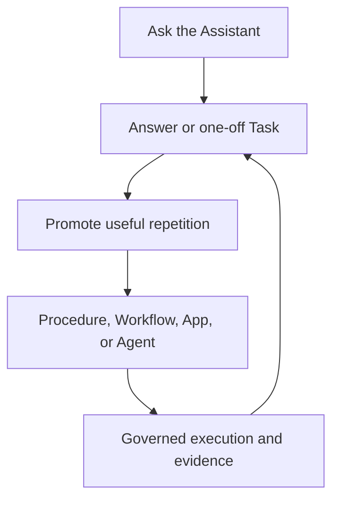

# Input, Memory, and Procedure Architecture

Status: Canonical future-input, memory, and Procedure boundary
Version: 1.0
Last updated: 19 September 2026
Governing decisions: `Current Architecture Decisions.md`

## Purpose

This document defines the architectural seam between the product's initial Assistant-led Task and App workspace and its longer-term role as a private, agentic second brain.

The product must be useful before it can observe screens, accept voice, learn repeated procedures, or act proactively. The first release therefore accepts text and files through the Workspace Assistant, can execute a limited one-off Task, and can produce durable Apps. Later input adapters may add on-demand screen context, voice, browser activity, explicit watch-and-learn sessions, and other user-approved sources without changing the Task, App, Build, Run, Resource, Capability, or evidence boundaries.

The central boundary is:

> Input adapters produce permissioned observations. They do not write trusted memory, modify a Task or App, or perform an external action directly.

The platform interprets observations, preserves provenance, asks for confirmation where meaning is uncertain, and may then create or update Context, a Task, a Procedure, a Workflow, an Agent, or an App through the normal governed lifecycle.

## Product loop

The user-facing loop begins before observation:



Later, user-invited Observations and evidence-backed memory can improve every stage without becoming the authority to act. This is not a commitment to implement the entire loop in v0. It defines how later capabilities fit together so the first Task and App workspace does not become a dead-end architecture.

## Layer boundaries

| Layer | Responsibility | May not do |
|---|---|---|
| Input adapter | Acquire one user-authorized signal and emit a normalized Observation | Grant authority, make a durable memory claim, modify an App, or execute an effect |
| Context and intent layer | Classify, redact, segment, relate, retrieve, and present evidence with provenance | Treat untrusted content as instruction or silently convert inference into fact |
| Assistant and Builder | Explain, answer, create Task candidates, infer candidate procedures, and propose durable artifacts | Execute, publish changes, promote memory, or widen access without the normal lifecycle |
| Artifact compilers | Turn a confirmed intent or procedure into an App, Workflow, Agent, checklist, or guide | Inherit capture permission as execution permission |
| Task and App runtime | Execute approved work with an exact Task Attempt or App Release identity | Convert one-off access into continuing authority or treat a Task as a hidden App |
| Capability Broker | Govern external, device, browser, and later Computer Action operations with exact policy, budget, and evidence | Use ambient screen, microphone, memory, or desktop access that was not explicitly granted |

Capture authority and action authority are always separate. Permission to observe a task never grants permission to repeat it, send data, click a destructive control, or use the captured account session.

## Delivery tracks

| Gate or track | User value | New inputs | Durable outputs |
|---|---|---|---|
| v0 Assistant, Task, and App | Ask once, do once, or make useful work reusable | Typed intent and deliberately attached files | Tasks, Attempts, Artifacts, Apps, Versions, Resources, Runs, and evidence |
| Local automation in first usable release | Run general reusable work while the Mac/runtime is available | Local schedules, qualified HTTP, public/authenticated browser capabilities | Attributable Runs, structured data, outcomes, corrections, evidence |
| Automation expansion | Extend integrations and action providers | Additional connectors/HTTP profiles and later scoped Computer Action | More capable Apps under the same authority boundaries |
| Memory track | Avoid repeatedly explaining approved information | Task and App evidence, approved Context, and connected sources | Local-first Context, evidence-backed Memory claims, and repeated-work hypotheses |
| Availability track | Keep eligible Apps available when the Mac is offline | Cloud schedules and cloud-accessible Connections | Always-available Releases and remote access |
| Contextual-input gate | Ask about current work with less explanation | On-demand screen snapshot and push-to-talk after consent and host proofs | Answers, Task or App drafts, and optional user-approved Context |
| Watch-and-learn gate | Demonstrate a bounded task and receive an editable procedure | Explicit start/stop capture session with visible state | Observation sequence, Episode, draft Procedure, and guide mode |
| Procedure and autonomy gate | Turn confirmed procedures into repeatable help | Repeated demonstrations, corrections, and opt-in retained signals | Checklist, Workflow, Agent, App, shadow-run evidence, and bounded suggestions |

Broader automation, memory, and availability tracks may progress independently when their dependencies are satisfied. Local schedules and browser operation are already first-release requirements; ambient browser-context capture remains later. In particular, useful local memory does not wait for cloud deployment. Each new collection or autonomy gate must still prove user value and trust before it expands observation or control.

## Input adapter contract

An `InputAdapter` is a trusted platform component, not generated App code. It exposes a small lifecycle:

```text
adapter_id
capabilities() -> AdapterCapabilities
permission_status() -> PermissionStatus
start(capture_scope) -> CaptureSession
stop(capture_session_id) -> StopResult
health() -> AdapterHealth
emit_observation() -> ObservationEnvelope
```

An adapter declares the source kinds it can acquire, whether acquisition is one-shot or session-based, which operating-system permission it requires, its processing locations, and whether raw material can be discarded after derivation.

The platform owns consent, capture indicators, exclusions, retention, classification, and routing. Adapters may not prompt a model, select an App, or call the Capability Broker on their own.

### Initial adapters

v0 implements only:

- `text-intent`, created when the user deliberately submits text to the Workspace Assistant, a Task scope, or an App-scoped Builder;
- `file-attachment`, created when the user deliberately selects or drops a file into a trusted platform surface.

These may project into the existing Task or Build intent, Artifact, and evidence records instead of requiring new Observation tables. The semantic contract is preserved even when the first physical implementation is simpler.

Later adapters may include:

- `screen-snapshot`, one user-invoked current-screen or selected-window capture;
- `voice-utterance`, one push-to-talk recording and transcript;
- `watch-session`, a visible, task-scoped sequence of application, accessibility, OCR, and interaction signals;
- `browser-context`, an explicitly shared page or session view;
- `connected-source`, a user-authorized message, document, calendar, or other external event.

Passive, indefinite collection is not a default adapter mode.

## Computer Action seam

`ComputerActionProvider` is a future trusted outbound capability provider, not an `InputAdapter`. It exists for work that cannot be completed reliably through an API, direct HTTP, a supported connector, or deterministic browser automation.

The capability ladder is:

1. API or feed;
2. direct HTTP;
3. supported connector;
4. deterministic browser automation with an isolated profile;
5. operating-system accessibility or application automation using stable element identities;
6. visual computer use as the last fallback.

A Computer Action request must name the executing Task Attempt or App Run, target application and where possible window or document, allowed operation family, data scope, time and action budget, effect class, evidence policy, and stop behavior. The shell owns a visible active indicator and immediate stop control. Material writes, sends, submissions, deletions, purchases, or authority changes use the ordinary approval and receipt path.

Screen observation, accessibility inspection, and action are separate grants. A captured window, inferred Procedure, or authenticated session never becomes permission to click or type. v0 reserves this interface but implements no Computer Action provider.

## Observation envelope

Every adapter emits a normalized envelope before its content can enter reasoning or memory:

| Field | Meaning |
|---|---|
| `observation_id` | Stable identity for deduplication, correction, deletion, and provenance |
| `workspace_id` | Owning trust and storage boundary |
| `adapter_id` and `source_kind` | Exact acquisition path and source type |
| `captured_at` | Trusted capture time |
| `capture_session_id` | Optional explicit session grouping |
| `scope_hint` | Optional Workspace, Task, Task Attempt, App, Run, record, or project association supplied by the trusted shell |
| `content_ref` | Protected Artifact reference or bounded inline structured content |
| `content_digest` | Identity of the captured or normalized bytes |
| `classification` and `sensitivity` | Enforcement labels used for storage, model routing, display, and export |
| `provenance` | Device, application/window where allowed, producing user, transformations, and source references |
| `consent_ref` | Applicable user action, operating-system grant, exclusions, and declared purpose |
| `processing_route` | Local or named remote processing actually used |
| `retention_class` | Raw and derived retention behavior |

The envelope is deliberately source-neutral. Screen, voice, text, files, and connected services may yield different payloads, but downstream systems receive the same identity, provenance, policy, and lifecycle facts.

## Derived objects

These objects form the evolution vocabulary. Task is implemented in v0; the remaining new memory, procedure, Workflow, and Agent stores and interfaces are later-phase concepts.

| Object | Meaning |
|---|---|
| Task | A bounded requested outcome with versioned intent and one or more attributable Attempts |
| Observation | One acquired signal plus provenance and policy metadata |
| Episode | A bounded group of Observations representing one task or event |
| Memory Claim | A candidate fact, preference, relationship, or summary derived from evidence |
| Procedure | A reviewable semantic description of how a goal is achieved, including alternatives and uncertainty |
| Skill or Operator | A tested reusable primitive that can perform one procedure step |
| Workflow | A versioned composition of deterministic and agentic steps |
| App | A durable user-facing capability with interface, state, versions, and governed execution |
| Agent | A persistent actor that may reason and invoke approved workflows or App Entrypoints |

An Observation is evidence, not truth. A Memory Claim remains derived until accepted by the applicable policy or user. A Procedure is a hypothesis until reviewed or validated. A Task grants no authority beyond its exact Attempt execution snapshot. None of these objects grants ambient runtime authority.

## Raw and derived data lifecycle

Raw capture and derived knowledge have different risk and retention profiles:

1. Acquire the minimum source material needed for the declared purpose.
2. Prefer local extraction of text, structure, embeddings, redaction, and task boundaries when quality is sufficient.
3. Store raw material only when the user needs replay, evidence, or correction; otherwise discard it after derivation.
4. Store derived semantic steps, claims, and summaries separately with links to retained evidence.
5. Let the user inspect, correct, exclude, export, or delete both the raw source and every dependent derivative.
6. Propagate revocation and deletion to search and embedding projections.

Continuous video is not the default persistence model. A watch session should normally retain semantic events, selected evidence frames, and user-confirmed steps rather than an indefinite recording.

## Deployment and processing routing

An `On This Mac` Release keeps its execution and durable App state on the device. It may use remote models and selected external services. An `Always available` Release executes and persists App operational state in cloud. Neither target changes its boundary silently.

Task execution and Workspace memory have explicit placement independent of an App Release. v0 Task Attempts execute locally and their durable state remains local, even when a named remote model processes selected content. The first useful Workspace-memory profile also persists locally. Later cloud Task execution, memory synchronization, or cloud-authoritative memory requires a separate visible choice; cloud-deploying one App does not move either Tasks or memory.

Routing follows these rules:

- local Task, Workspace-memory, and Release state remains local; cloud Release state remains cloud-authoritative;
- use local processing for capture, redaction, OCR, embeddings, search, classification, transcription, and summarization when it meets the product's quality and latency bar;
- permit a clearly identified remote model or sandbox when it materially improves capability, reliability, or time to value;
- disclose the provider, purpose, material data, processing location, credential owner, and cost owner before the first materially different route;
- remember equivalent consent so normal use does not become a sequence of repetitive prompts;
- never silently fall back from local to remote or from one provider to another;
- when the preferred route is unavailable, show the consequence and offer an eligible alternative or a reduced local result;
- keep provider-specific behavior behind adapters so stronger local models can replace remote work later without changing product objects.

The first prototype may rely on one strong remote model for Task and Builder quality while keeping local Task history, App code, data, permissions, and future durable memory on the Mac. This is compatible with the deployment model.

## Trust and security requirements

1. Capture state is visible and immediately stoppable.
2. The user can exclude applications, windows, sites, accounts, folders, and sensitive categories where the operating system permits it.
3. Input content is untrusted evidence and cannot override platform, Workspace, Task, App, or user instructions.
4. Secrets and high-risk fields are redacted before model routing where practical and never placed in ordinary logs.
5. Raw and derived retention are independently configurable and inspectable.
6. Every remote disclosure creates evidence sufficient to explain what left the device and why.
7. Every action uses the normal Task Attempt or App/Workflow Run, Grant, approval, and Capability path; observation does not bypass it.
8. Desktop action has a separately scoped grant, visible active state, evidence, and immediate stop control; capture consent is never reused for control.
9. Workplace use begins as a user-owned assistant. Employer surveillance, productivity scoring, covert capture, and employee ranking are outside the product direction.

## General-purpose builder continuity

The App/workflow framework is the accepted initial product, with broad generated-code capability and optional custom UI. Preserve the user's intended outcome, rules, correction rationale, Build/Version lineage, and Run evidence for future memory and proactive assistance. This does not replace generated Apps with a predefined routine catalogue or require a new Procedure store in v0.

First-release browser operation is an outbound Capability, not ambient observation. Browser evidence may be retained within authorized Run/Artifact records; session credentials and action grants never become memory by inference. Core/domain records and interfaces remain portable to the later Windows host.

## v0 implementation projection

The first implementation does not need an adapter registry, Observation database, memory graph, screen recorder, microphone service, Computer Action provider, procedure miner, or proactive suggestion engine.

It must do only the following:

- keep the Workspace Assistant available independently of any selected App while allowing an explicit Builder role for construction;
- route a request to a direct answer, limited one-off Task, or App Build without requiring the user to select an implementation object first;
- execute a Task through a bounded platform-owned profile and retain its revision, Attempt, outputs, evidence, and promotion lineage;
- treat typed text and deliberately attached files as source-neutral input rather than hard-coding all Task or Builder logic around a chat transcript;
- retain source provenance and classification for attached material;
- route durable Task changes through Task Revision and Task Attempt and all durable App changes through Build, Version, Release, and Run contracts;
- keep model access behind provider-neutral Task, Builder, and App Runtime routes;
- keep the shell-owned and Context capture seams separate from generated App UI and code.

This is the minimum work that protects the future direction without delaying the initial product.

## Acceptance criteria

The boundary is ready for implementation when:

- v0 text and file inputs can be represented without adding screen or voice code;
- a bounded Task can execute and produce Artifacts without creating a hidden App or acquiring ongoing authority;
- a later screen or voice adapter can emit an Observation without changing the App Contract;
- a future Observation can be associated with a Workspace, Task, Task Attempt, App, Run, or record without becoming owned by generated code;
- raw capture can be deleted without corrupting authoritative App data or historical Run facts;
- capture permission cannot authorize execution;
- local and remote processing routes are visible and testable;
- unavailable remote services degrade honestly rather than silently changing privacy or behavior;
- the user can reach useful Task and App outcomes without understanding adapters, envelopes, memory graphs, or model routing.

## Deliberately deferred

- automatic discovery of unknown recurring tasks;
- continuous ambient screen or audio capture;
- cross-device activity synchronization;
- autonomous Context writes or fact promotion;
- any desktop control in v0 and unrestricted desktop control in every phase;
- unattended replay of learned UI procedures;
- organization-wide monitoring or analytics;
- a full memory graph, Procedure schema, or Skill marketplace;
- fully local advanced planning and code generation as a launch requirement.
