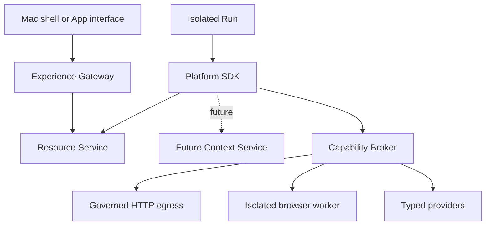

# Resource, Context, and Generic I/O Architecture

Status: Canonical long-horizon boundary; current-release subset profiled below
Last updated: 21 September 2026
Governing decisions: `Current Architecture Decisions.md`

## Acceptance record

This document defines the portable long-horizon data, knowledge, and external-integration boundary. It preserves shapes for bounded aggregation, relationship expansion, Context, governed reusable HTTP Action Profiles, browser providers, and authenticated inbound webhook Triggers without making all of them current-release work.

The contract is deployment-neutral. `../specifications/Current Release Specification.md` alone activates the implementation subset. In the first slice, table and file Resources are authoritative on the Mac and are limited to App-scoped create/get/list/update/delete with optimistic revisions, declared exact-match filters, stable cursor pagination, and Artifact-backed files. The existing qualified HTTP/API profile and general browser operations support outbound web work. App browser runs can use dedicated authenticated Connections and local schedules. Typed text and deliberate file attachment remain the initial Assistant/Build input adapters; runtime browser evidence does not activate ambient browser-history capture. The separate v0 Task Runner uses selected inputs and a fixed platform tool profile rather than this generated-App SDK; non-trivial parsing runs through its registered parser helper. Aggregation, relationship expansion, Resource Transaction Domains, a general migration framework, shared Context/memory, additional connector/HTTP profiles, and hosted webhook ingress remain inactive until qualified. Local scheduling and the BrowserProvider are first-usable-release requirements under `../specifications/Local_Automation_and_Platform_Extension_Profile.md`.

It refines accepted principles without changing the product thesis:

- users create horizontal, custom Apps rather than choosing from one vertical product;
- generated code remains flexible inside its managed runtime boundary; the same-user local prototype does not claim hostile-code containment;
- mutable data, Context, credentials, and external effects stay behind platform-owned interfaces;
- ordinary users see Data, Files, Knowledge, and Connections rather than storage engines, transaction domains, retrieval pipelines, or egress proxies.

## Executive recommendation

Preserve one small Python SDK namespace with three eventual runtime families:

1. **Resources** for authoritative App-owned tables and files-active in the minimal first-release profile;
2. **Context** for bounded, read-only, provenance-preserving user, Workspace, and App knowledge-a post-v0 memory-track seam;
3. **Capabilities** for governed external operations-named model routes, the existing qualified HTTP profile, and general browser operations with protected Connections and reviewed effects are first-release scope; additional HTTP/connector profiles follow qualification.

Input acquisition sits above this SDK. Trusted platform `InputAdapter` implementations emit normalized Observations into the context and intent layer; generated Apps and Runs do not receive capture APIs. The exact adapter and Observation boundary is defined in `Input Memory and Procedure Architecture.md`.

The critical design choice is not to limit what an App may represent. It is to make every generated-App interaction cross a typed boundary with an exact Release binding, short-lived Run authority, finite limits, and evidence. One-off Tasks use their own exact Attempt execution snapshot and do not forge a Release binding to access this SDK.

The portable boundary should therefore:

- support ordinary create/read/update/delete without exposing SQL or database credentials, and leave gated room for later aggregation, relationship expansion, and search;
- leave a future path for bounded atomic work across declared tables without requiring a Resource Transaction Domain in v0;
- allow the current narrow allowlisted HTTP fixture and later policy-qualified unfamiliar APIs without requiring a bespoke connector for every service;
- reserve browser automation for rendered, interactive, or session-dependent web behavior;
- preserve authenticated external-event contracts through platform-managed webhook Triggers without exposing an App server when a deployment profile enables hosted ingress;
- treat Context as selected evidence, never as ambient global memory;
- preserve immutable content and revision history for files and Context;
- stop unsupported breaking schema changes at publication rather than attempting a premature general migration platform;
- keep App-to-App data access, anonymous endpoints, and general public Apps deferred until their user and authority models are designed.
- keep observation capture, memory derivation, and governed action as separate authority paths;
- allow local or named remote processing based on capability and usability, while keeping canonical state local by default and prohibiting silent route changes.

## 1. Design goals

### Required outcomes

Across the roadmap, the boundary should support these fixtures without changing authority ownership. File processing, optional custom interfaces, local recurring collection, and public/authenticated browser work are first-release obligations. Broader memory, connector, and webhook portions remain later:

- a scheduled website monitor that stores and searches changing records;
- an uploaded-file reconciliation App that writes several related tables atomically;
- an assisted-outreach App that reads approved knowledge, drafts content, and requests approval before an external effect;
- an App integrating an unfamiliar JSON API without a platform-specific connector;
- a custom interface that reads and edits permitted App data through the App UI Bridge;
- an interactive or authenticated browser task when ordinary HTTP is insufficient.
- later on-demand screen or voice context that can be converted into bounded evidence without becoming App state or execution authority.

### Product constraints

- The Builder decides schemas, interfaces, and implementation details from user intent.
- The user should not need to choose a database, vector store, HTTP client, transaction strategy, or browser engine.
- The App package declares logical requirements. The Release binds concrete Resources, Context Sources, Connections, providers, constraints, and Grants.
- The Run receives opaque handles and typed clients, never infrastructure credentials.
- Every result remains attributable to the App Version, Release resolution, initiating Principal, Run, and operation.

### Explicit platform non-goals

- arbitrary SQL, database drivers, or user-managed database credentials;
- a general data warehouse or analytics engine;
- cross-Workspace transactions;
- implicit cross-App data access;
- automatic breaking data migrations;
- writable autonomous memory;
- passive screen or audio capture, automatic Procedure mining, and proactive ambient memory;
- unrestricted internet sockets;
- a connector catalogue as a prerequisite for API access;
- anonymous or unverified inbound endpoints;
- E4 payments, trades, legal commitments, security administration, physical control, or unrestricted mass outreach.

## 2. User model and internal model

| User-facing concept | Internal contract |
|---|---|
| Data | Versioned table Resource with generated views and schema |
| Files | Versioned file-store Resource backed by immutable blobs |
| Knowledge | Permissioned Context Source and immutable snapshot |
| Shared input | Trusted text, file, and later screen or voice Observation with provenance, classification, consent, and retention |
| Connection | External account identity plus brokered authorization; never the secret itself |
| Import | Quarantined Artifact validated and explicitly committed into a Resource or supplied to a Run |
| Export or report | Immutable Artifact delivered through a short-lived download handle |
| Search | Bounded Resource query or disposable search projection |
| App access | Release-bound Grant and current authorization, hidden behind plain-language access review |

The Builder may reason in technical terms. The ordinary product should translate the result into statements such as:

> This App can read and update its Customers and Follow-ups data, read your approved writing preferences, call api.example.com, and open the connected browser session. Sending a message still requires your approval.

## 3. Boundary model



The UI and Run paths use different short-lived identities but converge on the same authoritative owners. Neither path reaches a database, object store, browser profile, credential vault, or external service directly.

## 3A. Observation ingestion boundary

Input adapters are trusted shell or platform components that acquire one explicitly permitted signal and emit a normalized Observation. v0 implements only typed text and deliberately attached files and may project them into Build intent, Artifact, and evidence records. Later adapters may add one-shot screen snapshots, push-to-talk voice, visible watch sessions, browser context, or connected-source events.

The boundary follows five rules:

1. An adapter records source, provenance, classification, consent, processing route, and raw-retention behavior before downstream reasoning.
2. Adapter content is untrusted evidence. It cannot alter the instruction hierarchy, grant a permission, approve an effect, or promote itself into Context.
3. The Context and intent layer may derive an Episode, Memory Claim, or Procedure, but every derivative retains exact source edges and review state.
4. A proposed App, Workflow, or Agent is created through the normal Builder, Version, Release, and validation lifecycle.
5. Any action uses a normal Run and Capability operation. Capture permission is never reused as action authority.

Raw capture and derived knowledge have independent retention. The platform should prefer local extraction and redaction when quality is sufficient, but may use a named remote route when that materially improves usefulness and the disclosure is explicit. There is no silent local-to-remote fallback.

## 4. Resource contract

### 4.1 Resource identity and binding

An App Version declares a logical Resource reference. Publication creates or reuses an environment-specific managed Resource and records the exact binding in the immutable Release Resolution Record.

The layers remain separate:

| Layer | Contains | Mutable? |
|---|---|---|
| Source App Manifest | Logical Resource name, kind, schema reference, classification hint, and requested operations | No after App Version sealing |
| Resolved App Manifest | Canonical schema digest, fixed App scope, retain lifecycle, and required service interface | No |
| Release Resource Binding | Managed Resource ID, binding revision, provider compatibility, exact schema, classification, and access modes | No |
| Resource | Stable identity, current schema pointer, lifecycle, retention, and transaction domain | Yes through its owner |
| Resource contents | Versioned records or file namespace revisions | Yes through the SDK |
| Run handle | Short-lived opaque authority for exact operations | Expires or is fenced |

Releasing a new App Version never copies or embeds live data. Rolling back a Release changes implementation selection; it does not reverse Resource mutations.

### 4.2 Current Resource kinds

Only two kinds are required:

| Kind | Purpose | Authoritative unit |
|---|---|---|
| `table` | Structured records, drafts, exceptions, histories, relationships, and App state | Versioned record |
| `file-store` | Uploaded or generated files organized under App-owned paths | Versioned path pointing to immutable content |

Additional kinds such as streams, queues, vector indexes, graphs, or external databases are deferred. Search indexes and embeddings are rebuildable projections, not additional authoritative Resource kinds.

Every Resource is scoped to one Workspace, App, environment, authoritative placement, classification envelope, retention class, and provider binding. A hosted profile may add a home region. The prototype does not permit one Resource to be directly owned by several Apps.

### 4.3 SDK surface

Generated Python uses logical Resource references rather than provider identifiers. The active v0 operations are:

| Family | Operations | Notes |
|---|---|---|
| Metadata | `describe` | Returns safe schema, limits, and current revision metadata; never infrastructure details |
| Record read | `get`, `list` | Bounded, authorized, schema-aware, exact declared filters and stable cursor pagination |
| Record write | `create`, `update`, `delete` | Writes use idempotency and optimistic concurrency |
| File namespace | `stat`, `list`, `put`, `open`, `delete` | Paths map to immutable content revisions |
| Transfer | `create_upload`, `create_download` | Produces time-bound, operation-specific handles |

The surface is intentionally CRUD-capable but not SQL-shaped. `count`, aggregation, richer query operators, relationship expansion, search, upsert, batch, copy, multi-table transaction handles, and provider-neutral cloud execution are inactive portable seams, not v0 SDK methods. Provider-specific functions, connection strings, physical table names, bucket paths, presigned credentials, and object-store keys are not visible to App code.

### 4.4 Table record envelope

The platform owns a stable envelope around the Builder-defined payload:

```json
{
  "recordId": "rec_...",
  "resourceRef": "customers",
  "schemaVersion": "3",
  "recordRevision": 8,
  "createdAt": "2026-09-17T10:00:00Z",
  "updatedAt": "2026-09-17T10:05:00Z",
  "createdBy": {"runId": "run_..."},
  "updatedBy": {"principalId": "user_..."},
  "sourceRef": {"kind": "artifact", "id": "art_..."},
  "classification": "internal",
  "payload": {}
}
```

The App schema controls `payload`. The platform controls identifiers, revisions, timestamps, provenance, classification, and deletion metadata. Generated code cannot forge the platform envelope.

Relationships may store stable record IDs in declared fields, but v0 does not implement automatic expansion, transaction-domain referential checks, or cross-App/provider foreign keys.

### 4.5 Query contract

The v0 `list` operation permits projection of declared fields, equality or bounded `in` matching on profile-declared filterable fields, sorting on one declared stable key, stable cursor pagination, and explicit row/byte/time ceilings. Every read is automatically constrained to the authorized Workspace, App, environment, Resource, classification, and visibility; a caller cannot override those filters. Offset pagination, arbitrary boolean expressions, ranges, joins, aggregation, grouping, relationship expansion, and full-text or semantic search are not active.

Later profiles may add those operations one at a time behind named schemas, independent limits, authority checks, and acceptance fixtures. Search projections remain non-authoritative, and no future query form may cross App or Workspace authority implicitly.

### 4.6 Write and concurrency rules

- `create` accepts a caller-generated operation key and returns the stable record identity.
- `update` and `delete` require `expectedRevision` unless a separately granted unconditional operation is used.
- v0 does not expose `upsert`, multi-record `batch`, or a transaction handle; callers use explicit operations and durable Run recovery where a multi-step sequence can partially complete.
- retries reuse the same logical operation ID and cannot duplicate a committed mutation.
- deletion is a logical tombstone first; retention and purge remain platform-owned lifecycle operations.
- generated code may raise classification but cannot lower it.

Conflicts return a typed `revision_conflict` with current safe metadata. The App may re-read and retry inside its overall Run and cost limits; the Resource Service never silently overwrites a newer revision.

### 4.7 Reserved Resource Transaction Domain seam

Resource Transaction Domain is retained as portable vocabulary for a later profile; v0 creates no domain object and exposes no transaction handle. When evidence requires bounded multi-table atomic work, a profile may bind compatible table Resources to one hidden placement and atomicity boundary without making it user-facing.

A future transaction profile must:

- is bound to one Workspace, App, environment, authoritative placement, provider, and transaction domain;
- accesses only tables declared in the Entrypoint execution closure;
- has strict duration, record-count, byte, and operation limits;
- permits record reads, queries, and writes through a transaction handle;
- supports optimistic revisions and stable operation IDs;
- commits atomically or aborts completely;
- cannot include file content, Context, model calls, HTTP, browser work, approvals, or any external effect;
- cannot remain open while awaiting user input or network work.

Apps perform external work before or after a transaction and coordinate multi-step behavior through a durable Run or saga. This avoids pretending that an external API and the internal database can participate in one transaction.

### 4.8 Schema compatibility

v0 uses conservative structural compatibility. The following matrix is proposed:

| Change | v0 classification | Publication behavior |
|---|---|---|
| Add optional field | Backward compatible | Permit after validation |
| Add non-unique index | Operationally compatible | Permit as a durable provider operation; activation need not wait when queries remain valid |
| Change display label, help text, or UI hint | Presentation compatible | Permit |
| Tighten classification | Authority-affecting, data compatible | Re-resolve access and model/provider eligibility before activation |
| Add required field | Breaking | Block until an explicit migration is designed and rehearsed |
| Remove or rename field | Breaking | Block |
| Change type, format, units, or semantic meaning | Breaking | Block |
| Narrow or widen enum values | Breaking in v0 | Block; avoids surprising old readers |
| Add or change uniqueness/reference constraint | Breaking | Block and require explicit migration |
| Lower classification | Governance change | Require trusted human declassification; never inferred from schema |

Old records may omit a newly optional field. The SDK returns absence rather than silently manufacturing a value. Presentation defaults may exist in the UI; authoritative data defaults require an explicit write or migration.

Breaking evolution remains a preserved seam, not a hidden v0 feature. A future migration registers a new immutable schema, transforms data through a durable operation, validates it, and switches the Resource pointer only after success. Release activation never starts an unbounded migration automatically.

### 4.9 File-store semantics

A file-store is a mutable namespace over immutable content blobs:

- the logical path uses normalized Unicode, forward slashes, and case-sensitive comparison;
- absolute paths, `..`, empty segments, control characters, reserved platform prefixes, and ambiguous normalization are rejected;
- directories are virtual prefixes rather than independently mutable objects;
- `put` creates a new path revision and immutable content digest;
- replacement requires the expected path revision unless unconditional overwrite is separately granted;
- deleting a path creates a tombstone; referenced historical content remains until retention permits purge;
- `copy` creates another namespace revision referencing the same immutable content when policy and classification allow it;
- media type, size, classification, malware status, source, and digest are platform metadata;
- large transfers use short-lived handles while authorization is established by the trusted service, not by possession of a URL.

An upload first becomes a quarantined Artifact. After media validation, malware inspection, classification, and authorization, it may be committed into a file-store or supplied as a Run input. A generated report remains an Artifact unless the App explicitly stores it as durable mutable App data. This prevents evidence, temporary uploads, and canonical files from becoming the same object accidentally.

### 4.10 Limits and metering

Every Release binding fixes ceilings for:

- record count and storage bytes;
- request, transaction, batch, and query size;
- query duration and concurrent operations;
- file size, total file-store bytes, and transfer rate;
- projection and full-text indexing allowance;
- retention and version-history class.

Workspace and platform ceilings may reduce these values at operation time. Exceeding a hard ceiling returns a typed error and records a metering event; it never triggers an automatic paid expansion or silent partial write.

## 5. Future Context contract seam - inactive in v0

This section preserves the intended authority and provenance shape for the post-v0 memory track. The current release has durable Assistant Turns, Task results, App Resources, and Artifacts, but no shared Context Service, retrieval index, Context SDK, memory promotion, or cross-object injection. Nothing below is a current repository module or acceptance requirement until the memory gate opens and a focused contract is accepted.

### 5.1 What Context is

Context is permissioned, reviewed evidence supplied to a Build, Run, Assistant response, or model step for one declared purpose. It is not App state, policy, a database shortcut, raw observation history, or a continuously injected copy of everything known about the user.

The future initial Context profile may contain three readable scopes:

1. **User** - stable preferences and user-approved guidance;
2. **Workspace** - terminology, brand guidance, operating guidance, and approved knowledge;
3. **App** - App instructions, curated knowledge, and correction history.

Project, Agent, cross-App, and autonomous writable memory remain deferred. An App's Resource does not become Context merely because it is in the same Workspace.

Later Observation, Episode, Memory Claim, and Procedure records are upstream evidence and derivation objects. They do not become Context automatically. A trusted user or policy-mediated promotion creates a Context Revision with source edges, confidence, and review state.

### 5.2 Source, revision, request, and snapshot

| Object | Purpose |
|---|---|
| Context Source | Stable container with scope, owner, classification, retention, and access policy |
| Context Item | Stable logical preference, instruction, document, or claim |
| Context Revision | Immutable content or Artifact reference plus provenance, time, compatibility, and confidence |
| Context Request | App declaration of scope, selector, purpose, required flag, freshness, and maximum result size |
| Context Snapshot | Immutable record of the exact selected revisions, retrieval strategy, policy, and digests used by one Build or Run |

The App declares what it needs. The Release binds that logical request to exact eligible Sources and either `pinned` or `latest-compatible` revision behavior. The Context Service makes the final selection at Build or Run start and records an immutable snapshot.

### 5.3 Selector and retrieval modes

The minimum Context Request supports:

- exact key or namespace selection for preferences and instructions;
- metadata filters for approved document collections;
- optional bounded query text supplied by the Entrypoint;
- required classification ceiling and freshness;
- maximum items, tokens, and bytes;
- required or optional behavior when nothing eligible is found.

Retrieval proceeds in a fixed order:

1. authenticate the Build or Run and authorize the declared purpose;
2. constrain eligible Sources and revisions by Workspace, Release binding, scope, selector, classification, freshness, revocation, and region;
3. resolve exact keys deterministically where requested;
4. for searchable document collections, run a bounded lexical and semantic candidate search;
5. optionally rerank only the authorized candidate set through a Release-bound model route;
6. apply item, token, byte, diversity, and confidence limits;
7. return content with citations and create the immutable Context Snapshot.

Hybrid search is an implementation strategy, not an App-facing promise. The snapshot records the retrieval-policy revision, query digest, selected Context revision IDs, and any ranking-model identity required for later explanation. Embeddings and indexes remain disposable projections.

### 5.4 Instruction and evidence separation

Context content can contain malicious or mistaken instructions. The service therefore labels every returned item as one of:

- trusted platform instruction;
- Workspace or user instruction;
- App instruction;
- reference evidence;
- untrusted external content.

External documents are reference evidence by default. Their text cannot grant authority, override platform or Workspace policy, alter the App's instruction hierarchy, approve an action, or promote itself into durable memory.

Prompt assembly happens in a trusted service immediately before the bound model call. The model receives only the selected content allowed by the model route's classification and region rules. Protected raw content is not copied into general logs; the snapshot retains references and digests, with content retention governed separately.

### 5.5 Future read-only initial profile and correction

When this track begins, generated Apps and model steps will not write Context directly. They may:

- write ordinary App data to Resources;
- emit a correction suggestion or candidate preference as a typed Artifact or user task;
- ask the trusted interface to open a Context-management surface.

A human may accept, edit, reject, revoke, or delete a suggestion through the trusted shell. Acceptance creates a new Context Revision with provenance. Derived claims record confidence and source edges and never silently become user facts.

This keeps the first product useful without creating an autonomous memory system whose mistakes propagate across every App.

### 5.6 Freshness, revocation, and failure

- `pinned` bindings select exact approved revisions and fail if policy makes them unavailable.
- `latest-compatible` bindings select the newest eligible revision at snapshot time.
- `required: true` fails the Build or Run before execution when no eligible Context exists.
- `required: false` continues with an explicit `context_unavailable` event and empty result.
- revocation immediately blocks new snapshots and may cancel active work according to classification and policy.
- an existing historical snapshot remains part of the audit record even when its content later becomes unavailable; access to the content is re-authorized at view time.
- deleting a Source follows the accepted retention and evidence rules rather than rewriting historical receipts.

### 5.7 User controls

The trusted Mac shell exposes Knowledge through plain-language controls:

- which Apps may use a Source;
- what the Source contains and who owns it;
- why an App requested it;
- classification, freshness, and last update;
- recent Apps and Runs that used it;
- correction, revocation, and deletion state.

The generated App UI may display cited Context results but cannot reproduce these governance controls or broaden access.

## 6. Generic governed I/O

The first usable release retains the bounded allowlisted public-HTTP profile and adds general browser operations with protected authenticated Connections and approved browser effects. Both can serve locally scheduled Apps after their profile gates pass. Generic authenticated/write HTTP Action Profile execution, and inbound webhook ingress remain inactive. The browser and scheduler requirements are current scope under `../specifications/Local_Automation_and_Platform_Extension_Profile.md`; other broad integration rules below remain future profiles.

### 6.1 Selection rule

Use the narrowest sufficient mechanism:

| Need | Mechanism |
|---|---|
| Ordinary public or authenticated HTTP API | Generic governed HTTP |
| Static page retrieval that does not require rendering or interaction | Generic governed HTTP |
| Rendered JavaScript page, multi-step form, interactive navigation, or browser session | Browser Capability |
| Common consequential operation with known semantics, such as sending email | Dedicated typed Capability |
| High-impact or semantics that cannot be normalized safely | Deny in v0 or require a future dedicated provider |

The Builder may choose among these mechanisms, but Release resolution and registry policy determine whether the request can be authorized.

### 6.2 Generic HTTP binding

A Release-bound HTTP Capability fixes:

- exact hostnames, reviewed domain patterns, or a versioned user-configured destination set authorized by the Release;
- permitted schemes and ports;
- method set and optional normalized path templates;
- redirect destinations and maximum redirects;
- allowed request headers and content types;
- request, response, decompressed-body, timeout, rate, call, and cost limits;
- optional Connection and reviewed authentication placement;
- data-classification and destination policy;
- inline-body and Artifact thresholds;
- evidence, retention, and redaction rules;
- effect class, execution mode, idempotency requirements, and approval minimum.

Runtime inputs may choose only values inside those constraints. They cannot introduce a new host, broaden a path, weaken TLS, add arbitrary credential-bearing headers, or raise limits. A user may add a destination through trusted configuration without rebuilding the App, but the configuration revision receives the same destination-policy and access review before it becomes effective.

### 6.3 Request and result contract

The App-facing request contains only operation data:

```json
{
  "method": "GET",
  "path": "/v1/records",
  "query": {"updated_after": "2026-09-01T00:00:00Z"},
  "headers": {"accept": "application/json"},
  "body": null,
  "idempotencyKey": null
}
```

The host and Connection come from the binding, not an arbitrary full URL, unless the binding explicitly permits a bounded URL template. The Broker normalizes the request, applies policy, and sends it through trusted egress.

The normalized result includes:

- status and approved response headers;
- a small inline body or immutable Artifact reference;
- content type, length, digest, and truncation flag;
- final destination after redirects;
- operation and evidence references;
- cost, timing, and retry metadata;
- a typed error when policy, transport, provider, validation, or budget fails.

Raw provider cookies, authorization headers, platform headers, internal addresses, TLS internals, and credentials are never returned.

### 6.4 Trusted egress processing

Before connection, the trusted HTTP provider:

1. validates Run identity, execution closure, Release binding, Grant, budgets, and current revocation;
2. validates the request schema and canonicalizes scheme, host, port, path, query, and headers;
3. resolves DNS through the trusted resolver and blocks private, loopback, link-local, multicast, reserved, metadata, and platform infrastructure addresses;
4. rechecks the actual connection target and TLS identity;
5. injects credentials only at the approved location and origin;
6. enforces upload and request-body limits;
7. performs the request with a finite timeout and retry policy;
8. revalidates every redirect and never forwards credentials to an unapproved origin;
9. limits compressed and decompressed response sizes and validates media type;
10. scans, quarantines, or redacts content as policy requires;
11. validates a declared response schema when present;
12. writes the immutable Capability receipt and returns the normalized result.

Arbitrary TCP, UDP, DNS, SSH, database protocols, and sandbox-side proxies remain unavailable. Future protocols require registered Capability definitions rather than a raw socket escape hatch.

### 6.5 Authentication

Connections define the external account and approved authentication template. The credential broker may inject:

- an authorization header;
- a specific reviewed custom header;
- a bounded query field when unavoidable;
- a client certificate;
- an OAuth access token minted for the exact provider and scopes.

Generated code sees only the logical Connection reference. It cannot read, print, transform, or export the durable secret. Authentication is never forwarded across an unapproved redirect. A Connection can be revoked or rotated without editing the App package.

### 6.6 Effect and approval classification

HTTP method alone is insufficient to determine risk. A `GET` may trigger an effect in a poorly designed API, and a `POST` may be a read-only query. The binding therefore records reviewed endpoint semantics where known and applies a conservative fallback when unknown.

| Operation | Portable default treatment; only the first row is active in v0 |
|---|---|
| Public, declared read with no Connection | E0; inline or durable based on duration |
| Authenticated read | E1; publication or first-use consent and protected evidence |
| Bounded reversible write described by an approved HTTP Action Profile | E3 and durable; first-use may be permitted inside exact profile limits, while policy may raise matching operations to exact approval |
| Generic write without an approved Action Profile | E3; durable, exact approval, idempotency or reconciliation required |
| Delete, publish, send, or unknown external write semantics | E3; durable, exact approval unless a trusted typed definition establishes narrower semantics; idempotency or reconciliation required |
| Payment, trade, legal commitment, security policy, physical control, unrestricted mass action | E4; deny in v0 |
| Operation whose material target or effect cannot be normalized for approval | Deny generic HTTP; require a dedicated typed Capability or reject |

A dedicated typed Capability may provide safer target normalization, provider-native idempotency, precise approval text, stronger reconciliation, and a lower risk classification where justified. It improves safety and experience; it is not required merely because an API is unfamiliar.

### 6.7 Governed HTTP Action Profiles

A recurring integration should not require the user to approve the same well-understood operation forever merely because the platform has no bespoke connector. The Builder may therefore propose a Workspace-and-App-scoped HTTP Action Profile for trusted review.

The immutable profile defines:

- one bounded request family through the exact destination binding, method, and normalized path template;
- constrained path and query fields, denied redirects, request and response schemas, and explicitly forbidden body fields;
- the plain-language effect and material target fields shown to the user;
- idempotency placement or reconciliation behavior;
- maximum calls, batch size, affected objects, data volume, and time window;
- eligible Connection and data-classification ceiling;
- known reversibility or compensating action;
- baseline approval behavior and any threshold that raises matching calls to operation approval.

The Builder may propose this description but cannot certify its own risk or trusted permission summary. The trusted registry and policy layer validates the profile, and the user approves it during Access review or first use. The Release then binds the exact profile digest. Calls outside its endpoint, schema, targets, fields, limits, or approval conditions fail closed and cannot reuse the profile approval.

A profile does not contain executable provider code and is not a product-specific connector. It is a typed, governed description of one custom HTTP action. When the material effect still cannot be normalized, the platform continues to require exact operation approval or denies the call.

The exact candidate, approved-record, Release-binding, per-operation matching, delivery-safety, reversibility, threshold, user-summary, and canonicalization rules are normative in `../specifications/contracts/HTTP Action Profile.md` revision 2 and `../specifications/contracts/http-action-profile.schema.json`.

### 6.8 Browser Capability

Browser work uses a separate isolated browser worker and protected browser-profile boundary. Generated code submits typed operations such as navigate, inspect, extract, fill, click, upload, download, and capture evidence.

Rules:

- prefer HTTP when rendering and interaction are not required;
- bind the browser profile and allowed destinations in the Release;
- keep cookies and session material outside App code and model context;
- classify navigation and read-only extraction separately from actions that may submit, publish, delete, purchase, message, or change external state;
- require approval before a normalized consequential action;
- when the effect of an element or page state cannot be determined safely, stop, request supervised experimental handling, or reject;
- preserve screenshots, DOM excerpts, target identity, and resulting state as bounded evidence;
- never treat a provider pause or browser process as durable truth; the platform must be able to reconstruct or fail visibly.

Browser automation expands breadth but does not become a way to bypass HTTP destination policy, credential brokering, effect classification, or E4 exclusions.

### 6.9 Authenticated inbound webhook Triggers

The stable contract supports narrow authenticated webhook Triggers even though App interfaces remain Workspace-member-only. When a hosted or private ingress provider is enabled, the platform-not generated App code-owns the internet-facing endpoint. The first external local-first prototype may defer that provider and use manual actions, local schedules, polling, or imports instead.

Each webhook Trigger has:

- one opaque, rotatable platform endpoint;
- a Release-bound verification profile using HMAC, OAuth, a reviewed bearer secret, mutual TLS, or a registered provider signature;
- secret material held through a Connection rather than the manifest or handler;
- authenticated JSON POST, external payload schema, typed Entrypoint input schema, maximum bytes, rate, and source constraints;
- identity or compiler-validated declarative payload-to-input normalization;
- timestamp tolerance, nonce or provider delivery identity, replay protection, and occurrence deduplication;
- quarantine and evidence rules for malformed or suspicious content;
- an exact mapping to one declared job Entrypoint.

The ingress authenticates, validates, and safely normalizes the event, durably records one Trigger occurrence, acknowledges receipt without running generated code in the request path, and asks Run Control to create a normal Run. Delivery is at least once. Provider delivery identity is preferred; a bounded payload digest may be selected when no stable identity exists. Deduplication reduces repeated Runs but is not an exactly-once guarantee. The Run records the external sender metadata, Trigger binding, payload Artifact or validated input digest, Release, and effective service identity.

Anonymous forms, synchronous user-defined HTTP responses, arbitrary public routes, and general internet-facing App servers remain deferred. Webhooks add an authenticated event source; they do not make the App itself public.

The portable and environment-bound forms are normative in App Contract revision 5, Resolved App Manifest revision 4, and Release Resolution Record revision 5, with complete source, resolved, Release, and invalid fixtures.

## 7. Import, export, and App UI boundary

The App UI Bridge does not receive a separate storage back door.

- A user upload creates a scoped upload session through the Experience Gateway.
- The resulting bytes become a quarantined Artifact.
- The App may invoke an Entrypoint with the Artifact handle or explicitly commit validated content to a declared file-store.
- A custom interface queries declared Resource views or invokes normal record commands through the Bridge; the Resource Service re-authorizes each operation.
- Large query and file results use cursors or time-bound transfer handles.
- Export creates an immutable Artifact with provenance, classification, retention, and a short-lived download session.
- Clipboard, local file, or local-folder access uses the typed trusted-local capability boundary and remains visibly user-mediated. A later remote profile may route the same operation through a registered Device Gateway.

`../specifications/contracts/App UI Bridge.md` revision 3 defines the accepted projection: generated Surfaces receive bounded direct reads only, while durable Resource writes use declared Entrypoints rather than a second data model or authority path.

## 8. Failure semantics

The table spans active v0 operations and preserved future profiles. Inactive rows become requirements only when their owning track and contract are enabled.

| Failure | Required behavior |
|---|---|
| Resource authorization or schema mismatch | Reject before provider access; return typed non-retryable error unless Release changes |
| Record revision conflict | No write; return current safe revision metadata for explicit retry |
| Transaction limit or timeout | Abort the complete transaction; no partial commit |
| File scan or classification failure | Keep Artifact quarantined; do not commit into Resource |
| Required Context unavailable or revoked | Fail before Entrypoint execution or before the affected model step |
| Optional Context unavailable | Continue with explicit empty result and evidence event |
| HTTP destination or redirect violation | Stop before sending protected data; record policy denial |
| HTTP timeout or transient provider failure | Retry only within declared policy and idempotency safety; otherwise fail visibly |
| Ambiguous external effect after timeout | Enter reconciliation-required state; never blindly repeat |
| Webhook authentication, replay, schema, rate, or size violation | Reject or quarantine before Run creation; preserve bounded security evidence |
| Browser effect cannot be classified | Stop for supervision or reject; do not guess |
| Budget or quota exhausted | Stop at the hard boundary; preserve committed internal work and exact failure evidence |

## 9. Conceptual Python SDK

The SDK shape is illustrative rather than an implementation commitment:

```python
from platform_sdk import app

customers = app.resources.table("customers")
files = app.resources.files("documents")

page = await customers.list(
    filters={"status": ["active"]},
    order_by="updated_at",
    limit=50,
)

customer = await customers.create(
    payload={"name": "Example Ltd", "status": "active"},
    idempotency_key="import:row-418",
)

updated = await customers.update(
    customer.record_id,
    expected_revision=customer.record_revision,
    payload={"name": "Example Ltd", "status": "reviewed"},
)

report = await files.put(
    "reports/import-summary.json",
    artifact_ref="artifact:sha256:...",
)
```

The v0 generated React/Vite Surface may read safe projections and invoke declared Entrypoints through the App UI Bridge; it does not receive a second Resource authority path. A separate native-view DSL is inactive in v0. Type generation may improve the Builder experience, but runtime validation remains authoritative.


## 10. Validation against breadth

This matrix spans current and future roadmap fixtures. It validates that the boundary can grow without redefining authority; it is not a v0 acceptance list. Current-release acceptance is limited by the release specification and roadmap.

| Fixture or challenge | Resource use | Context use | Generic I/O use | Boundary exercised |
|---|---|---|---|---|
| Website monitor | Table plus optional file-store | Optional API extraction guidance | HTTP for static/API access; browser for rendered/authenticated sites | Schedule, deduplication, evidence, change history |
| File reconciliation | Several tables in one transaction domain plus file-store | Workspace rules or chart of accounts | Optional external API | Upload quarantine, atomic writes, correction |
| Assisted outreach | Draft and prospect tables | User style and Workspace guidance | Typed email send; generic research HTTP | Context provenance, approval, consequential effect |
| Interaction-heavy custom App | Tables and files | Optional App help or rules | None required | App UI Bridge and concurrency |
| Adaptive research App | Results table and Artifacts | Bounded research instructions | Multiple governed HTTP reads and model steps | Budgets, citations, dynamic planning |
| Unfamiliar API | Table | None required | Generic HTTP with user-supplied Connection and optional reviewed Action Profile | Horizontal integration without connector catalogue or repetitive approval |
| Authenticated external event | Table or Run input | Optional App instructions | Platform-managed webhook Trigger | Signature verification, replay protection, durable occurrence, normal Run authority |
| Unsupported payment App | Possible internal draft only | Optional policy evidence | Payment effect denied | Explicit E4 boundary rather than accidental limitation |

This design remains horizontal because none of the core services understands companies, invoices, prospects, outreach, or payments as domain objects.

## 11. Security and governance invariants

1. A logical declaration is never authority.
2. Every Resource, Context, Artifact, Connection, and Capability operation is scoped to one Workspace and exact purpose.
3. Generated code, generated UI, and models never receive storage, database, object-store, browser-profile, or durable credential secrets.
4. All mutable authoritative data writes go through the owning service.
5. Search, embeddings, caches, and previews remain non-authoritative.
6. App data does not become global or cross-App Context implicitly.
7. Context content cannot grant permissions or approve effects.
8. External access has no raw socket escape path.
9. Redirects, DNS, and authentication are checked by trusted egress at operation time.
10. Consequential or ambiguous external actions are durable, approval-gated, reconciled, or denied.
11. Every operation is bounded by time, volume, rate, concurrency, and cost.
12. Revocation and lease fencing stop new authority independently of worker termination.
13. Inbound events are authenticated, replay-protected, validated, and durably recorded before generated code runs.
14. Input adapters never receive Resource-write, Build-publication, Run, or Capability authority.
15. Raw observation, derived claim, approved Context, and authoritative App data remain distinguishable and independently deletable where policy permits.
16. Every material remote processing route records the provider, purpose, data category, processing location, credential owner, cost owner, and user-visible consequence.

## 12. Flexibility assessment

The design is intentionally restrictive about **authority paths**, not **application ideas**.

An App may define arbitrary schemas, write custom Python logic, render a custom TypeScript interface, call a previously unknown HTTP API, operate a browser, use models, process files, and combine those capabilities into new workflows. It does not need a vertical template or connector for each request.

The constraints become visible only where the platform must be able to answer:

- whose data is this;
- may this App access it;
- which exact version and schema apply;
- where may data leave;
- which credential may be used;
- what external effect will occur;
- does a human need to approve it;
- what happened, what did it cost, and can it be retried safely.

The main initial limits are deliberate: no public Apps, no unsupported runtime stacks, no writable ambient memory, no invisible cross-App sharing, and no unsupported high-impact actions. Real generated code may execute locally inside the supported managed runtime. These limits remove high-risk operating modes; they do not force ordinary Apps into predefined business workflows.

## 13. Portable decisions and active v0 profile

- Activate App-scoped `table` and `file-store` Resources first behind one local Resource SDK.
- Limit v0 to create/get/list/update/delete, optimistic revisions, declared exact filters, stable cursors, and Artifact-backed files.
- Keep Resource Transaction Domains, multi-table transaction handles, aggregation, richer query, reference expansion, search, and provider-neutral cloud Resources inactive until an acceptance fixture proves the need.
- Permit conservative additive schema evolution automatically and require explicit migrations for breaking changes.
- Model file stores as versioned namespaces over immutable content and keep Artifact-to-Resource promotion explicit.
- Defer the Context SDK and service to the post-v0 memory track; when introduced, keep it read-only initially and materialize a purpose-bound snapshot for every Build or Run that uses it.
- Preserve permission-first, selector-bounded Context retrieval as a future rule rather than implementing hybrid search now.
- Retain the existing bounded HTTP profile and add current-release general browser Capabilities with protected Connections and governed effects. Local schedules may invoke either qualified route. Broader HTTP profiles remain separately qualified.
- Classify unknown writes conservatively while permitting reviewed HTTP Action Profiles for recurring bounded effects.
- Prefer HTTP for APIs and static retrieval; use browser Capabilities for rendered, interactive, or session-dependent work.
- Support authenticated platform-managed webhook Triggers without exposing generated App servers when the cloud profile is available.

## 14. Alternatives considered

### Give each App a database and credentials

Rejected for v0. It is flexible locally but bypasses Workspace isolation, Release authority, evidence, schema compatibility, transaction policy, revocation, and portability. It also makes generated code compromise equivalent to database compromise.

### Expose arbitrary SQL through a sanitizing proxy

Rejected for v0. SQL parsing is not the only risk; schema discovery, unbounded plans, joins across boundaries, provider coupling, and result exfiltration remain. A bounded query contract covers the target internal-App workload and can later gain safe advanced query forms.

### Make every external API a dedicated connector

Rejected as a universal rule. It creates a catalogue bottleneck and contradicts the horizontal vision. Dedicated providers remain useful for common and high-risk actions.

### Allow Apps to write global memory

Rejected for v0. Incorrect inference, prompt injection, and accidental sensitive-data propagation would affect unrelated Apps. Proposed Context updates remain human-reviewed.

### Treat uploaded files, reports, evidence, and App files as one object type

Rejected. Their mutability, lifecycle, trust, retention, and user meaning differ. Explicit promotion is a small cost for clearer authority and deletion behavior.

### Use browser automation for all web access


  Rejected. It adds latency, cost, fragility, session risk, and ambiguous effects where a constrained HTTP request is clearer and easier to govern.

### Defer all inbound webhooks permanently

Rejected as a permanent architecture rule. v0 does defer inbound webhook operation; a later cloud/automation profile may add narrow authenticated ingress owned by the platform without exposing generated servers or public App interfaces.

## 15. Matters deliberately left to later work

These do not need resolution before accepting this contract:

- the physical database and object-storage products;
- exact default numeric limits, which belong to topology and cost validation;
- general breaking migration syntax and automation;
- Context write APIs, long-term memory graphs, and project/Agent scopes;
- screen, voice, watch-session, and connected-source adapters plus exact Observation payload schemas;
- Episode grouping, Memory Claim promotion, Procedure mining, and proactive suggestion policy;
- cross-App datasets, action APIs, and event subscriptions;
- anonymous ingress, public Apps, synchronous custom endpoints, and public APIs;
- arbitrary query joins and analytical workloads;
- external database Resources;
- general local or private Runner storage providers.

## 16. Acceptance conditions and follow-up specifications

The accepted baseline retains these conservative current-release rules:

- Apps store operational state in their own Resources; shared Context updates and the Context SDK do not exist in v0;
- v0 typed text and selected files may use existing Build and Artifact records, while later sources must enter through the normalized Observation boundary;
- enum, type, semantic, uniqueness, and relationship changes remain breaking until an explicit migration exists;
- aggregation, one-hop expansion, transaction-domain objects, search, and generic migration machinery are inactive;
- the only v0 generic web route is the narrow manually invoked allowlisted read used by the accepted research fixture; generic writes are inactive;
- authenticated webhook forms remain portable future vocabulary and no v0 ingress is operated;
- the only v0 generated Surface is React/TypeScript/Vite through the App UI Bridge, with a trusted fallback for Apps without a Surface.

App Contract revision 5, Resolved App Manifest revision 4, Release Resolution Record revision 5, Capability Protocol revision 6, HTTP Action Profile revision 2, and App UI Bridge revision 3 define the exact accepted portable webhook, Action Profile, deployment, and App-surface forms with reference and invalid fixtures. The current release activates only the subset stated above. Local Resources are authoritative for an 'On this Mac' Release; Cloud Resources become authoritative for a future 'Always available' Release. Every external route is explicit, and later inputs cannot bypass Context or action authority. Numeric limits and provider qualification remain implementation evidence.
