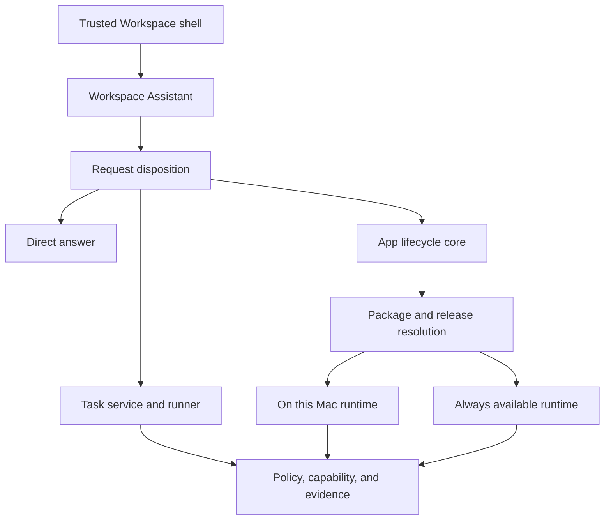
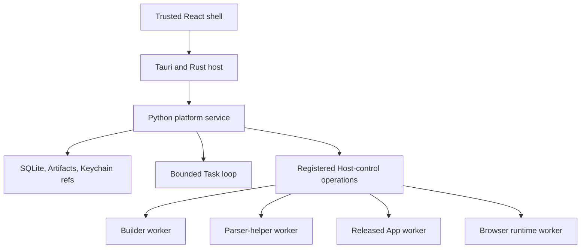

# System Architecture

Status: Canonical
Last updated: 21 September 2026

## Purpose

Define one architecture for a Mac-first agentic workspace in which non-technical users start with an Assistant, can complete bounded one-off Tasks or create and operate reusable Apps, can choose local or cloud deployment per App, and can later evolve the same foundation into a user-controlled procedural second brain.

The architecture is independent of a particular model provider, cloud vendor, coding agent, or industry use case.

## Architectural position

The Assistant has three initial request dispositions: answer without execution, execute a one-off Task, or create or change an App. Apps have one portable product model and two Release targets:

- 'On this Mac': execution and persistent product data are local;
- 'Always available': execution and persistent product data are cloud-hosted.

Remote AI calls are permitted in either target. Deployment controls where the App runtime and its durable state live; it does not imply that every dependency is offline.

The first implementation builds a local platform-owned Task Runner and the local App target. The cloud target is designed into interfaces but is not operated until the local Task and App lifecycles have proven useful. Workspace Context and memory have a separate placement boundary and do not wait for cloud App deployment.

## General-purpose local release and platform portability

The first usable release includes local recurring execution and general browser operation, including user-connected authenticated sessions. App/workflow goals are open-ended; supported runtime and permission boundaries are explicit. A custom UI is optional. Retain intent, rules, correction rationale, and run evidence alongside generated code.

macOS ships first; Windows is a required later target. Core, App contracts, schedules, browser-provider semantics, and React interfaces remain shared. Credentials, private IPC, process trees and containment, paths, startup/sleep behavior, native file access, and distribution use platform adapters. Shared tests run on Windows early; Windows-native product qualification remains later. See '../specifications/Local_Automation_and_Platform_Extension_Profile.md'.

## Core invariants

1. The Assistant is the primary entry point; the user is not required to choose an implementation object first.
2. Task is the durable one-off execution object; App is the primary durable reusable execution object.
3. A Task Attempt never requires a hidden App, Version, Release, or Entrypoint.
4. One App Version is portable across deployment targets.
5. A Release binds an exact Version to one target, Resources, Connections, policies, runtime, and schedules.
6. Task Attempts, Builds, and Runs are durable, observable, cancellable records.
7. Corrections and repairs create Task revisions or candidate App Versions; they do not rewrite historical execution.
8. Mutable App data remains outside immutable App Versions.
9. Generated code may run locally, but receives no undeclared durable credential or ambient access through the platform.
10. Generated UI uses a typed App UI Bridge and never connects directly to platform storage, secrets, or native APIs.
11. Consequential external effects pass through current policy and approval.
12. Task Runner authority, Builder authority, released-App authority, and human authority are distinct.
13. Deployment location, persistent-data location, provider, credential owner, and billing owner never change silently.
14. Input collection, derived memory, App modification, desktop action, and other action authority remain separate.
15. Thin vertical slices establish evidence before new collection, distribution, or autonomy boundaries are enabled.

## Topology

The diagram shows logical ownership, not a required number of services. The local prototype implements those owners through a Tauri host and one modular Python platform service, with separate child-process groups for Builders, disposable parser helpers, and generated Apps. The cloud profile may extract the same owners into managed services when availability, trust, or scale requires it.

## Concrete v0 technology baseline

| Layer | Selected implementation | Boundary |
|---|---|---|
| Mac host | Tauri 2 and Rust | Native windows, narrowly scoped Tauri commands, file selection, Keychain, updates, top-level process supervision, and local-service mediation |
| Trusted shell UI | React, TypeScript, and Vite | Assistant, Task, App, Activity, permission, deployment, and recovery surfaces; no direct database or arbitrary shell access |
| Platform service | Bundled Python 3.13 service using FastAPI/Pydantic interfaces | Assistant routing, Task and App domain services, persistence, validation, model adapters, Build orchestration, Resources, and evidence |
| Local IPC | Versioned HTTP/event protocol over a private Unix-domain socket | Rust host is the browser-facing mediator; generated interfaces and ordinary local web pages cannot call the platform service directly |
| Task model plumbing | Pydantic AI core behind a platform 'ModelProvider' interface | Structured output, streaming, and fixed typed tools only; platform lifecycle and authority remain canonical |
| File parsing | Registered disposable parser-helper profile | Non-trivial PDF, Office, archive, image, native-library, and conversion work runs with one selected input and finite resource/output limits outside Core |
| Builder | 'BuilderHarness' interface; DeepSeek Harness first candidate and OpenCode comparator | Per-Build home and workspace, normalized events, pinned version, no publication or runtime authority |
| Generated backend | Python 3.13, FastAPI, Pydantic 2, Uvicorn, 'uv', and 'uv.lock' | Separate supervised App process using only the versioned platform SDK and resolved execution closure |
| Generated interface | React, TypeScript, Vite, pnpm lock, and the platform component kit | Static assets in an isolated generated surface; all privileged operations use the App UI Bridge |
| Local state | SQLite control ledger, per-App SQLite Resource stores, content-addressed Artifact files, and Keychain secrets | Generated code receives logical handles rather than paths, database connections, or credentials |
| Verification | Pytest and Ruff for Python, Vitest and Playwright for TypeScript, Cargo tests for Rust, and contract fixtures | A Version cannot be sealed unless its required profile checks pass |

Exact patch versions are repository locks, not architecture prose. A runtime-profile revision changes them only after clean installation, Build, Run, recovery, and packaging tests. External test packages include or install every managed runtime through a signed and hash-verified product flow; the user does not prepare a developer environment.

### Local process topology

The Rust host starts and monitors the platform service and is the final operating-system supervisor for Builder, parser-helper, App, and browser-runtime workers. The Core owns desired lifecycle and names only registered worker profiles through the private Host-control protocol; it cannot ask Rust to execute an arbitrary binary path. Workers have separate process groups, bounded launch descriptors, working directories, environment allowlists, runtime homes where applicable, logs, cancellation, and cleanup. The parser helper additionally has no network or shell authority. The initial local Builder/App worker boundary is operational separation, not hostile-code containment: those workers still execute under the signed-in macOS user. Internal testing therefore uses non-sensitive data. Broader or higher-risk distribution requires a separately qualified containment boundary or an explicit narrowed capability envelope.

## Core domain objects

| Object | Responsibility |
|---|---|
| Workspace | User or team boundary for Tasks, Apps, policy, Connections, Resources, and later shared context |
| Task | Stable one-off outcome and lifecycle root |
| Task Revision | Immutable instructions, selected input references, constraints, expected output, classification, and provenance |
| Task Attempt | One attributable execution of one exact Task Revision through a named execution profile and authority snapshot |
| App | Stable user-facing identity and purpose |
| Build | Reusable construction or repair process |
| App Version | Immutable package containing source, compiled assets, schemas, dependencies, tests, and metadata |
| Release | Binding of one Version to one deployment target and concrete authority |
| Entrypoint | Typed operation exposed by an App |
| Trigger | Manual, scheduled, event, webhook, or later observed invocation source |
| Run | One App execution of one Entrypoint against one exact Release |
| Run Event | Ordered evidence of state changes, actions, model calls, approvals, costs, and failures |
| Resource | Mutable App-owned table, file area, index, queue, or configuration store |
| Artifact | Immutable Task Attempt, Build, or Run output and evidence |
| Connection | Platform-held access to an external service or authenticated browser profile |
| Capability | Typed operation against a platform, device, browser, or external system |
| Grant | Scoped authority for a Principal and exact Task Attempt or App Release to use a Capability |
| Observation | Later user-authorized input with source, provenance, classification, and retention |
| Memory Claim | Later derived and reviewable retained assertion linked to evidence |
| Procedure | Later reviewable description of repeated work; it grants no authority by itself |

## Logical components

### Trusted Workspace shell

Owns navigation, the human session, trusted prompts, file and credential selection, deployment communication, approvals, updates, and recovery. It hosts platform-native trusted views and the one v0 generated Surface path: isolated React/TypeScript/Vite static assets through the App UI
Apps without a Surface use a trusted fallback; native-view DSL rendering is not a v0 runtime capability.

### Workspace Assistant and request disposition

Interprets intent, asks material questions, and recommends a direct answer, one-off Task, or reusable App based on required state, repetition, interface, triggers, and authority. The choice and its material consequences are visible and user-correctable. A direct answer remains a durable
searchable Assistant Turn and may be cited later or deliberately saved as an Artifact without becoming a Task.

When reusable software is appropriate, the Assistant adopts the Builder role: it creates and edits App workspaces, runs build and test commands, diagnoses failures, and proposes candidate Versions. Builder access is temporary construction authority, not production authority.

### Task service and Task Runner

Owns Tasks, immutable Task Revisions, Attempts, retry and cancellation intent, current state, output Artifacts, Activity, and promotion lineage. The v0 Task Runner is trusted platform code with one narrow local execution profile: typed instructions, deliberately selected files, a named model route, bounded read/transform/analysis tools, and bounded output creation.

It does not create an App workspace, run arbitrary generated code, browse or control the desktop, schedule work, use ambient files, write to external systems, or promote results into memory. Policy, model routing, budgets, human input, evidence, and protected operations remain platform-owned. Only bounded plain-text and JSON reads are parsed inside Core; every non-trivial parser or converter runs through the disposable registered parser-helper profile and returns a size-bounded normalized result.

### App Lifecycle core

Owns Apps, Builds, Versions, Releases, Runs, corrections, rollback, deletion, and compatibility. It is the authoritative coordinator for the local prototype and the logical owner in cloud.

### Package and compiler

Validates a Source App package, resolves defaults and service requirements, records dependency locks, builds generated assets, runs tests, and seals an immutable Version. Packages contain no user data, credentials, absolute paths, or deployment-provider identity.

### Release resolver

Binds a portable Version to:

- 'local' or 'cloud' target;
- concrete Resources and storage providers;
- runtime and process provider;
- Connections and secret references;
- model routes;
- schedule authority;
- capability policy and budgets;
- exact compatibility checks.

The resulting Release Resolution Record is immutable and recorded with every Run.

### Runtime manager

Owns desired App-process lifecycle, runtime selection, dependencies, environment projection, health policy, logs, leases, timeouts, and resource budgets. In v0 it requests only registered worker profiles through Host control; the Rust host validates launch data, starts and monitors the operating-system process group, and owns forceful termination and orphan cleanup. App workers lazy-start for a manual or scheduled Run or active custom Surface and stop after a bounded idle period with no Run, wait, or open Surface; only Core is resident by default.

The first local runtime supports one standardized App stack. Supporting horizontal user intent does not require supporting arbitrary frameworks immediately.

### Resource service

Provides the minimal v0 table create/get/list/update/delete operations with optimistic revisions, declared filters, stable cursors, and Artifact-backed file namespaces. Apps use logical Resource handles; they do not receive storage credentials, SQLite handles, raw database connections, or cloud-vendor identifiers. Aggregation, reference expansion, transaction-domain objects, and a general migration framework remain inactive.

### Capability broker

Authorizes file, HTTP, browser, notification, email, calendar, model, future Computer Action, and other governed operations against the current user and exact execution authority. App operations use the Release and Grant snapshot; Task operations use the narrower Task Attempt execution snapshot. It evaluates destination, budget, approval, placement, and revocation, and records a receipt without exposing durable credentials to generated UI, the Task model route, or ordinary logs.

### App UI Bridge

Provides scoped reads, Entrypoint invocation, operation status, trusted file/Artifact flows, shell navigation, and filtered events. A local private channel and a future authenticated cloud transport implement the same contract.

### Scheduler and trigger service

Owns schedules, due occurrences, idempotency, retry, visible missed-run state, and user-initiated retriggering without automatic catch-up. Local and cloud deployments use different providers behind the same logical interface.

### Input and context boundary

Initially accepts typed text and deliberately selected files for the Assistant, Tasks, and Builds. Later adapters for browser context, screen, voice, and connected sources emit Observations. Observations remain untrusted evidence and cannot directly modify Tasks or Apps, write trusted memory, or perform actions.

Future desktop control is a separate outbound Computer Action capability behind policy and the Capability Broker. It is not an input adapter and never inherits capture consent.

## Request and Task lifecycle

1. The user describes an outcome to the Assistant.
2. The Assistant asks only questions that change behavior, access, cost, persistence, or acceptance.
3. If no execution is required, the Assistant records a durable searchable Turn, answers, and may create a user-saved Artifact.
4. If bounded one-off execution is sufficient, Task service creates an immutable Task Revision from the confirmed intent and deliberately selected inputs.
5. Task service resolves a local Task execution snapshot containing the exact revision, execution-profile version, model route, tool allowlist, authority and budget snapshot, and output policy.
6. One Task Attempt executes through the platform-owned Task Runner and records ordered Activity, protected tool operations, outputs, evidence, cost, and terminal state.
7. A retry creates a new Attempt; changed instructions or inputs create a new Task Revision.
8. If reuse becomes valuable, the user may create a Build Brief from the Task. The new App retains provenance but starts the normal App lifecycle and receives no inherited authority.

The accepted App Run and Run Event contracts remain Release-bound. The initial Task Attempt contract is separate while sharing control principles and implementation primitives where safe. A generalized execution kernel is a later refactor, not a v0 schema fiction.

## App lifecycle

1. A user creates a draft App intent.
2. The Builder maintains an editable Build Brief and App workspace.
3. The Builder generates code and assets in the supported stack.
4. Build commands and dependency installation run under a visible bounded Build plan; re-approval occurs only when executable, network, file, credential, privilege, or risk scope expands materially.
5. The compiler validates contracts, tests, dependencies, and requested access.
6. A candidate immutable Version and preview Release are created.
7. The user reviews behavior, deployment target, persistent-data location, access, and known limitations.
8. Publication creates an active Release.
9. Manual or triggered invocations create Runs.
10. Corrections create a new Build and candidate Version.
11. Rollback creates a Release pointer to an earlier compatible Version.
12. Deletion fences new work, revokes authority, and begins owner-controlled retention cleanup.

## On this Mac profile

The local profile contains:

- signed Tauri Mac shell and narrowly scoped Rust native host;
- bundled Python platform service reached through private local IPC;
- local Task service and platform-owned Task Runner;
- disposable resource-bounded parser helpers for non-trivial selected-file parsing;
- local SQLite control and per-App Resource stores;
- versioned content-addressed application files and Artifacts;
- macOS Keychain-backed secrets;
- one managed workspace, 'uv' environment, and built interface per App;
- generated App processes logically orchestrated by the Core runtime manager and supervised at the operating-system boundary by the Rust host;
- an isolated local browser-runtime worker in the approved resident Core, dispatching normal Runs;
- a registered local browser-runtime worker with protected Connection state;
- scoped native file and device access;
- direct outbound calls to selected AI providers, websites, and APIs.

Closing the main window keeps the background runtime, scheduler, and active automation running. Reopening reconnects to the same runtime. Quitting the runtime, signing out, sleeping, or shutting down the Mac stops local work. The scheduler records missed occurrences visibly and lets the user retrigger them later through normal Run admission; waking or restarting never automatically catches them up. Future eligible occurrences continue normally. Background status and stop controls remain accessible; login startup is a separate preference.

The initial App prototype accepts the same broad host trust model as coding agents: generated App code and the selected Builder can execute under the user's account after visible approval. A distinct workspace or process is not a security sandbox. Risk is reduced through dedicated workspaces, supported runtimes, scoped product capabilities, command visibility, secrets separation, process supervision, backups, and rollback. Stronger OS, container, VM, or remote microVM isolation is later hardening and becomes mandatory before enabling capability classes or distribution modes whose risk cannot be made acceptable under this disclosed model.

The Task Runner does not receive this broad generated-code posture. It is platform-owned code using a fixed tool profile, explicit inputs, output paths, and finite budgets. A Task that needs arbitrary code generation or durable runtime behavior is routed into the App lifecycle in v0.

## Always available profile

The cloud profile contains:

- authenticated control and experience APIs;
- cloud-authoritative relational and object storage;
- managed secret storage;
- durable scheduler and queue;
- shared platform operators;
- isolated ephemeral workers for generated code and browser jobs;
- responsive web or companion clients;
- metering, quotas, retention, export, deletion, and tenant isolation.

Do not provide one permanent VM per App by default. An App is a package, state, interface, triggers, and jobs. Interactive requests use shared services or functions; generated-code and browser work receive isolated workers for the duration required.

A cloud App that depends on local files or a native device capability cannot complete that step while the device is offline. A later Device Bridge may expose a `waiting_for_device` state, but cloud hosting does not imply access to an unavailable Mac.

## Portability and migration

The App Version is location-neutral. Deployment-specific choices exist only in the Release Resolution Record.

The first migration model is explicit:

- local to cloud performs compatibility checks, discloses transferred data, rebinds Resources and Connections, and transfers selected state;
- cloud to local exports the package and selected data and then binds local providers;
- schedule ownership moves deliberately so two Releases do not perform duplicate effects;
- live bidirectional synchronization is deferred.

## Generated code and execution

Generated code is a first-class capability, not an exception hidden behind declarative tooling.

### Build-time authority

The Builder can write within the App workspace, install dependencies allowed by policy, invoke the selected toolchain, run tests, and start previews. It cannot silently read unrelated files, copy durable secrets into code, publish a Release, or grant production authority.

### Runtime authority

A released App receives only its resolved configuration, logical Resource handles, permitted Connections, model route, and Capability interface. Host-level access outside those interfaces requires a specific user-visible grant.

### Cloud isolation

Generated cloud code executes in a fresh or strongly isolated worker with finite CPU, memory, time, storage, network, and cost limits. Durable state lives outside the worker. Credentials are brokered or reduced to narrow short-lived material.

## Web and browser capability

Use the least complex sufficient mechanism:

1. approved API or feed;
2. direct HTTP retrieval and parsing;
3. supported service connector;
4. deterministic browser automation in a dedicated profile;
5. scoped operating-system accessibility or application automation;
6. visual or agentic computer use.

Browser profiles, cookies, uploads, downloads, and side effects are separate protected Resources. Public and authenticated automation must respect site policy, rate limits, access controls, and applicable law. A technically possible automation is not automatically an eligible product capability.

Browser automation is required for the first usable local release through Playwright/Chromium behind a replaceable BrowserProvider. The internal v0.0 manual milestone may precede it. Desktop automation remains a later governed capability. Local browser or Computer Action work is useful for device-bound sessions. Cloud browser work requires cloud-held session material and stronger isolation. A cloud execution that needs the user's desktop must wait for an online, explicitly granted Device Bridge.

## Data and evidence

Every App Run is reconstructable from:

- App, Version, Release, Entrypoint, and Trigger;
- initiating Principal;
- input and configuration snapshot;
- relevant Resource and Context references;
- model and provider route;
- Capability requests, approvals, responses, and costs;
- output Artifacts and verification;
- ordered state and error events.

Every Task Attempt is reconstructable from:

- Task and exact Task Revision;
- initiating Principal and selected input digests or Artifact references;
- Task execution-profile version, model/provider route, tool allowlist, placement, and budget snapshot;
- human-input and policy decisions;
- protected operations and receipts;
- output Artifacts, outcome, cost, and ordered state and error events.

Sensitive payloads may be referenced or redacted rather than copied into ordinary logs. Evidence, audit, telemetry, and user-visible Activity are related but distinct data products.

## Failure and recovery

- Task Attempts, Builds, and Runs have explicit terminal, waiting, interrupted, and uncertain conditions.
- Process termination never implies that an external effect did not occur; idempotency and provider receipts determine recovery.
- Local application restart reconciles process leases and due schedules.
- Cloud queues use retry, deduplication, retention, and dead-letter handling.
- A partial Build cannot become an active Version.
- A failed or cancelled Task Attempt never overwrites a prior Attempt or implies that an external effect did not occur.
- A failed migration leaves the source deployment authoritative.
- The trusted shell remains usable when generated UI or App code fails.
- Backups and export are required before external testers rely on sensitive local data.

## Evolution toward a second brain

The Task-and-App execution platform supplies the action, permission, evidence, versioning, and recovery foundation for later assistance.

The initial gate is useful Assistant-led Tasks and Apps created from text and selected files. After that gate, three tracks may advance independently:

1. automation expansion: extend the shipped local scheduler/browser provider, web and connected services, and later governed Computer Action;
2. intelligence: local approved Context, evidence-backed memory, on-demand screen and voice context, watch-and-learn, and Procedure compilation;
3. availability: `Always available` App deployment, remote clients, and later eligible cloud Task execution.

Within each track, cheaper and more deterministic mechanisms precede broader collection or control. Opt-in proactive assistance and bounded autonomy require the applicable execution, memory, and trust gates; they are not unlocked merely because one track ships.

No future phase grants action authority merely because the system observed or inferred a behavior.
