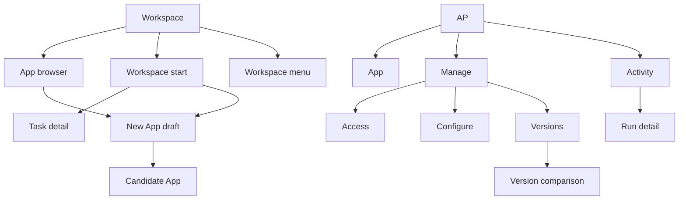

# Mac Experience Architecture and Screen Specification

Status: Canonical Assistant-first Mac experience; dimensions and visual treatment remain testable
Last updated: 21 September 2026

## Purpose

This document turns the accepted product, desktop, input, and App UI Bridge boundaries into a concrete Mac application experience. The initial experience begins with the Assistant, supports bounded one-off Tasks, and uses Apps for reusable work. The shell is designed to become the control surface for later Context, Observations, Procedures, Workflows, and Agents without placing those systems in v0 navigation.

It answers:

- what the user opens;
- how the shell, generated App, and Builder fit together;
- which screens are platform-owned;
- how creation, operation, correction, and recovery flow;
- how local and explicit remote work remain understandable;
- which interaction choices are accepted and which visual details remain testable.

It does not select a desktop framework or freeze visual measurements. It is the experience baseline for implementation.

## Experience thesis

The product should feel like one calm workspace in which the user asks for an outcome, gets useful work done, and creates durable Apps when reuse warrants them-without first choosing an implementation object.

The user should not feel that they are switching among a chat tool, coding agent, workflow engine, database, scheduler, and observability product. Those systems appear through one request-led experience:

1. Describe the outcome to the Assistant.
2. Receive an answer, do the work once, or make it reusable.
3. Understand inputs, access, location, route, and consequences.
4. Inspect the result and evidence.
5. For reusable work, preview and publish an App.
6. Use its interface and inspect what happened.
7. Retry, correct, or promote work in plain language.

The Assistant is persistent in state, always reachable, and the front door when no App is selected. It adopts a Task, Builder, correction, or diagnosis role when the request requires one, but durable Tasks, Apps, data, Attempts, Runs, evidence, and decisions remain in the centre. Future screen, voice, or connected-source adapters feed the Assistant through the trusted Observation boundary rather than becoming separate product shells.

## Boundaries already accepted

The screen design must preserve these decisions:

- the signed Mac application is the primary v0 product surface;
- deployment is selected per App as 'On this Mac' or, when available, 'Always available';
- an 'On this Mac' Release keeps persistent App code, state, secrets, logs, history, and ordinary execution on the Mac while allowing disclosed calls to remote AI models, websites, APIs, and user-selected services;
- an 'Always available' Release uses cloud execution and persistent cloud state in exchange for continuous schedules, stronger compute, and remote access;
- the same portable App Version can be bound to either target without embedding machine paths, credentials, or provider identities;
- typed text and deliberately attached files are the only v0 input adapters; later screen, voice, and watch-session controls remain shell-owned and never belong to generated App UI;
- a typed trusted-local capability service handles explicit native capabilities; a later cloud Release may wait for a registered Mac when a particular operation still needs device data;
- the Task is the durable bounded one-off object and the App is the primary durable reusable v0 execution object;
- v0 Task Attempts use a platform-owned local Task Runner with typed text, selected files, fixed tools, and no browser or desktop control;
- generated interfaces render inside a trusted platform shell;
- the shell owns governance, identity, Connections, publication, approvals, versions, and device consent;
- generated UI uses the six-method App UI Bridge and receives no credentials, raw network, native IPC, or direct Device Gateway access;
- generated-App durable writes and external effects use declared Entrypoints;
- every modification creates a candidate App Version;
- implementation concepts remain behind progressive disclosure;
- ordinary users begin with an outcome rather than choosing Apps first; App-specific Data, Runs, Connections, Access, Approval, Configuration, and Versions appear inside the selected App or through a trusted Workspace menu when genuinely Workspace-wide.

## Zazoo / Bridge influence

Use the following as the design base:

- collapsible App browser, central working surface, and persistent right Assistant panel;
- one aligned header rhythm across the three regions;
- quiet, dense, professional surfaces rather than a consumer-chat aesthetic;
- routable list and record views;
- shared search, filter, view, and overflow patterns;
- honest empty states and explanations for disabled actions;
- resizable panels and a centre-first working mode.

Adapt it by making the Assistant the front door, Tasks the bounded one-off object, and Apps-not Modules or agents-the primary reusable v0 execution object. The right panel is a scoped Assistant whose Task and Builder behavior is request-led, not an autonomous persona. Governance is enforced by platform-owned surfaces and execution boundaries rather than being presented as a large technical subsystem.

## Shell anatomy

The first prototype uses three regions.

| Region | Owner | Purpose | May collapse? |
|---|---|---|---|
| Left App browser | Platform | Folders and Apps in the current Workspace | Yes |
| Centre | Platform shell plus active Task or App | Durable object currently being used | No |
| Right Assistant | Platform | General help plus creation, explanation, correction, and diagnosis in explicit scope | Yes |

### Shared header rhythm

All three regions align to one top band, but their contents differ:

- left: Workspace switcher;
- centre: current object identity, state, and primary action;
- right: Assistant scope and panel controls.

Exact height, widths, colour values, density, and resizer behavior remain prototype hypotheses.

### Left App browser

The left region is not global product navigation. Its list body contains only folders and reusable Apps in the current Workspace. Tasks do not become pseudo-Apps. The selected App remains visibly highlighted while the centre changes between its tabs, records, Runs, and trusted management pages. With no selection, the centre shows the Assistant-led Workspace start view; Home does not become a competing rail destination.

The Workspace selector stays in the aligned top band. Workspace-wide members, Connections, settings, billing, security, and future cross-App views open from that menu or a command surface; they do not compete with Apps in the list. A compact create control may sit in the App-browser header, but 'New App' becomes a draft item in the same list as soon as creation starts.

Folders are lightweight organization in v0. They may group, collapse, reorder, and move Apps, but do not create a permission, Context, data-sharing, execution, or policy boundary. Attention is communicated with compact App badges and health state, not by adding top-level navigation destinations.

Data remains inside each App. Agents, global Context, marketplace, Intelligence, and global Data are not v0 destinations.

### Centre surface

The centre always renders a durable platform object or App interface. It never becomes a full-page chat transcript.

It hosts:

- the Workspace start prompt and recent Task and App results;
- Task plan, progress, result, Artifacts, evidence, retry, and promotion;
- the selected App's default 'App' tab;
- New App intent and Build Brief;
- Build progress and candidate preview;
- published App interface;
- App-scoped Activity and Run detail;
- App-scoped Manage sections and trusted flows;
- temporary Workspace administration opened from the Workspace menu;
- a minimal Workspace start view with recent Tasks, Apps, results, failures, and a primary Assistant prompt when no App is selected.

### Right Assistant panel

The panel header always displays one scope:

- 'Workspace Assistant';
- 'Task [name]';
- '[App name] Builder';
- 'Run [number] Diagnosis';
- '[Record name] Correction'.

The panel retains a resumable conversation per scope. Scope changes are explicit and do not silently carry data or instructions between Apps.

The panel opens automatically for a direct Assistant request, Task execution or revision, App creation, correction, and execution diagnosis. It collapses during ordinary App use so the generated interface remains primary. Collapsing never loses the scoped session or current work.

The panel contains:

- short conversational exchange;
- current task or question;
- links to durable outputs in the centre;
- assumptions and unresolved decisions;
- Stop, Resume, or Request changes when relevant.

Long specifications, diffs, previews, evidence, and forms open in the centre rather than being trapped in chat cards.

## Navigation model

The Mac navigation stack must support Back and Forward, routable records and Runs, and reopening the last meaningful surface after relaunch. Deep links restore the Workspace and central route; a Builder scope may reopen only when the user is authorized and the session remains relevant.

## Screen inventory

### Workspace and App-browser surfaces

| Screen | Primary question answered | Primary action |
|---|---|---|
| App browser | Which App do I want to use? | Select an App or begin a draft |
| Workspace start | What do I want help with, and what deserves attention? | Ask the Assistant or open a recent Task or App |
| Task detail | What did this one-off request use, do, and produce? | Review, retry, revise, or make reusable |
| New App | What do I want to exist? | Submit an outcome description |
| Workspace menu | Which Workspace-wide membership, Connection, security, billing, or settings task do I need? | Open one trusted administration flow |

### App screens

| Screen | Primary question answered | Primary action |
|---|---|---|
| App | What can I do with this App now? | App-specific action |
| Activity | What has this App done, and what needs attention? | Inspect or retry a Run |
| Run detail | What was requested, what happened, and what evidence exists? | Resolve the next action |
| Access | What may this App read, write, send, spend, schedule, and change? | Review a requested change |
| Configure | Which safe operational values may I change without rebuilding? | Save configuration |
| Versions | Which implementation is active, and what changed? | Compare, publish, or roll back |
| Version comparison | How will behavior, data, access, cost, and dependencies change? | Publish candidate or keep current |

### Trusted overlays, sheets, and pages

Short consequential decisions remain platform-owned sheets even when opened from generated UI:

- approval decision;
- file or folder chooser and outbound-transfer consent;
- device capability consent;
- Publish confirmation;
- rollback confirmation;
- Artifact viewer or save flow;
- security or reauthentication challenge.

Connection setup or repair and detailed Access management use full trusted centre pages when they become multi-step. Generated UI may open them but cannot render or impersonate them.## Workspace entry and App browser

On launch, restore the last meaningful Task or App centre route when authorization still permits it. If no prior route is valid, show the Workspace start view with the Assistant composer. Recency and attention may rank recent Assistant Turns, Tasks, Apps, and results as presentation aids; they never silently execute work or become authority. An on-demand searchable Workspace history reopens older Assistant Turns, Tasks, and Apps without becoming permanent left-rail navigation.

The App browser is a compact hierarchical list rather than a separate catalogue page or gallery of cards. An App row may show only the information useful for selection: name, selected state, lifecycle or health state, and a compact attention count. Rich purpose, schedule, ownership, output, and Run information belongs in the selected App.

An empty Workspace keeps the real shell visible, leaves the App browser empty except for its create control, and focuses the Assistant prompt. 'New App' becomes a draft entry only when the user chooses reusable work. Search and filtering may appear in the App-browser header when scale justifies them. Folders may be created and renamed without changing App authority or behavior.

Cross-object attention does not require a permanent Home or Activity destination in v0. App badges, notifications, deep links, and the Workspace start view can aggregate it without replacing the compact App browser.

## Assistant request and Task experience

The Workspace start centre displays one primary prompt:

> What would you like help with?

The user may type a request and deliberately attach files. The Assistant infers the lightest suitable result:

- `answer now` when no execution is needed;
- `Do once` for a bounded Task;
- `Make reusable` for work that needs an interface, mutable state, repetition, triggers, or ongoing ownership.

The Assistant need not ask the user to classify every request. When the paths have materially different access, persistence, cost, or behavior, it shows the recommendation and a plain-language alternative before proceeding.

An answer that needs no execution remains a durable Assistant Turn with its source links and route disclosure. Workspace history can reopen or search it, and the user may cite it into later work or save it as an Artifact. Persistence alone never upgrades an answer into a Task.

For 'Do once', the centre changes from Workspace start to a durable Task detail. Before execution it shows purpose, selected inputs, expected output, `On this Mac` execution, any named remote model route, and material limits. During execution it shows a concise plan, current step, elapsed time, Stop, and expandable technical details. On completion it shows the result, output Artifacts, source/evidence links, duration, cost, and any uncertainty.

The primary follow-up is contextual: save or open the output, retry, change the request, or `Make reusable`. Retry creates a new Attempt. Changed instructions or inputs create a new Task Revision. `Make reusable` opens an App Build Brief prefilled from the chosen revision and evidence; it never silently carries permissions.

Tasks appear in recent work, searchable Workspace history, and deep links, not as permanent entries in the left App browser. A Task detail remains reopenable even after its Assistant panel is collapsed or the application relaunches.

## New App and Build experience

### Start

When the user chooses `Make reusable`, the centre displays one focused prompt or prefilled Build Brief:

> What should this App do for you?

The user may attach examples or files. Demonstrating a process appears only after a later explicit watch-and-learn phase is supported. Examples are prompts, not mandatory templates or categories.

### Clarify and build

After the first request:

- the Builder panel handles conversational clarification;
- the centre shows the evolving Build Brief;
- safe build work begins automatically when enough information exists;
- material questions are marked directly in the relevant Brief section;
- a live preview replaces abstract explanation as soon as it is useful.

The centre may switch between `Brief`, `Build`, and `Preview` during creation. These are lifecycle views, not permanent product navigation.

### Build progress

Show normalized milestones:

1. Designing App.
2. Preparing interface and data.
3. Connecting required systems.
4. Testing sample work.## New App and Build experience

### Build progress

Show normalized milestones:

1. Designing App.
2. Preparing interface and data.
3. Connecting required systems.
4. Testing sample work.
5. Checking access and limits.
6. Preview ready.

Expose raw events only under Technical details. A blocker pauses only dependent work and always states the next user action.

### Preview and publication

Preview uses the real generated interface with sample data or output. The header visibly identifies `Preview` and the candidate version.

The preview review area summarizes:

- what worked;
- assumptions;
- known limitations;
- requested access;
- expected schedule and cost range;
- test evidence.

`Publish` opens a trusted platform review. The user approves consequences, not source code or manifests.

## Published App anatomy

The default App route opens the generated interface.

The platform provides a stable App header containing:

- App identity;
- Active, Preview, Paused, Degraded, or Needs attention state;
- next scheduled work when relevant;
- manual Run when declared;
- `Edit with AI`;
- overflow actions.

The platform-owned tabs are `App`, `Manage`, and `Activity`, in that order. `App` is always the default and contains the generated working interface. `Manage` groups `Access`, `Configure`, and `Versions`; App-specific Connection and Device issues appear within Access rather than becoming global left-rail destinations. `Activity` contains Runs, approvals, errors, and changes for the selected App. A material issue may deep-link to the exact Manage or Activity subview.

Inside `App`, the v0 generated interface is one isolated React/TypeScript/Vite micro-frontend profile using the platform UI kit. Apps with no declared Surface use the trusted fallback below. A separate native-view DSL remains portable contract vocabulary but is not implemented or accepted by the v0 runtime profile.

If an active App declares no Surface, `App` renders a trusted fallback instead of a blank page. It shows the App's purpose and state, available manual actions generated from their input schemas, schedule or webhook summary, next expected work, recent authorized outputs, recent Run result, and current Connection, approval, device, or input blocker. It does not invent a domain dashboard or expose manifest vocabulary.

Generated UI may not visually impersonate platform-owned governance, Connection, approval, publication, or device-consent screens.

A trusted approval sheet states the exact action, acting account or principal, destination or recipient, data leaving the device, one-time or reusable scope and frequency, reversibility, cost or limit, and what will happen after approval. Human-input prompts remain visually and semantically separate.

## Task Attempt detail

Task detail answers, in order:

1. What did I ask for?
2. Which inputs, route, tools, and limits were used?
3. What was produced, and how confident should I be?
4. What happened during this Attempt?
5. Should I retry, revise, save the output, or make it reusable?

The default timeline uses user-meaningful steps. Model calls, tool operations, protected references, raw errors, usage, and hashes remain expandable. A Task may be `Completed - Needs review`; technical success and output confidence remain separate. A Task waiting for information uses the same trusted human-input pattern as a Run and does not treat an answer as approval.

## Activity and Run detail

Activity combines Runs, approvals, errors, and important changes for one App. Filters remain simple: state, trigger, and time.

Run detail answers, in order:

1. What started this work?
2. What was the outcome?
3. What changed or was produced?
4. What did the App access and do?
5. What needs attention?

The default timeline uses user-meaningful milestones. Technical evidence-model calls, browser steps, retries, raw logs, screenshots, receipts, and hashes-remains expandable.

Execution completion and output confidence stay separate. A Run may be `Completed - Needs review`.

An adaptive Run may become `Waiting for you`. Run detail shows the material question in a trusted response container, records who answered, and resumes the same Run without treating the answer as permission or approval.

## Correction and evolution

A correction starts from the object that is wrong:

- Task result -> `Change this request` or `Try again`;
- record -> `This field is wrong`;
- Run -> `This run missed something`;
- App -> `Change how this works`;
- Assistant panel -> Task-scoped request;
- Builder panel -> App-, Run-, or record-scoped request.

For a Task, changed instructions or inputs create a new Task Revision and retry creates a new Attempt. For an App, the shell opens the Builder in the selected scope and carries the relevant evidence. The Builder produces a candidate App Version and a regression test; it never mutates the active version directly.

The centre shows a comparison organized by:

- behavior;
- sample outputs;
- data and compatibility;
- access and approvals;
- schedule;
- dependencies;
- expected cost.

Ordinary data correction may use a declared action Entrypoint, such as correcting one reconciliation exception. A correction that changes behavior, schema, dependencies, or authority still opens the Builder and creates a candidate version.

## Delete Task

`Delete Task` lives in the trusted Task overflow. Before confirmation, the shell summarizes active or waiting Attempts, Task-owned input copies and output Artifacts, evidence entering retention, and source files that will remain untouched. Confirmation fences new Attempts, cancels safely cancellable work, removes the Task from recent work, and delegates stored-content cleanup to the owning services. It never deletes an original file merely because that file was selected as input.

## Delete App

`Delete App` lives in the trusted App overflow menu. Before confirmation, the shell summarizes active Releases and triggers, running or blocked work, App-owned Resources and Artifacts entering retention, audit evidence that may remain, Workspace-owned Connections that will remain, and the restoration policy.

Confirmation immediately prevents new invocations, deactivates Releases and triggers, revokes App and Surface authority, cancels safely cancellable work, and hides the App from the normal browser. App-owned data is removed only through its owner and retention process. Workspace Connections, user Context, and source files that never left the Mac are never deleted with the App.

## Access

Access defaults to one plain-language summary:

> This App reads two websites, writes only to its own Listings data, runs every Monday, and sends internal alerts. It cannot contact external people, access other Apps, delete records, or add sources without approval.

Expandable groups are:

- Reads.
- Writes.
- External actions.
- Schedule and budgets.
- Self-change policy.
- Device access, when present.

Any increase in authority invalidates the previous review for the affected Release. Technical Grants and policy records remain under Advanced.

## Configure

Configure contains only user-editable operational inputs declared by the App, such as source list, match criteria, schedule preference, or notification destination.

A change belongs here only if it does not require rebuilding the App. If a request changes behavior, schema, dependencies, or authority, the shell automatically routes it to `Edit with AI` and creates a candidate version. The user does not need to classify the change first.

## Workspace Connections

The Workspace menu may open a temporary trusted Connections inventory. It is not a permanent left-region destination. Each Connection shows:

- provider and account label;
- Apps using it;
- health and last successful use;
- scope summary;
- repair, revoke, and inspect actions.

The App's Access view references Connections without exposing credentials. Generated UI may request `shell.open` to a Connection, but only the trusted shell can create or repair it.

## Location and privacy communication

Use user language:

- `Do once` - run this bounded Task as a Task and retain its result and evidence;
- `Make reusable` - create or change an App with its own interface, state, Versions, and ongoing authority;
- `On this Mac` - the current Task or App executes here and its persistent product data remains here;
- `Always available` - the App executes and persists its operational state in cloud;
- `Connected` - the current Task or App is using a disclosed AI provider, website, API, or other selected external service;
- `Waiting for this Mac` - a cloud workflow needs a specifically granted device capability;
- `Waiting for connection` - a network-dependent operation cannot proceed;
- `Offline` - local views and eligible local actions remain available, while outbound work waits.

Do not display location labels on every normal action. Show them when location affects availability, privacy, transfer, consent, cost, or recovery. Ask for consent on first use of a material boundary and again when the provider, data class, purpose, credential owner, billing owner, or retention behavior changes; do not repeat an equivalent prompt on every call.

Before a first material outbound transfer, state what leaves the Mac, why, which Task or App and provider receive it, and whether the choice can be remembered.

## App UI Bridge mapping

| User interaction | Bridge or trusted route |
|---|---|
| Open or filter visible App data | `resource.read` |
| Submit form, edit record, delete, refresh, or start work | `entrypoint.invoke` |
| Recover status after reconnect | `operation.get` |
| Select local files | `artifact.request-upload`, then trusted shell picker |
| View or save an Artifact | `artifact.open`, then trusted shell flow |
| Open Activity, Access, Configure, Versions, Approval, Connection, Record, Run, or Builder | `shell.open` |
| Receive progress | Filtered SSE events with durable cursor |
| Use a local capability | Capability Broker to typed trusted-local capability service; a later remote profile may use a registered Device Gateway; never direct from generated UI |

The UI shows `Running`, `Waiting`, `Needs approval`, `Failed`, or `Completed`; it does not expose receipts, cursors, capability tokens, or internal service names.

## State rules

| State | Where it appears | Required behavior |
|---|---|---|
| Loading | Local region or row | Preserve surrounding navigation; use progressive results where safe |
| Empty | Real destination | Explain what belongs here and offer one relevant action |
| Offline | Shell and affected surface | Keep local records usable; pause outbound work; show the disclosed state of any already-dispatched remote operation |
| Waiting for approval | Task, App badge, App, Activity, Run, notification | Open the trusted approval sheet |
| Waiting for you | Task, App badge, App, Activity, Run, notification | Open the trusted typed response; never represent it as approval |
| Waiting for this Mac | App badge, App, Activity, Run, notification | Name the Device and required capability |
| Missing Connection | App, Access, Run | Repair, substitute, or remove dependency without losing the candidate |
| Failed | Affected object | Preserve evidence and offer retry, change, reduced operation, or diagnosis |
| Degraded | App header and Activity | Explain which functions remain usable |
| Needs review | Output, Task Attempt, and Run | Separate uncertainty from execution failure |
| Update available | Shell | Never interrupt a consequential action; explain restart requirement |

## Interaction rules
1. Each screen has one dominant next action.
2. Risky or irreversible actions use explicit verbs and a trusted confirmation.
3. Disabled actions explain why and how to enable them.
4. Progress reflects durable authoritative state rather than optimistic client state.
5. Closing the main window keeps active automation and the local scheduler running; reopening reconnects to that same runtime. Explicit runtime quit, logout, sleep, or shutdown stops local execution. Missed jobs remain visible with intended time, reason, and a manual retrigger action; waking or restarting never automatically catches them up. Interrupted Runs retain their own recovery state. Keep background status and pause/stop/quit controls accessible, and treat login startup separately. Only a future `Always available` Release may claim cloud scheduling while the Mac is unavailable.
6. Generated interface errors cannot obscure shell navigation or trusted recovery.
7. Search, filters, and views preserve user context when navigating to a record and back.
8. Assistant and Builder responses link to the changed durable object rather than duplicating it in chat.
9. No access increase, provider switch, data transfer, or execution-location change occurs silently.
10. Advanced information is available but never required for ordinary use.

## Keyboard and accessibility baseline

- predictable focus order across App browser, centre, and Assistant;
- focus returns to the invoking control after sheets close;
- panel collapse, navigation, primary actions, and search are keyboard-accessible;
- reduced motion, zoom, contrast, and system appearance are respected;
- status never depends on colour alone;
- custom micro-frontends meet the same labels, focus, and keyboard contract as native surfaces;
- live progress announcements are concise and do not repeat every event;
- no essential action depends on hover.

## Responsive behavior

The Mac desktop is the v0 target.

- wide: the Assistant expands for a Task, creation, correction, or diagnosis and otherwise remains collapsed but immediately reachable;
- medium: folders may collapse and the Assistant may narrow;
- compact: the App browser becomes a labelled overlay or drawer rather than an icon-only global navigation rail, and the Assistant becomes a full-height drawer;
- the centre remains the primary surface at every width;
- generated custom interfaces must declare a supported minimum width and reflow within the centre;
- a future Windows client may preserve the contract with platform-appropriate chrome;
- a future phone client is a companion surface, not a promise that every custom App UI scales automatically.

Exact breakpoints and dimensions remain prototype findings.

## Cross-surface validation matrix

| Fixture | Native or custom UI | Screens that must be proven |
|---|---|---|
| One-off selected-file Task | Platform-native Task detail | Workspace start, route choice, input and route review, progress, result, evidence, retry, revision, make reusable |
| Website monitoring | Generated React/Vite table and record surface | New App, preview, App, Activity, Run detail, Access, Configure, correction, Versions |
| File reconciliation | Generated React/Vite interaction and exception surface | trusted file selection, explicit outbound-transfer consent when required, progress, exceptions, correction, version comparison |
| Assisted outreach | Generated React/Vite research and draft surface | approval, external action state, Access, Run evidence, recipient-level failure |
| Interaction-heavy novel App | Custom micro-frontend | isolation, App-local navigation, shell recovery, accessibility, Bridge completeness |
| Adaptive operational App | Generated React/Vite surface | durable input wait, evidence, cost, uncertainty, resume, correction |
| Unfamiliar API or headless App | Trusted fallback App surface | manual action, access, Connection repair, Run evidence, no-Surface behavior |

For every fixture, test the applicable happy path, empty result, offline reconnect, input or approval wait, partial failure, correction or revision, and deletion. App fixtures additionally test missing Connection, device wait where relevant, new Version, and rollback; Task fixtures test retry and promotion without authority transfer.

## Accepted interaction baseline

1. Make the Assistant the front and door frame: keep its state persistent and scoped. Use a global Workspace scope with no App selected and Task, Builder, correction, or diagnosis behavior for the active work; collapse it during ordinary App use.
2. Make the left region an App browser containing folders and Apps only; keep Workspace-wide administration behind the Workspace menu.
3. Use lightweight folders only for organization; do not let them imply permissions, Context inheritance, data sharing, or execution boundaries in v0.
4. Use `App`, `Manage`, and `Activity` as the selected App's stable centre tabs, in that order, with `App` as the default.
5. Keep one-off Tasks as durable centre objects reached from Workspace start, recent work, and deep links; do not place them in the App browser or leave them only in chat.
6. Keep Runs, approvals, errors, and changes in App-scoped `Activity`; use App badges, notifications, deep links, or an on-Demand Workspace view for cross-App attention rather than permanent global navigation.
7. Keep safe operational values in Configure and automatically route behavioral, schema, dependency, or authority changes to `Edit with AI` and a candidate App Version.
8. Use trusted sheets for short consequential decisions. Use full trusted pages for multi-step Connection and detailed Access work.
9. Use `Brief`, `Build`, and `Preview` as temporary creation-stage views.
10. Keep a manual `Run` action in the App header only when the App declares one.
11. Add App search or filtering to the App-browser header only when scale proves it necessary; reserve a keyboard command surface as a later option.
12. Render the trusted fallback App surface when an active App has no declared Surface.
13. Keep `Delete App` in the trusted overflow and use consequence review, immediate authority revocation, and retention-owned cleanup.
## Current local automation and Windows requirements

The first usable Mac release includes schedule configuration/activation/pause, next and last actual run, missed occurrences and reason, runtime availability, browser account connection, visible sign-in/takeover, resume/stop, and uncertain-effect recovery. Use existing Manage and Activity surfaces and trusted approvals; no custom App interface may interpose these controls. Apps without generated UI remain useful through trusted configuration/results/Activity.

The missed-work journey must show the user-initiated retrigger action and its linked outcome, with no automatic catch-up. The background journey must show continued work after window close and accessible stop/quit controls; login-start presentation remains separate. Browser login does not imply blanket permission to submit, send, or modify data. These journeys need usability prototypes in addition to the retained eight App wireframes.

Windows is a later client with the same product model and shared React/Core logic. Mac-specific menu, shortcut, dialog, credential, process, and lifecycle behavior belongs to native platform adapters. Shared Windows tests begin early, while Windows-native distribution remains separately qualified. See `../specifications/Local_Automation_and_Platform_Extension_Profile.md`.

## Explicit v0 exclusions

- public or anonymous App screens;
- mobile parity;
- arbitrary frameworks and languages outside the supported generated-App runtime;
- direct generated-UI network or native calls;
- global Data, Agents, Context, marketplace, or Intelligence sections;
- operating-system accessibility automation and visual desktop control in v0; general browser automation is included through its separately governed provider;
- screen capture, voice capture, watch-and-learn, an always-present avatar, ambient memory, or proactive suggestions; the shell preserves only the trusted adapter and Observation seam;
- a visual workflow editor as a primary experience;
- technical manifests, undo, dependency graphs, or raw traces in ordinary navigation;
- silent self-modification or automatic production repair;
- cross-App data browsing without an explicit future contract.

## Remaining prototype questions

- exact rail, centre, and expanded-Assistant dimensions;
- exact compact-screen breakpoints and drawer behavior;
- visual treatment of `Manage` and direct issue links;
- focus transition when the Assistant panel expands or collapses;
- density, typography, colour, and motion tokens;
- whether a command surface becomes necessary after observed Workspace scale.

## Approved low-fidelity wireframe set

Status: Accepted v0.3 reusable-App shell set in `Mac Reusable-App Path Wireframes.pdf`.

The nine-page PDF begins with a scope page and then contains eight reusable-App-path wireframes:

1. App browser with a selected App on its default `App` tab;
2. New App plus evolving Build Brief;
3. Build progress and candidate preview;
4. published App with illustrative platform-style and custom centre surfaces;
5. App-scoped Activity and Run detail;
6. Access and approval;
7. correction and version comparison;
8. App-scoped Connection and location-aware recovery under Manage.

The App-browser, centre-tab, and collapsible-Assistant composition is approved and propagated across the eight wireframes. The PDF scope page identifies Workspace Assistant/Task screens and browser takeover/schedule recovery as states still requiring focused prototypes. Local scheduling, collection/monitoring, and browser Connections are now current-release requirements. Cloud/device-wait, broad notifications/connectors, and other illustrative future features remain outside this release. Any screen labelled or styled as native App UI is implemented through the one v0 React/Vite Surface profile or trusted no-Surface fallback. The wireframes do not freeze exact dimensions, typography, colour, motion, component styling, or desktop framework.

The set remains authoritative for the App shell and lifecycle. It predates the accepted first-class Task path, so the Workspace start, Task progress/result, retry, and `Make reusable` states require a focused prototype update before implementation sign-off. This does not add a permanent Home destination or a new primary navigation pattern; Task detail uses the same centre surface and scoped Assistant.

## Cross-surface validation result

The shell has been reviewed against file processing, structured-data, narrow allowlisted public-HTTP, connected-workflow, custom-interface, adaptive-Run, and unfamiliar-App fixtures. The new Task path is specified but still needs wireframe and usability proof. Durable input wait, a trusted fallback App surface, correction, deletion, and shell recovery remain required. Empirical host and accessibility proof is still pending.

## References

- `Product Vision and Principles.md`
- `Roadmap and Scope.md`
- `Current Release UX Specification.md`
- `../architecture/Input Memory and Procedure Architecture.md`
- `../specifications/contracts/App UI Bridge.md`
- `../architecture/Security Privacy and Data Boundaries.md`
- `../architecture/System Architecture.md`
- `../research/Zazoo Bridge Deep Technical Assessment.docx`
