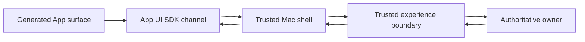

# App UI Bridge

Specification version: 0.1, revision 3
Schema ID: `urn:alpha:app-ui-bridge:v0.1`
Status: Accepted location-neutral design baseline
Last updated: 21 September 2026

## Purpose

The App UI Bridge is the narrow, versioned contract through which a platform-native App view or isolated custom micro-frontend uses authoritative App behavior inside the signed Mac shell.

It preserves two goals simultaneously:

1. Generated Apps may present almost any useful interface inside their central surface.
2. Interface code receives no database, credential, internal-service, provider, Device Gateway, or native Mac authority.

The Bridge is a logical route family and schema set owned by the trusted experience boundary, not a separately deployed service and not a direct connection to each App backend. The local-first prototype carries it over a private typed channel to authoritative local owners. Future cloud or hybrid profiles may carry the same contract through an authenticated experience Gateway.

This Bridge governs generated App surfaces only. The shell-owned Workspace Assistant, text and file input, and future screen, voice, watch-session, or connected-source adapters sit outside it. Observation access is never added to a generated App merely because the App is visible in the centre.

Revision 3 profiles the first implementation to one isolated React/TypeScript/Vite micro-frontend path plus a trusted no-Surface fallback. The portable native-view semantics remain defined for compatibility but are inactive and rejected by the v0 runtime profile.

## User experience boundary

The signed Mac application keeps the Zazoo/Bridge-inspired three-region shell:

- left: Workspace and App navigation;
- centre: the generated App interface;
- right: the scoped Assistant, Builder, correction, or diagnosis panel.

The generated App controls only its centre surface and App-local route. The trusted shell owns the title bar, Workspace identity, active or preview state, Activity, Access, Configure, Versions, Connections, approvals, Builder scope, device consent, and security messaging.

The active generated interface executes in an isolated origin or sandboxed frame and communicates through the platform App UI SDK. Trusted fallback and platform management views use broader shell APIs and do not impersonate a generated Surface. A later native-view profile must use the same logical Bridge semantics rather than acquiring an authority shortcut.

## Core accepted decisions

1. The trusted shell mediates every custom-interface call. Generated code receives an opaque channel-bound session identity, not a reusable bearer token.
2. Direct Resource access through the Bridge is read-only and bounded. Durable writes use declared `action` or `job` Entrypoints.
3. Every Entrypoint invocation creates or joins a normal governed operation and, when execution is required, a Run.
4. Commands return an authoritative receipt identity, not a claim that work is complete.
5. Server-Sent Events with durable cursors are the default progress transport. Pulling is the recovery path. Bidirectional streams are limited to explicitly supervised sessions.
6. File selection, upload, download, approvals, Connections, publication, role changes, and device consent open trusted shell flows.
7. Generated UI never calls Tauri, WebView-host APIs, Keychain, filesystem paths, native IPC, object storage, internal services, or the Device Gateway directly.
8. The Bridge restricts authority, not layout or interaction design inside the App surface.
9. The Bridge exposes no capture, microphone, screen-recording, global memory, or raw Observation method. Any future App use of derived Context follows the normal Release-bound Context contract.

## Workspace Assistant and input boundary

The Workspace Assistant is a trusted shell surface. It may operate with no App selected or adopt an explicit App, Run, or record scope. When it creates or changes an App, it invokes the platform-owned Build lifecycle; it does not use the App UI Bridge to edit generated code or trusted state.

Text and selected files enter through trusted shell controls in v0. Later on-demand screen or voice input remains shell-owned, produces normalized Observations, and reaches the Assistant or Builder only after classification, provenance, consent, retention, and route policy are applied. Generated surfaces may request `shell.open` to navigate to an eligible trusted Assistant or Context view, but they cannot start capture, read raw Workspace observations, or inherit capture permission.

## Trust and transport model

The shell creates a short-lived App UI Session Grant after establishing the current user context. It verifies the surface artifact and Release, creates an isolated frame, and establishes a private typed channel. The custom interface sees the safe Grant description and opaque `sessionId`; any credential needed for a remote owner remains in trusted shell state.

For a future web, Windows, cloud, or hybrid profile, another trusted host may implement the same SDK and transport contract. Portability does not require identical host technology or owner location.

### Session scope

One App UI Session Grant is bound to exactly:

- one user and Workspace;
- one App, App Version, Release, environment, and Surface;
- one surface artifact digest and Bridge version;
- a finite set of method families;
- declared Entrypoints and their exact schemas;
- declared read-only Resource views with exact fields or path prefixes, operations, classification ceiling, and visibility-policy digest;
- permitted shell actions and event topics;
- issue, expiry, nonce, origin or channel binding, and revocation reference.

The Grant is a descriptive authority snapshot, not the final authorization decision. Every authoritative owner rechecks the current user, Release status, Grants, policy, classification, budgets, suspension, and revocation on each protected operation.

The session is revoked when the user signs out, loses App access, the Release or surface changes incompatibly, the Workspace is suspended, or the shell detects channel or origin violation.

## Surface bootstrap

The shell sends one bootstrap document after the channel handshake. It contains:

- the App UI Session Grant;
- safe App and Surface display metadata;
- active or preview state;
- theme, locale, timezone, and accessibility preferences;
- current connection state and freshness timestamp;
- SDK and Bridge compatibility information.

It does not contain raw Connection state, secrets, Workspace-wide data, internal URIs, policy documents, or the human session credential.

## Bridge methods

The v0 method set is deliberately small.

| Method | Purpose | Authority rule |
|---|---|---|
| `resource.read` | Describe, get, query, count, aggregate, list, or stat a declared Resource view | Read-only; exact view, Resource, projection or path prefix, and operation must appear in the Session Grant |
| `entrypoint.invoke` | Invoke a declared App query, action, or job | Input uses the pinned Entrypoint schema; normal Run, approval, budget, and Capability rules apply |
| `operation.get` | Recover authoritative status after reconnect or lost events | Only operations visible to the session and initiating user or App role |
| `artifact.request-upload` | Ask the trusted shell to select and upload user-approved files | Shell owns picker and transfer; result is a quarantined Artifact handle, never a local path |
| `artifact.open` | View or download an authorized Artifact | Shell owns viewer or save flow; possession of an ID is not authorization |
| `shell.open` | Open a trusted platform surface such as Activity, Access, Configure, Versions, approval, Connection, record, Run, or Builder | Navigation only; cannot mutate trusted state |

### Resource reads

`resource.read` supports the Resource contract's bounded operations:

- table: `describe`, `get`, `query`, `count`, and `aggregate`;
- file-store: `describe`, `stat`, and `list`.

The request envelope is stable. Its `arguments` are validated against the Release-pinned Resource operation schema and the Builder-defined Resource schema. Response payloads are returned in platform envelopes with provenance, classification, revision, cursor, truncation, and freshness metadata as applicable.

The Surface declaration's `resourceRefs` are read-only visibility requests. The compiler and Release derive explicit view grants containing field projection or file path prefixes, classification ceiling, visibility-policy digest, and allowed operations. They never grant write authority. This prevents a generated UI from bypassing App validation merely because it can display a table.

### Writes and effects

All durable App-data writes and every external effect originate through `entrypoint.invoke`.

The Builder may generate small action Entrypoints for form submission, record editing, deletion, batch changes, or file promotion. This adds a typed business boundary without constraining the interface. The Entrypoint receives initiating-user identity, validates its input, uses the Resource SDK or Capability Broker, and produces normal Run evidence.

A `query` Entrypoint may return synchronously when its registry-owned execution mode allows it, but it still has a governed operation identity. An `action` or `job` returns `accepted`, a receipt, and normally a Run identity. Approval or device dependency produces a visible blocked receipt rather than a fake success.

### Artifacts

The custom interface never receives a filesystem path, object-store URI, or reusable storage credential.

- Upload begins through a trusted shell picker.
- Selected bytes move through a one-purpose transfer session.
- The returned Artifact remains quarantined until scanning and classification complete.
- An Entrypoint may consume the authorized Artifact handle or promote it into a file-store.
- View and download requests are re-authorized and handled by the trusted shell.

### Trusted shell actions

The generated interface may ask the shell to open:

- App Activity;
- Access;
- Configure;
- Versions;
- one Run, record, Artifact, approval, or Connection;
- the Builder in App, Run, or record scope.

The shell validates the reference and renders the destination. Generated UI cannot impersonate a trusted approval, Connection, publication, permission, or device-consent screen.

## Request and response semantics

Every request includes:

- Bridge API version;
- `requestId` unique within the session;
- opaque `sessionId`;
- exact method;
- method-specific target and input.

The shell and gateway enforce a bounded request size, call rate, outstanding-command count, and deadline. Reusing a `requestId` with different bytes is rejected. Retrying the same logical write also requires the Entrypoint's idempotency key where declared.

Every response has one status:

| Status | Meaning |
|---|---|
| `succeeded` | Authoritative owner completed the read or synchronous operation |
| `accepted` | Work was durably accepted; follow its receipt and optional Run |
| `blocked` | Work exists but awaits approval, Connection, device, budget, or user input |
| `failed` | The request or operation failed with a typed safe error |

An accepted transport response is never rendered as completed work. The UI follows the receipt through events or `operation.get` until a terminal state appears.

## Event stream

The trusted shell owns one authenticated SSE subscription and forwards only events allowed by the Session Grant. Event topics are:

- `operation`;
- `run`;
- `approval`;
- `artifact`;
- `app-health`;
- `device`.

Structured human-input requests are projected as authorized `run` events. Generated UI may explain the question and ask the shell to open the affected Run, but the trusted Run view owns response submission, schema validation, authorization, expiry, and resume. No new Bridge method is introduced, and an input response cannot substitute for approval.

Each event has a stable event identity, durable cursor, per-stream sequence, subject, type, registered payload-schema digest, payload, and time. The interface treats delivery as at least once, deduplicates by event identity, detects cursor gaps, and recovers through `operation.get` or a fresh authorized read. Event order and delivery never mutate canonical state or grant authority.

WebSocket or equivalent bidirectional streaming is not part of the ordinary Bridge method set. A separately granted supervised-session descriptor may proxy interactive browser or preview control; it is expiring, single-purpose, and never exposes a provider URL.

## Navigation, lifecycle, and offline behavior

- App-local routes are namespaced under the Surface and may not replace shell routes.
- Changing active Release creates a new Session Grant and reloads incompatible surfaces.
- Preview and production never share a session or Resource binding accidentally.
- The shell may cache safe read models for responsiveness with visible freshness metadata.
- Offline cache is non-authoritative and cannot approve, publish, write, or invoke work.
- Local schedules and Runs continue after the main window closes because the runtime remains background-resident. Reopening reconnects to existing work. Explicitly quitting the runtime stops new local schedule claims and local execution. Missed occurrences remain visible for user-initiated retriggering, without automatic catch-up.
- An explicitly dispatched remote operation may continue only under its disclosed Run contract; its provider and data boundary never change silently.
- A future device-dependent remote operation may become `waiting_for_device` without changing the rest of the App's authority or location.
- An adaptive Run waiting for structured input remains the same Run and is presented as `Waiting for you`; the trusted Run view submits the response outside generated UI authority.

## Browser isolation requirements

A custom micro-frontend uses:

- an isolated origin or sandboxed frame;
- restrictive CSP with no arbitrary `connect-src`;
- no ambient cookies or shared local storage;
- no top-level navigation, popup, raw download, clipboard, camera, microphone, or native IPC by default;
- packaged static assets or authorized Artifact rendering;
- sanitized untrusted HTML, Markdown, model output, and external content;
- frame and artifact integrity pinned to the active Release.

The App UI SDK validates message origin, channel nonce, request and response schema, request correlation, and Bridge version. Unknown messages fail closed.

## Portable native-view behavior — inactive in v0

A future generated native-view profile must use the same logical methods and Session Grant projection even though trusted shell code renders it. This keeps native and custom surfaces behaviorally consistent and prevents native components from becoming an accidental authority shortcut. The v0 runtime rejects App-declared native-view Surfaces.

Platform-owned Activity, Access, Configure, Versions, Connections, approvals, human-input responses, and device consent use broader trusted Experience APIs outside the generated App UI Bridge.

## User-facing behavior

The ordinary user sees:

- one App embedded in the Mac workspace;
- immediate local interaction for navigation and safe cached reads;
- clear `Running`, `Waiting for approval`, `Waiting for you`, `Waiting for this Mac`, `Offline`, `Failed`, and `Completed` states;
- trusted shell sheets for permissions, Connections, uploads, downloads, and device consent;
- evidence and Run details reachable without exposing protocol concepts.

The user does not see sessions, tokens, schema digests, request envelopes, event cursors, internal services, or transport choices unless advanced diagnosis requires them.

## Error model

Errors use stable categories:

- `authorization_denied`;
- `session_expired`;
- `release_changed`;
- `method_not_granted`;
- `schema_invalid`;
- `resource_not_visible`;
- `entrypoint_not_visible`;
- `revision_conflict`;
- `approval_required`;
- `connection_required`;
- `waiting_for_device`;
- `budget_exhausted`;
- `rate_limited`;
- `temporarily_unavailable`;
- `operation_failed`.

Safe error details may identify the next user action and trusted shell destination. They never contain credentials, raw provider errors, internal addresses, filesystem paths, policy internals, or another tenant's identifiers.

## Versioning

- `apiVersion` identifies the envelope family.
- The Session Grant pins one exact Bridge interface version and method-schema digests.
- Compatible optional fields may be added within v0.1.
- Removing a method, changing authority semantics, or changing required fields needs a new compatible interface version or major API version.
- The host rejects a micro-frontend whose compiled App UI SDK range is incompatible.

## Local automation presentation

First-release schedules and browser Connections are configured in trusted shell surfaces. Generated UI may invoke only its approved Entrypoints and open allowed shell destinations through the existing Bridge. Schedule activation, browser sign-in/takeover, credential handling, grants, and effect approvals remain platform-owned. No new Bridge method or Run terminal state is introduced by this scope revision.

Mac-specific native behavior is mediated through platform adapters; the later Windows shell preserves these Bridge authority semantics.

## Explicit v0 exclusions

- direct Resource writes from generated UI;
- arbitrary fetch, sockets, GraphQL, SQL, or internal-service clients;
- generated approval, Connection, publication, permission, or device-consent surfaces that claim platform authority;
- arbitrary native Mac APIs or direct Device Gateway calls;
- offline mutation queues;
- public or anonymous App interfaces;
- cross-App Resource reads;
- general bidirectional sockets;
- custom UI plugins outside one App Surface.

## Implementation-readiness validation

Before the Bridge is used in an externally shared build, prove:

1. the v0 custom React/Vite Surface and trusted no-Surface fallback can read or invoke only their declared routes, upload, inspect, reconnect, and recover; any later native-view profile must pass the same conformance suite before activation;
2. a custom UI cannot use an undeclared Resource, Entrypoint, method, shell destination, event topic, or Artifact;
3. a forged message, stale session, changed Release, revoked user, or wrong frame fails before owner access;
4. a lost event stream recovers without duplicate effects or false completion;
5. a malicious custom interface cannot call native IPC, leak credentials, reach arbitrary network destinations, or imitate trusted governance state;
6. keyboard navigation, focus return, screen-reader labelling, reduced motion, contrast, and zoom work across shell and embedded Surface;
7. the conditional Tauri spike supports origin isolation, channel binding, signed updates, crash containment, and the required accessibility behavior.

## Accepted review outcomes

1. Use shell-mediated sessions rather than exposing a Bridge bearer token to generated UI.
2. Permit bounded direct Resource reads and require declared Entrypoints for durable writes.
3. Use the six-method v0 set and trusted `shell.open` navigation into platform controls.
4. Use a typed action Entrypoint for ordinary operational data correction. Open the Builder with record scope when the correction changes App behavior, schema, dependencies, or authority; do not add a separate Bridge mutation method.
