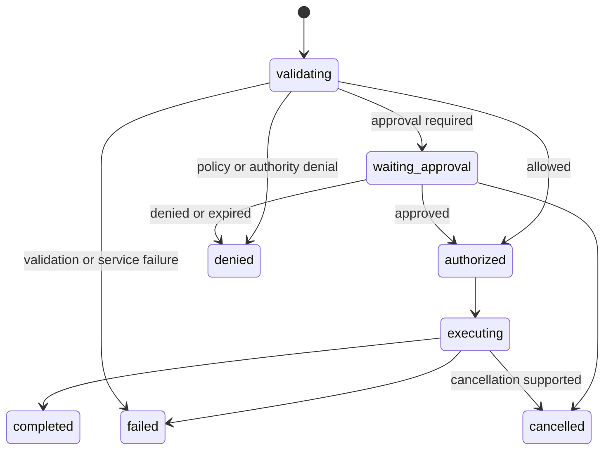

# Capability Protocol

Specification version: 0.1, revision 6
Request schema ID: `urn:alpha:capability-request:v0.1`
Response schema ID: `urn:alpha:capability-response:v0.1`
Approval schema ID: `urn:alpha:capability-approval:v0.1`
Status: Accepted design baseline
Last updated: 17 September 2026

## Purpose

The Capability Protocol is the sole application-facing path for consequential access to platform Resources, Connections, Context, models, browsers, external systems, and communication channels.

Generated code asks the Capability Broker to perform a typed operation. The Broker proves authority, validates the request, applies constraints and budgets, obtains approval when required, invokes the Release-bound provider, validates the result, and returns an auditable Receipt.

The protocol is transport-neutral. The v0 Platform SDK may use an internal HTTP or RPC transport, but transport details are not part of App code or the stable contract.

The protocol is not a requirement that the platform pre-build a domain connector for every external system. Generic governed HTTP and browser Capability definitions can cover unfamiliar systems while retaining this authority, credential, budget, approval, and receipt model.

## Core invariants

1. A Capability declaration requests authority; only a Release binding and current Grant can supply it.
2. Every call is bound to one Workspace, App Version, Release resolution, Run, Entrypoint, and logical Capability reference.
3. The Broker checks the Entrypoint execution closure and Release binding on every operation.
4. Generated code never receives raw Connection credentials or provider tokens.
5. Execution mode is registry-owned. Low-risk deterministic reads may execute `inline`; effects, approval-gated work, long-running work, non-reversible writes, and recovery-sensitive operations execute `durable`.
6. Approval is a platform decision made outside generated code.
7. Idempotency applies to the logical effect, not one network attempt.
8. The Release supplies maximum baseline authority. Runtime overlays may only deny, revoke, reduce constraints or budgets, or raise approval.
9. Budgets are reserved before execution and settled afterward.
10. Every terminal operation has an immutable receipt suitable for the Run ledger.
11. Generated workers have no unrestricted raw network path; generic external access uses constrained HTTP or browser Capabilities rather than bypassing the Broker and egress policy.

## Roles

| Role | Responsibility |
|---|---|
| App SDK | Creates typed requests and awaits or resumes durable operations |
| Runner | Supplies Run identity and short-lived authority lease; suspends work without holding compute |
| Capability Broker | Authorizes, validates, evaluates policy, reserves budget, coordinates approval, dispatches, and records receipts |
| Policy service | Evaluates effective rules against the Release Resolution Record and current revocation state |
| Approval service | Presents understandable action summaries and records human decisions |
| Credential broker | Exchanges opaque Connection bindings for provider-scoped short-lived credentials |
| Provider adapter | Converts the stable Capability definition into one concrete provider operation |
| Run ledger | Records ordered lifecycle, authority, approval, cost, result, evidence, and error events |

## Relationship to definitions and providers

The protocol preserves three independent layers:

1. **Definition** — The Resolved App Manifest pins the Capability name, request and result schema digests, effects, risk, audit requirements, and approval minimum.
2. **Binding** — The Release Resolution Record selects the provider compatibility envelope, Connection authorization, Grant, constraints, approval policy, execution mode, idempotency window, and budgets.
3. **Operation** — The Capability Request supplies one Run-bound input. The Broker invokes the selected provider and returns a normalized result and receipt.

App code therefore depends on a stable Capability definition, not on Gmail, Outlook, Playwright, a model vendor, a database driver, or another concrete provider.

## Generic governed I/O

The v0 registry includes generic definitions for external integration, including an HTTP request Capability and browser interaction. These definitions are deliberately generic enough that an unfamiliar API does not require a new top-level App Contract field or dedicated product connector.

A generic HTTP binding constrains at least:

- destination hosts and allowed redirect destinations;
- HTTP methods and optional path patterns;
- request and response size;
- timeout, rate, call, and cost limits;
- optional Connection and permitted authentication placement;
- evidence and redaction behavior;
- effect and approval policy derived from the method, destination, declared purpose, and Workspace rules.

The trusted provider or egress layer injects approved credentials. Generated code receives only the normalized result. The Builder prefers, in order: an existing typed provider or reusable module; a governed generic HTTP operation; then isolated browser automation when rendering, interaction, or browser session state makes HTTP unsuitable. Dedicated typed providers remain preferred for common or high-risk operations where target normalization, provider-specific idempotency, stronger approvals, or support guarantees are needed. Policy may deny a generic request and require such a provider; the platform does not require one solely because the API is unfamiliar.

### HTTP Action Profiles

A recurring unfamiliar-API write may use a reviewed HTTP Action Profile rather than requiring exact approval forever or a bespoke executable connector. The normative record, lifecycle, validation, and matching rules are defined in `HTTP Action Profile.md` and `http-action-profile.schema.json`.

The Resolved App Manifest carries only a portable compiler-derived candidate digest and profile-schema digest. The approved profile is a separate immutable registry data scoped to one Workspace, App, and logical Capability. It defines one bounded family of requests through the exact destination and normalized path template, constrained path and query variables, method, request and response schemas, forbidden fields, material target and effect fields, idempotency or reconciliation behavior, Connection and classification ceiling, finite volume limits, reversibility information, redirect denial, and approval policy. The Release binds its exact revision, profile digest, matching candidate digest, human approval decision, and Connection binding.

The Builder may propose the operation but cannot assign authoritative effect, risk, approval, review status, or user-facing permission summary. The Broker verifies every normalized call against the Release-bound profile before applying first-use or operation approval. A typed threshold may raise matching calls from first-use to operation approval; it may never lower the registry or Workspace minimum. Any out-of-profile call fails closed: it is reevaluated as an ordinary generic request and cannot reuse profile approval.

The initial HTTP provider profile accepts HTTPS JSON requests and responses, denies redirects, and enforces exact declared route families and body boundaries. The stable Capability contract may later admit other media types or redirect policies through a new compatible provider profile; their presence in the architecture does not make them v0 implementation requirements.

An Action Profile neither exposes credentials nor supplies provider code. In v0, reusable first-use authority is limited to reversible or compensatable EI operations protected by provider idempotency. Irreversible, delete, send, publish, and reconciliation-only operations remain exact-approval actions. If the platform cannot normalize the material effect, target, delivery safety, or reconciliation behavior, exact operation approval or denial remains mandatory.

## Protocol records

v0 defines five immutable record types:

- `CapabilityRequest`
- `CapabilityResponse`
- `CapabilityApprovalRequest`
- `CapabilityApprovalDecision`
- the Capability operation record maintained by the Broker and referenced through `operationId`

The operation record is control-plane state. Its minimum state machine is normative. The accepted Run Event Kernel projects its lifecycle, approvals, budgets, provider evidence, result, and terminal receipt into the Run ledger without replacing the authoritative Broker record.

## Capability Request

```json
{
    "apiVersion": "alpha.platform.capability/v0.1",
    "kind": "CapabilityRequest",
    "metadata": {
        "callId": "call-notify-0001",
        "runId": "run-refresh-0001",
        "entrypointRef": "refresh-records",
        "sequence": 7
    },
    "authority": {
        "releaseResolutionDigest": "sha256:digest",
        "capabilityRef": "notification-send",
        "capability": "notification.send",
        "definitionDigest": "sha256:digest",
        "authorityLeaseId": "lease-refresh-0001"
    },
    "idempotency": {
        "key": "refresh-2026-09-16:matching-records",
        "scope": "app-capability-target"
    },
    "executeBefore": "2026-09-16T12:05:00Z",
    "input": {}
}
```

### Request identity

- `callId` is generated by the App SDK and remains stable across transport retry of the same logical call.
- `runId`, `entrypointRef`, and `sequence` locate the call inside one Run. A resumed Run receives a new worker and authority lease without changing its identity.
- `authorityLeaseId` is an opaque, short-lived lease reference. The signed authority token is attached at the transport layer and MUST NOT appear in the JSON body, logs, model context, or App storage.
- The Broker assigns `operationId` when it first accepts the request.

### Request input

`input` MUST validate against the request schema digest pinned in the App Version. The Broker also validates every target, domain, recipient, operation, Resource, and limit against the effective Capability constraints in the Release Resolution Record.

Validation occurs before credentials are requested or a provider is contacted.

### Execution deadline

`executeBefore` is the latest instant at which provider execution may begin. A waiting operation expires without execution when the deadline is reached. Approval expiry is the earlier of `executeBefore` and any policy-defined expiry. Provider work that began before `executeBefore` may finish within its separately bounded provider timeout. A terminal idempotent result already recorded before the deadline may still be replayed.

## Run authority

The Runner obtains a short-lived, audience-restricted authority token for the Capability Broker. Its claims are at most:

- Workspace, App, App Version, Release, and Release resolution digest;
- Run and Entrypoint;
- allowed Capability references;
- authority profile and lease;
- issued-at, expiry, token identifier, and intended Broker audience.

The token grants permission to ask the Broker. It does not grant direct Resource, provider, network, or credential access.

The Broker MUST compare token claims with the request body, Run record, Entrypoint execution closure, Release binding, and current revocation state. Any mismatch is denied.

For provider execution, the credential broker mints a separate, narrower, short-lived provider credential or handle. It is delivered only to the trusted provider adapter.

## Execution modes

Every Capability definition has one registry-owned mode:

| Mode | Permitted use | Operational behavior |
|---|---|---|
| `inline` | Fast, deterministic, read-only, low-risk operations that cannot require human approval | Authorized, budgeted, invoked, validated, and receipted within the caller's request path |
| `durable` | External effects, approval-gated work, long-running operations, non-reversible writes, or work requiring recovery and reconciliation | Broker operation persists independently of the worker and may suspend or resume |

The App does not send or choose the mode. The Broker obtains it from the Release binding and registry definition. A provider adapter may force `durable`; no caller, Release administrator, or runtime overlay may downgrade a registry-required durable operation. Both modes use the same authority, constraint, budget, result-validation, evidence, and receipt rules.

## Authorization and execution order

For a new logical call, the Broker performs the following order:

1. Verify transport identity, signature, audience, expiry, and authority lease.
2. Verify Workspace, App Version, Release resolution, Run, and Entrypoint.
3. Confirm the Capability is present in the Entrypoint execution closure.
4. Load the exact Capability binding and verify it is enabled.
5. Recheck Grant, Connection, provider, and revocation state.
6. Validate the input against the pinned request schema.
7. Intersect and enforce registry, source, Grant, Workspace, environment, Release, and restrictive runtime-overlay constraints.
8. Resolve or reserve the idempotency record.
9. Reserve finite budget for the operation.
10. Evaluate policy and determine `allow`, `require-approval`, or `deny`.
11. If approval is required, confirm the Capability is durable, persist the operation, and suspend the Run without holding worker compute.
12. Obtain provider-scoped credentials and execute through the selected adapter.
13. Validate the provider result against the pinned result schema.
14. Apply redaction and evidence rules.
15. Settle budget, commit the idempotency outcome, emit Run events, and return a receipt.

The Broker MUST NOT contact a provider before steps 1 through 10 succeed. Runtime inputs may narrow the Release baseline but cannot widen authority, raise a budget, lower approval, change a target identity, or select a different compatibility envelope.

## Durable operation state



Terminal states are `completed`, `denied`, `failed`, and `cancelled`.

When approval is required, the Broker returns `pending-approval`, persists the operation, and releases execution capacity. Approval causes the platform to resume the suspended Run or deliver the terminal operation result. Generated code does not poll credentials, recreate the action, or create its own approval loop.

Inline operations do not enter `waiting_approval` and do not require independent resumable state. They still receive an `operationId`, emit mandatory audit events, and return the same terminal receipt shape. If policy raises an inline operation to require approval, the operation is denied with a mode mismatch unless the registry explicitly permits durable escalation; v0 does not permit implicit escalation.

## Policy and approval

### Policy outcome

Policy evaluation produces exactly one outcome:

- `allow`
- `require-approval`
- `deny`

A deny rule wins over allow or approval. Otherwise, approval strictness is:

```text
never < first-use < always
```

The effective Release mode may be raised by current emergency or revocation policy at operation time. It may never be lowered below the Release Resolution Record.

### Approval Request

The trusted Approval service creates an understandable, immutable challenge containing:

- operation, App, Release, and Capability identity;
- authorization and effect digests;
- effect and risk class;
- action title and plain-language description;
- material targets and facts, with classification labels;
- estimated maximum cost when relevant;
- evidence references;
- requested approval scope and expiry.

Generated code may suggest text for an action description, but the platform constructs the final summary from the typed request and binding. Untrusted text is visibly marked.

### Approval scopes

v0 supports:

| Scope | Meaning |
|---|---|
| `operation` | Approves the exact authorization digest and material effect represented by the effect digest |
| `binding` | Satisfies `first-use` for the exact authorization digest until expiry or revocation |

`always` permits only `operation` approval. `first-use` may permit `binding` approval if Workspace policy allows it.

The authorization digest includes at least:

- Workspace, App, App Version, and environment;
- Capability and definition digest;
- HTTP Action Profile digest, when present;
- provider compatibility envelope;
- Connection authorization revision, when present;
- Grant and effective-constraint digests;
- effect class and effective approval mode.

Changing any included field invalidates the first-use approval. Revocation invalidates it immediately. For an operation-scoped approval, typed material facts and the effect digest bind the exact action; an approval is not valid merely because the authorization digest is unchanged.

### Approval Decision

Approval decisions are created only by the trusted Approval service. They record:

- approver principal;
- outcome and reason;
- exact authorization and effect digests;
- decision scope;
- decision and expiry times.

Changing any material effect input creates a different effect digest and requires a new operation approval. Changing authority or policy inputs creates a different authorization digest and invalidates binding approval. An App cannot approve its own operation, broaden an approval, or reuse a decision from another binding.

## Authorization and effect identity

The Broker derives two different canonical identities:

- `authorizationDigest` covers the exact Release resolution, Run authority, Capability definition, HTTP Action Profile digest when present, Grant, Connection authorization, effective constraints, approval mode, restrictive runtime overlays, and other policy inputs used to decide whether the call may proceed.
- `effectDigest` covers the provider-neutral Capability definition, Action Profile when present, normalized material effect input, effective target binding, and business idempotency key. It deliberately excludes provider deployment, retry attempt, Release revision, and credential generation when those do not change the logical effect.

These digests MUST NOT be substituted for each other. Approval and audit use the authorization digest; operation approval also binds the material effect digest. Idempotency compares effect digests. Every receipt stores both.

## Idempotency

`callId` and idempotency key have different purposes:

- `callId` traces one logical SDK invocation.
- the idempotency key protects one logical external effect across retry, resume, replay, or duplicate delivery.

For Capabilities whose registry definition sets `idempotencyRequired: true`, `idempotency` is mandatory.

The Broker scopes a key to:

```text
(Workspace, App, environment, Capability definition, effective target binding, key)
```

The effective target binding includes the Connection or Resource binding affected by the operation.

The Release resolution is deliberately not part of the deduplication scope. A deployment or provider change must not make an already-performed external effect appear new. The exact Release resolution remains part of the authorization digest and receipt.

Rules:

1. The Broker stores only a cryptographic key digest in durable audit records.
2. Same scope, key, and effect digest returns the same pending or terminal operation.
3. Same scope and key with a different effect digest fails with `CP_IDEMPOTENCY_CONFLICT`.
4. A provider retry reuses the same provider idempotency identity when supported.
5. The Release Resolution Record pins a finite deduplication window. v0 requires at least 30 days for external communications and other non-reversible effects.
6. Expiry of the deduplication record never implies an operation is safe to repeat; the App remains responsible for business identity keys.

Entrypoint idempotency governs whole Run invocation. Capability idempotency independently protects each effect inside that Run.

## Budget enforcement

Before policy approval or provider execution, the Broker reserves the maximum permitted amount for dimensions the Capability can consume. v0 dimensions are:

- Capability calls;
- model calls;
- browser seconds;
- cost in micro-US dollars.

On completion or terminal failure, the Broker settles actual usage and releases unused reservation. A request is rejected before provider execution if safe reservation is impossible.

Pending approval retains only the policy-defined reservation needed to prevent oversubscription; it does not retain worker compute.

Provider pricing and metering policy profiles are pinned through the Release provider binding. App-supplied cost claims are never authoritative.

## Capability Response

Every response contains:

- the original call identity and Broker operation identity;
- one protocol status;
- typed result, pending-approval information, or structured error;
- a receipt containing immutable authority, policy, provider, idempotency, budget, evidence, and audit references.

Statuses are:

| Status | Result | Pending approval | Error |
|---|---|---|---|
| `completed` | Present; may be JSON `null` if allowed by result schema | `null` | `null` |
| `pending-approval` | `null` | Present | `null` |
| `denied` | `null` | `null` | Present |
| `failed` | `null` | `null` | Present |
| `cancelled` | `null` | `null` | Present |

The receipt MUST identify the exact Release resolution and Capability definition, authorization digest, effect digest, execution mode, provider binding when selected, actual provider deployment and implementation digest when invoked, protected credential-generation audit reference when credentials were used, policy decision when reached, approval decisions, idempotency outcome when reserved, budget reservation and charge when attempted, evidence, and audit events. Fields for phases not reached are explicit `null`; the Broker does not invent decisions or reservations for an early authentication or validation failure.

Provider-specific payloads that cannot fit the pinned result schema are rejected as `CP_PROVIDER_RESULT_INVALID`; they are not passed through unvalidated.

## Error model

Errors have:

- stable `code`;
- safe human-readable `message`;
- `retryable` boolean;
- `phase`;
- optional `detailsRef` pointing to protected diagnostic evidence.

The message MUST NOT contain secrets, raw credentials, provider tokens, private policy internals, or unredacted sensitive input.

### Standard errors

| Code | Meaning |
|---|---|
| `CP_AUTH_TOKEN_INVALID` | Transport identity or authority token is invalid |
| `CP_AUTHORITY_MISMATCH` | Request, Run, Entrypoint, lease, or Release identity differs |
| `CP_CAPABILITY_NOT_IN_CLOSURE` | Entrypoint did not declare the Capability |
| `CP_BINDING_DISABLED` | Release disabled the Capability or dependent binding |
| `CP_GRANT_REVOKED` | Required Grant is absent, expired, or revoked |
| `CP_CONNECTION_UNAVAILABLE` | Required Connection cannot be used |
| `CP_INPUT_SCHEMA_INVALID` | Input fails the pinned request schema |
| `CP_CONSTRAINT_VIOLATION` | Request exceeds effective constraints |
| `CP_APPROVAL_DENIED` | Required approval was denied |
| `CP_APPROVAL_EXPIRED` | Approval request or decision expired |
| `CP_IDEMPOTENCY_KEY_REQUIRED` | Effectful Capability omitted its key |
| `CP_IDEMPOTENCY_CONFLICT` | Same key was used with a different effect digest |
| `CP_BUDGET_EXCEEDED` | Required budget cannot be reserved |
| `CP_EXECUTE_BEFORE_EXCEEDED` | Provider execution cannot begin before `executeBefore` |
| `CP_EXECUTION_MODE_MISMATCH` | An inline operation would require durable behavior |
| `CP_PROVIDER_UNAVAILABLE` | Selected provider is unavailable |
| `CP_PROVIDER_TIMEOUT` | Provider did not complete in time |
| `CP_PROVIDER_RESULT_INVALID` | Provider output fails the pinned result schema |
| `CP_OPERATION_CANCELLED` | Operation was cancelled |
| `CP_INTERNAL` | Broker failed without a safer specific code |

Only errors marked `retryable: true` may be automatically retried, and retry MUST retain the same logical call and idempotency identity.

## Cancellation

Cancellation is best effort once a provider has begun an external effect. The Broker MUST distinguish:

- cancelled before provider invocation;
- provider cancellation confirmed;
- cancellation requested but effect status unknown.

Unknown effect status is `failed`, not safely `cancelled`, and requires reconciliation before retry.

## Observability and evidence

The protocol emits mandatory facts for the accepted Run Event Kernel:

- request accepted plus authorization and effect digests;
- authority and closure decision;
- constraint decision;
- idempotency reservation or replay;
- budget reservation and settlement;
- policy outcome;
- approval requested and decided;
- provider invocation and normalized outcome;
- result digest and evidence references;
- terminal error and retry classification.

Inputs and outputs are stored only according to App observability rules, classification policy, and redaction paths. Mandatory authority, approval, budget, and lifecycle facts cannot be redacted away.

## Security requirements

- Direct network access remains disabled for generated App code.
- Capability access is deny-by-default.
- Credentials are never included in request, response, evidence, logs, model context, or App storage.
- Broker and provider adapters run in the trusted platform plane, separate from App sandboxes.
- Every provider call is attributable to one immutable Release resolution and operation.
- Result validation and redaction occur before data is returned to App code.
- Approval surfaces display typed targets and effects rather than only App-authored prose.
- Current revocation, emergency policy, and Workspace suspension override historical allow decisions.
- App retries cannot bypass approval, budget, idempotency, or constraint evaluation.
- Runtime policy may only narrow Release authority; any expansion or relaxation requires a new Release.
- Credential generation and actual provider deployment are resolved in the trusted plane and recorded only through protected audit references and receipts.

## Schema and semantic validation

Structural validation uses:

- `capability-request.schema.json`
- `capability-response.schema.json`
- `capability-approval.schema.json`

Semantic validation additionally proves:

- the Capability and definition digest match the exact App Version;
- the Capability appears in the Entrypoint execution closure;
- the Release resolution and authority lease match the Run;
- idempotency is present when required;
- the registry-owned execution mode is compatible with approval, effect, duration, and recovery requirements;
- input and result validate against registry-pinned schemas;
- effective constraints, approval mode, provider, Connection, Grant, and budgets remain current;
- approval scope, authorization digest, effect digest, and material facts match the operation;
- terminal responses contain exactly one result or error path allowed by their status.

## Versioning and compatibility

- `alpha.platform.capability/v0.1` versions the common operation envelopes and behavior.
- Individual Capability definitions have independent versions and request/result schema digests.
- A provider adapter may change without App code changes when it still implements the pinned definition.
- Breaking protocol-envelope or state-machine changes require a new protocol version.
- Breaking Capability input or result changes require a new Capability definition version.
- Historical receipts retain the exact protocol version, definition digest, Release resolution digest, authorization digest, effect digest, execution mode, and provider deployment evidence used.

## Accepted decisions

1. Use registry-owned `inline` mode for fast deterministic low-risk reads and `durable` mode for effects, approval, long-running work, non-reversible writes, and recovery-sensitive operations.
2. Suspend Runs during human approval instead of holding worker compute or letting App code implement approval loops.
3. Keep Run authority, provider credentials, and approval authority separate.
4. Separate authorization identity from effect identity; bind approval to authority and material effect while using effect identity for idempotency.
5. Treat idempotency as protection of the logical effect across retry, resume, Release changes, and managed provider rollout.
6. Normalize provider behavior behind pinned Capability definitions and reject unvalidated provider output.
7. Define `executeBefore` as the latest instant provider execution may begin, with approval expiry never extending beyond it.
8. Permit reviewed, immutable HTTP Action Profiles for bounded recurring custom effects without treating them as executable connectors or allowing the Builder to self-classify risk.
