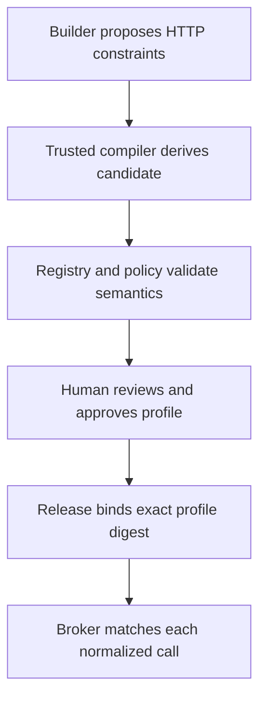

# HTTP Action Profile

Specification version: 0.1, revision 2
Schema ID: `urn:alpha:http-action-profile:v0.1`
Status: Accepted design baseline
Last updated: 17 September 2026

## Purpose

An HTTP Action Profile is an immutable, non-executable, Workspace-and-App-scoped authority description for one reviewed generic HTTP effect.

It solves a narrow problem: an unfamiliar API write should not require a bespoke connector, but a user should not have to approve the same well-understood bounded action forever. A profile lets the platform grant reusable first-use authority only when the operation's destination, shape, material effect, targets, limits, Connection, and delivery safety can be normalized and reviewed. One profile describes a bounded family of calls, such as updating any customer whose identifier satisfies the approved request schema; it is neither one literal request nor broad API access.

It is not:

- executable provider code;
- a secret or credential container;
- a general connector;
- a wildcard network permission;
- Builder-certified risk;
- permission to perform an out-of-profile operation;
- support for E4 effects.

## Lifecycle and trust separation



The lifecycle has three distinct objects:

1. **Portable candidate** — a compiler-derived digest in the Resolved App Manifest. It expresses what the App requested but carries no authority.
2. **Approved profile** — the immutable record governed by this specification. It carries trusted classification and human review provenance and is scoped to one Workspace, App, and Capability reference.
3. **Release binding** — the exact profile revision and digest selected for one Release, with the matching candidate digest, approval decision, and Connection binding.

This separation is mandatory. A Builder may propose fields that contribute to the candidate; it cannot create an approved profile, set its trusted effect class, or approve it.

## Candidate identity

For an eligible generic `http.request` write, the trusted compiler canonicalizes this tuple:

```text
(
  capability name and definition digest,
  logical Capability reference,
  logical Connection reference,
  normalized purpose,
  exact scheme, host, port, path template, and method,
  request and response schema digests,
  media types and permitted non-credential headers,
  proposed material fact selectors,
  proposed delivery-safety declaration,
  requested finite limits,
  profile-schema digest
)
```

It serializes the tuple under RFC 8785 and stores its SHA-256 value as `httpActionProfileCandidate.candidateDigest`. The profile's `resolution.candidateDigest` and Release binding MUST match that value.

The compiler emits a candidate only when every field can be represented declaratively. Failure to derive a candidate does not block generic HTTP automatically; it means the operation remains subject to exact operation approval or denial.

## Top-level record

```json
{
  "apiVersion": "alpha.platform.registry/v0.1",
  "kind": "HttpActionProfile",
  "metadata": {},
  "resolution": {},
  "spec": {}
}
```

Unknown fields are rejected. The complete structural contract is `http-action-profile.schema.json`.

## Metadata and scope

`metadata` contains:

| Field | Meaning |
|---|---|
| `profileId` | Stable profile identity |
| `profileRevisionId` | Immutable revision identity |
| `workspaceId` | Exact owning Workspace |
| `appId` | Exact owning App |
| `capabilityRef` | Logical `http.request` Capability reference |
| `displayName` | Short trusted review label |
| `description` | Plain-language bounded purpose |
| `status` | Always `approved` in this record type |

A profile cannot be reused by another Workspace, App, or Capability reference. A new App Version may reuse it only when the portable candidate digest remains identical and current policy still permits the binding.

## Review resolution

`resolution` proves how untrusted intent became approved registry data:

- candidate and source App Version identities;
- exact generic HTTP Capability definition digest;
- exact profile schema version and digest;
- registry and policy snapshots;
- trusted classifying service;
- approving human Principal and approval-decision identity;
- review and optional expiry times.

The profile's canonical digest is not embedded in the record. It is computed over canonical bytes and stored by the registry, Release binding, authorization digest, operation receipt, and audit ledger.

An expired, revoked, superseded, or policy-incompatible profile cannot authorize a new operation even if a historical Release still references it.

## Destination

The destination is exact and declarative:

- `scheme` is `https`;
- `host` is one exact hostname with no wildcard;
- `port` is explicit;
- `pathTemplate` is a normalized absolute path without query or fragment;
- `pathParameterNames` lists every Level-1 template variable exactly once;
- `queryParameterNames` lists every permitted query field;
- `method` is `POST`, `PUT`, `PATCH`, or `DELETE`.
- `redirectPolicy` is `deny` in v0.

v0 path templates use only simple `{name}` substitutions. Expansion values come from the typed request, are percent-encoded as one path segment, and cannot add `/`, `?`, `#`, a host, or a scheme. Query fields are request-schema data and are independently constrained; they are never concatenated as raw URL text.

The trusted HTTP provider repeats DNS, IP-range, TLS, redirect, and destination policy checks for every attempt. A syntactically valid profile cannot authorize private, loopback, link-local, metadata, platform-internal, or otherwise prohibited destinations.

## Request and response contracts

Both contracts pin:

- exact JSON Schema digest;
- allowed media types;
- visible non-credential headers;
- finite byte maximum.

The Broker validates the normalized request before approval or provider contact and validates the normalized response before returning it. `authorization`, cookies, API keys, signatures, and other credential-bearing headers cannot be declared in `allowedHeaders`; the credential broker injects them at the reviewed location.

The request contract also lists forbidden body JSON Pointers. The request schema constrains every permitted path, query, header, and body value; forbidden fields provide a second explicit boundary for security-sensitive attributes such as roles or administrative flags. Undeclared query parameters, body fields rejected by the schema, and all redirects fail closed.

Response validation failure produces an ambiguous or failed operation according to delivery-safety rules. It never causes an unsafe blind retry.

## Material effect

An Action Profile is always E3. E0 and E1 reads do not need an Action Profile; E4 is denied in v0.

`materialEffect` supplies trusted approval language and the facts that distinguish one action from another:

- `action`: `create`, `update`, `delete`, `send`, `publish`, or `custom`;
- `titleTemplate` and reviewed description;
- two or more `materialFacts`, including at least one `target` and one `effect` fact.

Each fact declares:

- stable identifier and user-facing label;
- role: target or effect;
- source: path parameter, query, header, or body;
- selector: field name or JSON Pointer;
- scalar value type;
- data classification;
- whether it is required and shown in approval.

Selectors are resolved only against the validated normalized request. A selector may not execute code, traverse arbitrary documents, invoke a model, or fetch another resource. Material fact identifiers are unique. Every required fact must resolve exactly once. A target or effect that cannot be normalized makes the profile ineligible.

## Delivery safety

Exactly one strategy is required:

| Mode | Meaning |
|---|---|
| `idempotency-header` | The trusted provider injects the logical effect key into one reviewed request header |
| `idempotency-body-field` | The trusted provider inserts the logical effect key at one exact body JSON Pointer |
| `manual-reconciliation` | An approved read-only Entrypoint can inspect the provider state; ambiguous outcomes stop for review |

The provider retention window for an idempotency key is explicit. The Broker's own deduplication record remains authoritative across worker retry and resume.

`manual-reconciliation` does not qualify for reusable first-use approval in v0. It may appear only with `approval.baseline: always`; ambiguous transport or response outcomes stop and require review. Automatic retry of a possibly completed effect is prohibited.

## Finite limits

Every profile fixes:

- calls per Run, hour, and day;
- items per call and day;
- provider timeout;
- request and response byte maxima through their contracts.

The Release and runtime may lower these values. No policy overlay, user input, App code, or provider may raise them. Rate and volume accounting is scoped at least by Workspace, App, profile, Connection, and environment.

## Connection and classification

The profile pins the logical Connection reference, connector identity and definition digest, required scopes, and maximum data classification that may leave the platform through this action.

Release resolution must prove that the Connection binding matches all five. Credential generation and secret material stay outside the profile and Release. Rotation of the same authorized credential generation does not change the profile; changing account identity, connector, scope, or authorization requires Release re-resolution and may require a new profile review.

## Reversibility and compensation

The profile records whether an effect is:

- `reversible`;
- `compensatable` through another exact approved profile; or
- `irreversible`.

It also records whether prior state is captured. Compensation is a new governed effect, not rollback magic: it has its own profile, Release binding, approval, idempotency, receipt, and possible failure.

Reusable `first-use` authority is allowed only for a reversible or compensatable operation with idempotency-header or idempotency-body-field safety. Delete, send, publish, irreversible, and manual-reconciliation profiles require `always` approval unless a future typed Capability specification explicitly establishes a safer rule.

## Approval policy

`approval.baseline` is `first-use` or `always`.

- `first-use` permits one binding-scoped human decision for the exact authorization digest, subject to a finite TTL and immediate revocation.
- `always` permits only exact operation approval and has no binding-approval TTL.

Thresholds may raise matching operations to `always`. v0 thresholds compare either items per call, calls per Run, or one numeric material fact with `gt` or `gte`. They may never lower an approval requirement. Workspace, environment, registry, and emergency policy may always raise or deny.

## Release binding

The Release Resolution Record stores:

```json
{
  "profileId": "hap-crm-task-create",
  "profileRevisionId": "haprev-crm-task-create-001",
  "profileDigest": "sha256:<digest>",
  "candidateDigest": "sha256:<digest>",
  "approvalDecisionId": "apd-hap-crm-task-create-001",
  "connectionBindingRef": "crm-api"
}
```

Changing any field creates a new Release revision. The Release's ordinary Capability constraints remain the maximum authority; the effective permitted set is their intersection with the profile and all current policy.

## Per-operation matching

Before policy approval or provider contact, the Broker:

1. verifies Run authority and the exact Release resolution;
2. loads the profile revision by identity and verifies its digest;
3. checks current status, expiry, revocation, Workspace, App, Capability, and Connection;
4. validates the normalized request schema;
5. expands and normalizes the destination without permitting origin escape;
6. verifies method, media type, headers, schemas, classification, and every finite limit;
7. resolves typed material facts and constructs trusted effect text;
8. derives authorization and effect digests including the profile digest;
9. enforces delivery safety and reserves budget;
10. evaluates baseline approval plus thresholds and stricter current policy;
11. invokes only through trusted HTTP egress;
12. records provider evidence, reconciliation state, and the terminal receipt.

No partial match exists. If any profile condition fails, the call cannot reuse profile approval. It is reevaluated as an ordinary generic HTTP operation, which requires exact operation approval when the effect can still be normalized or is denied when it cannot.

## User-facing permission summary

The ordinary user sees a trusted plain-language summary derived from the profile's display name, purpose, target and effect facts, Connection, limits, and approval policy. Raw methods, paths, schemas, and digests remain available under advanced details. Generated code cannot author or override the trusted summary.

## Semantic validation

JSON Schema validates structure. Trusted profile review additionally MUST:

1. reproduce the candidate digest from the exact Resolved Capability;
2. verify Workspace, App, Capability, App Version, registry, policy, and schema identities;
3. parse the path template and prove exact agreement with parameter names;
4. prove that path and query variables are bounded by the request schema and forbidden fields cannot be supplied;
5. reject wildcard, forbidden, private, internal, insecure, or redirect-expandable destinations;
6. reject credential-bearing App-visible headers or secret-shaped content;
7. validate request and response schemas and every material selector;
8. require unique fact identifiers and at least one visible target and effect fact;
9. reject E4 semantics and self-declared effect reductions;
10. prove idempotency placement or validate the read-only reconciliation Entrypoint;
11. enforce finite coherent limits and classification ceilings;
12. validate compensation profile existence and compatibility when present;
13. raise approval for irreversible, delete, send, publish, or reconciliation-only behavior;
14. verify threshold references and numeric types;
15. require an eligible human approval decision with an exact authorization summary.

## Canonicalization

The approved record uses Unicode NFC, sorted set-like arrays, duplicate-key rejection, RFC 8785 JSON canonicalization, and SHA-256. Ordered material facts preserve declared display order; their identifiers still must be unique. The canonical digest is stored externally so the record does not hash itself.

## Standard errors

| Code | Meaning |
|---|---|
| `HAP_SCHEMA_INVALID` | Record fails JSON Schema validation |
| `HAP_CANDIDATE_MISMATCH` | Approved record does not reproduce the Resolved Capability candidate |
| `HAP_SCOPE_MISMATCH` | Workspace, App, Capability, or Connection scope differs |
| `HAP_DESTINATION_INVALID` | Destination or path template is unsafe or broader than requested |
| `HAP_CREDENTIAL_PLACEMENT_INVALID` | App-visible fields could carry a protected credential |
| `HAP_MATERIAL_EFFECT_INCOMPLETE` | Targets or effects cannot be normalized and displayed |
| `HAP_DELIVERY_SAFETY_INVALID` | Idempotency or reconciliation cannot protect ambiguous execution |
| `HAP_LIMIT_INVALID` | A limit is absent, incoherent, or wider than policy |
| `HAP_APPROVAL_TOO_WEAK` | Approval baseline or threshold is below the trusted minimum |
| `HAP_UNKNOWN_REFERENCE` | Schema, fact, Connection, Entrypoint, or compensation profile is unresolved |
| `HAP_EFFECT_UNSUPPORTED` | The operation is E4 or otherwise denied in v0 |
| `HAP_EXPIRED_OR_REVOKED` | Current policy prevents use of the historical profile |

## Fixtures

- `../examples/reference-http-action-profile.json` is the valid reference record.
- `../fixtures/http-action-profile-invalid-fixtures.yaml` defines structural, semantic, and binding failures.

## Explicit v0 exclusions

- wildcard destinations or arbitrary full URLs;
- executable adapters, scripts, expressions, transformations, or model calls in a profile;
- reusable first-use authority for irreversible, delete, send, publish, or reconciliation-only effects;
- E4 actions, including payments, trades, legal commitments, security administration, and physical control;
- cross-Workspace, cross-App, or hidden cross-Capability reuse;
- automatic widening after App, policy, registry, Connection, or schema change.
