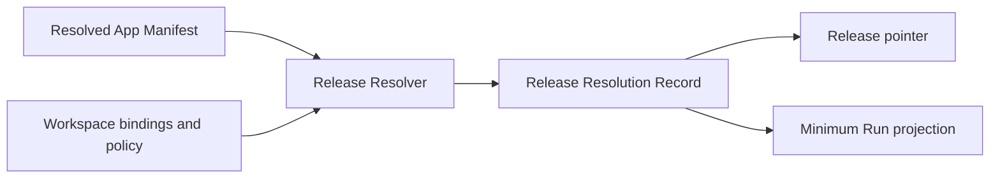

# Release Resolution Record

Specification version: 0.1, revision 5
Schema ID: `urn:alpha:release-resolution-record:v0.1`
Status: Accepted design baseline
Last updated: 18 September 2026

Revision 5 adds an explicit App-level deployment binding for `local` and `cloud` Releases. It retains revision 4's HTTP Action Profile and authenticated-webhook bindings while keeping secrets, endpoint URLs, delivery attempts, mutable occurrence state, and user data outside the record.

## Purpose

The Release Resolution Record is the immutable, canonical record that binds one sealed App Version to one Workspace environment. It converts portable requirements in the Resolved App Manifest into exact Resources, Connections, Context Sources, providers, Grants, approval policies, schedules, and finite execution limits.

The record answers one operational question:

> Where will this App execute and persist its operational state, and exactly what may this App Version use there, through which providers, under which constraints and limits?

It contains no credential material, runtime token, mutable provider endpoint, or production data.

## Governing principles

1. The Resolved App Manifest declares portable requirements; the Release Resolution Record supplies Workspace-specific bindings.
2. Every record is immutable. Any change that expands or materially changes authority, identity, compatibility, policy, configuration, schedule, or a limit creates a new Release revision and record.
3. Release resolution may narrow or disable declared behavior. It may not add undeclared authority.
4. Stable service-interface definitions remain pinned in the App Version; concrete providers are selected here.
5. Effective baseline authority is explicit. Runtime may apply only restrictive overlays: deny or revoke access, reduce constraints or budgets, and raise approval requirements.
6. Secrets remain behind Connection and credential brokers. The record contains only opaque references and digests.
7. Every enabled Entrypoint has finite budgets and a minimum Run authority profile.
8. Production Runs consume a reduced projection of this record and the Entrypoint execution closure, not the full Workspace configuration.
9. Mutable Resource data, credential generations, Context content selected through `latest-compatible`, provider deployments, health, and routing observations are recorded at Run or operation time rather than versioned through Releases.
10. Deployment is selected per Release. The record binds `local` or `cloud`; the portable App Version does not.

## Lifecycle position



The stable Release object is a control-plane pointer. It identifies the currently selected immutable Release revision. Updating that pointer is separate from creating this record and MUST use compare-and-swap semantics.

## Inputs to resolution

The resolver consumes exact immutable inputs:

- sealed App Version and package digest;
- Resolved App Manifest digest;
- Workspace and environment identity;
- configuration revision;
- Resource binding and Connection authorization revisions;
- Context access rules and pinned Context revisions where required;
- provider and deployment-profile definitions;
- Grant revisions;
- Capability, Workspace, environment, and Release policy snapshots;
- schedule revisions;
- webhook endpoint bindings and verification-profile revisions;
- approved HTTP Action Profile revisions;
- Workspace, plan, and Release budget ceilings.

The record includes digests for resolver, registry, policy, and combined inputs so the decision can be reproduced and audited.

## Top-level shape

```json
{
  "apiVersion": "alpha.platform.release/v0.1",
  "kind": "ReleaseResolutionRecord",
  "metadata": {},
  "resolution": {},
  "spec": {}
}
```

Unknown fields are rejected at every level.

## `metadata`

`metadata` binds the record to platform identities:

| Field | Meaning |
|---|---|
| `releaseId` | Stable Release identity |
| `releaseRevisionId` | Immutable Release revision identity |
| `workspaceId` | Owning Workspace |
| `appId` | Stable App identity |
| `appVersionId` | Exact sealed App Version |
| `environment` | `preview` or `active` |
| `resolvedManifestDigest` | Exact canonical Resolved App Manifest |
| `packageDigest` | Exact sealed package |

Platform creation time and actor are stored in the Release revision audit envelope rather than the canonical resolution body.

## `resolution`

The resolution header records:

- exact resolver identity, version, and distribution digest;
- exact service and Capability registry snapshot;
- exact effective policy snapshot;
- digest of the complete immutable resolution input tuple.

Changing any input that can affect a binding or decision MUST create a new input digest and record.

## `spec.status`

The resolver produces one status:

| Status | Meaning |
|---|---|
| `ready` | All enabled Entrypoints can execute |
| `degraded` | Optional behavior is disabled, but at least one intended Entrypoint remains usable |
| `blocked` | The Release cannot be activated |

An `active` Release may point only to a `ready` or explicitly accepted `degraded` record. A `blocked` record is retained as diagnostic evidence but cannot receive Runs.

## Deployment binding

`spec.deployment` records the App-level execution and persistence boundary:

| Field | Local value | Cloud value |
|---|---|---|
| `target` | `local` | `cloud` |
| `persistentStateLocation` | `device` | `cloud` |
| `defaultExecutionLocation` | `device` | `cloud` |
| `scheduleAuthority` | `device` | `cloud` |
| `availability` | `while-device-runtime-available` | `managed-always-on` |

The values are intentionally constrained as one coherent profile. A local Release may still call remote AI models, websites, APIs, and user-selected services; those routes are represented by service, Connection, and Capability bindings and do not change the Release's persistent-state
<!-- TRANSCRIPTION GAP: source lines 133-191 (about 59 lines, ~3 KB) were never screenshotted (no capture between 14.05.52 and 14.06.02). Text of the "Deployment binding" paragraph above is cut off and the section(s) that follow are missing. Remove this comment when filled. -->
- exact Workspace Connection and authorization revision, or `null` for accepted unconnected operation;
- connector identity and exact granted scopes;
- provider binding;
- effective availability and resolved unavailable behavior.

Allowed availability values are:

- `connected` — a valid Connection authorization revision is bound;
- `unconnected` — the connector explicitly supports unconnected operation;
- `disabled` — dependent behavior is deliberately disabled;
- `missing` — required binding is absent and the Release is blocked.

The Release does not name a credential generation. At operation time, the credential broker selects the current valid credential generation for the bound Connection authorization. Rotation or refresh therefore does not create a Release revision. Changing account identity, connector, granted scopes, or authorization policy does. The protected operation receipt records an opaque credential-generation audit reference; generated App code never receives it.

## Context bindings

Each Context binding maps a logical Context request to a permitted Context Source, selector, classification, maximum freshness, and compatibility rule. Optional unavailable Context is represented as `omitted`; required unavailable Context is `missing` and blocks dependent Entrypoints.

`resolutionMode` is one of:

| Mode | Release binding | Run evidence |
|---|---|---|
| `pinned` | Exact source revision and digest | The same revision and digest |
| `latest-compatible` | Stable source, selector, classification, freshness ceiling, and compatibility version | Exact source revision and digest selected for that Run |

User preferences and Workspace guidance should normally use `latest-compatible`; evidence, approved policy text, and reproducibility-sensitive inputs should use `pinned`. Access authority and content identity are deliberately separate.

## Capability bindings

Each declared Capability has one explicit binding containing:

- logical Capability reference and registry identity;
- enabled state and disabled reason;
- provider, optional Connection, and immutable Grant references;
- effective constraint object and canonical constraint digest;
- effective approval mode and all policy sources that contributed;
- idempotency requirement and deduplication window;
- registry-owned execution mode (`inline` or `durable`);
- budget dimensions charged by the Capability;
- an HTTP Action Profile binding or explicit `null`.

An HTTP Action Profile binding contains the exact profile and revision identities, canonical profile digest, matching portable candidate digest, human approval-decision identity, and logical Connection binding. It is valid only for `http.request`, only when the Resolved Capability carries the same candidate digest, and only when the profile's Workspace, App, Capability reference, Connection, definition, schemas, destination, effect, and limits all match the Release inputs.

The binding does not make an out-of-profile call eligible for first-use approval. The Broker compares every normalized call with the bound profile. A destination, path, method, schema, material target, classification, volume, threshold, delivery-safety, or Connection mismatch is evaluated as an ordinary generic operation and therefore requires exact operation approval or is denied. Changing or revoking a profile creates a new Release revision or immediately narrows current authority.

The App may not request a weaker execution mode. `inline` is permitted only for fast, deterministic, read-only, low-risk operations. `durable` is required for external effects, human approval, long-running work, non-reversible writes, or operations requiring recovery and reconciliation.

Effective constraints are the intersection of:

1. Capability registry limits;
2. Source App constraints;
3. Workspace Grant limits;
4. environment policy;
5. Release administrator restrictions.

No layer may widen an earlier layer. An empty intersection disables the Capability and all Entrypoints that require it.

### Approval precedence

Approval strictness is ordered:

```text
never < first-use < always
```

The effective mode is the strictest applicable requirement. Provenance uses the exact values:

- `source-request`
- `registry-minimum`
- `workspace-policy`
- `environment-policy`
- `release-admin`

Runtime approval decisions do not modify this record. They are separate, revocable records evaluated by the Capability Broker.

### Runtime policy overlays

The Release binding is the maximum baseline authority. A runtime overlay may only:

- deny or revoke an operation;
- reduce allowed targets, operations, scopes, or other constraints;
- reduce remaining budgets or execution limits;
- raise approval strictness.

An overlay may not add a Capability, target, Resource, Connection, Context Source, or provider; widen a constraint; increase a limit; lower approval; or replace an identity or compatibility binding. Any such expansion or relaxation requires a new Release revision.

## Entrypoint bindings

Every Entrypoint receives an explicit Release projection:

- enabled state and disabled reasons;
- digest of its App Version execution closure;
- runtime service binding;
- exact Capability, Resource, and Context bindings;
- exact retry, concurrency, timeout, and finite budget limits;
- exact Run authority profile.

Release limits may reduce App-requested ceilings but may not enlarge them. When an App ceiling is `null`, the Release MUST still choose a finite value.

All four v0 budget dimensions are mandatory:

- `modelCalls`
- `browserSeconds`
- `capabilityCalls`
- `costMicrousd`

Zero is valid and disables consumption of that dimension.

An Entrypoint marked `enabled: true` MUST reference only enabled bindings. An Entrypoint marked disabled cannot be invoked, scheduled, or exposed as an actionable UI command.

## Schedule bindings

Every declared schedule has an explicit binding containing:

- Trigger and Entrypoint references;
- enabled state;
- immutable settings revision and digest, or `null` when disabled and unconfigured;
- IANA timezone, or `null` when disabled;
- disabled reason, or `null` when enabled.

The next occurrence, current lease, and last-run status are mutable scheduler state and do not belong here.

## Webhook bindings

Every declared webhook has an explicit binding containing:

- Trigger and Entrypoint references;
- enabled state and disabled reason;
- an opaque endpoint-binding identity, never the endpoint URL;
- the ingress service binding;
- an immutable verification-profile revision and digest;
- exact verifier identity and definition digest;
- logical Connection binding used by trusted ingress;
- accepted methods and media types plus exact external payload- and Entrypoint-input-schema digests;
- exact identity or declarative normalization binding;
- effective payload and rate limits;
- optional immutable source-constraint set;
- timestamp tolerance, delivery-identity mode, and deduplication window;
- quarantine and evidence policy snapshots;
- fixed `at-least-once` delivery semantics.

An enabled binding requires every field above except an optional source-constraint set and an optional timestamp tolerance when the verifier definition permits it. The profile may narrow but never widen the Resolved Trigger. The target Entrypoint must be enabled. The Connection must be connected and grant the verifier's required scope. Verifier, schema, ingress-interface, and Connection mismatches block activation.

`endpointBindingId` names a mutable endpoint object owned by trusted ingress. The actual URL, rotation generation, current rate counters, received requests, delivery attempts, nonce cache, and occurrence state remain outside this immutable record. Rotating an opaque URL without changing verification authority does not require a new App Version; changing its profile or authority creates a new Release revision. Delivery is at least once: provider delivery identity is used when available, otherwise a bounded payload digest may be selected. Deduplication is never represented as an exactly-once guarantee.

## Checks

Resolution checks are immutable summaries with `pass`, `warning`, or `fail` status. Required checks include:

- package and manifest integrity;
- configuration validation;
- service compatibility;
- Resource schema compatibility;
- Connection and scope sufficiency;
- Grant and constraint intersection;
- approval-policy derivation;
- finite budget derivation;
- execution-closure containment;
- required preview or release tests.

Detailed validation logs remain in the referenced validation set. A `fail` check makes the record `blocked`.

## Minimum Run projection

For one Entrypoint, the control plane intersects:

1. the App Version execution closure;
2. the corresponding Entrypoint binding in this record;
3. current revocation and health state;
4. Run-specific reductions.

The resulting Run projection contains only required artifacts, configuration paths, Resource handles, Context access rules and selected snapshots, Capability references, service bindings, and finite budgets. It MUST NOT introduce anything absent from either immutable parent. For `latest-compatible` Context, the Run ledger records the exact selected revision and digest.

Current revocation may stop or narrow a Run without rewriting the historical Release Resolution Record.

## Canonicalization and identity

1. Records are JSON and validate against `release-resolution-record.schema.json`.
2. Strings are normalized to Unicode NFC.
3. Declaration arrays are sorted by their logical reference or `id`.
4. Set-like arrays are deduplicated and sorted lexicographically.
5. Maps contain no duplicate keys.
6. Bytes are serialized using RFC 8785 JSON Canonicalization Scheme.
7. The Release resolution digest is SHA-256 over canonical UTF-8 bytes and is stored in the Release revision envelope, Run records, Capability operations, and audit events.

The digest is not embedded in the record itself.

## Activation and rollback

Activation requires:

1. a non-blocked record;
2. required validation and health checks;
3. publication approval required by Workspace policy;
4. an atomic update of the stable Release pointer.

Rollback selects an earlier compatible Release revision. It does not mutate that revision or the App Version. Resource rollback and data migration are governed separately; selecting old code does not imply destructive data rollback.

## Security invariants

- No secret, token, cookie, private key, password, provider endpoint, or raw credential may appear.
- Every provider must implement an interface pinned by the App Version.
- Every enabled Capability must have an effective Grant and finite limits.
- Every external effect must flow through the Capability Broker.
- Every inbound webhook must be authenticated, schema-validated, replay-checked, and durably recorded before Run creation.
- Reusable generic HTTP write authority requires a matching approved Action Profile; otherwise exact operation approval or denial applies.
- Preview bindings use reduced authority and synthetic, sanitised, or explicitly approved sample data.
- Workspace, App, Release, and environment identities are checked again at Run creation and every Capability operation.
- Revocation takes effect immediately even though historical records remain immutable.
- Runtime overlays can only narrow Release authority; expansion requires a new Release revision.
- Credential refresh and managed-provider rollout never expose secrets and are evidenced at operation time.

## Standard errors

| Code | Meaning |
|---|---|
| `RR_SCHEMA_INVALID` | Record fails structural validation |
| `RR_INPUT_MISMATCH` | A referenced immutable input or digest differs |
| `RR_REQUIREMENT_UNBOUND` | A required service, Resource, Connection, Context, or Capability has no valid binding |
| `RR_WEBHOOK_INVALID` | Webhook endpoint, verifier, Connection, schema, replay, or policy binding is incomplete or inconsistent |
| `RR_ACTION_PROFILE_INVALID` | An HTTP Action Profile is absent, mismatched, expired, revoked, or broader than the resolved candidate |
| `RR_INTERFACE_INCOMPATIBLE` | Provider does not implement the pinned interface definition |
| `RR_SCOPE_INSUFFICIENT` | Connection scopes or Grant authority are insufficient |
| `RR_CONSTRAINT_EMPTY` | Effective constraint intersection permits no operation |
| `RR_POLICY_WEAKENED` | Effective approval or access policy is weaker than an input minimum |
| `RR_BUDGET_UNBOUNDED` | An enabled Entrypoint lacks a finite v0 limit |
| `RR_CLOSURE_EXPANDED` | Release binding adds authority outside the execution closure |
| `RR_SECRET_LEAK` | Credential or secret material appears in the record |
| `RR_CHECK_FAILED` | One or more mandatory checks failed |
| `RR_NONCANONICAL` | Persisted bytes are not canonical |

## Versioning and compatibility

- `alpha.platform.release/v0.1` versions the record shape and semantics.
- A new App Version, authority-bearing binding revision, provider compatibility envelope, Grant, policy snapshot, or effective limit creates a new Release Resolution Record.
- Mutable Resource data, credential refresh or rotation, `latest-compatible` Context updates, and managed provider rollout within the pinned envelope do not create a new Release Resolution Record.
- Provider changes do not require a new App Version when the pinned interface remains compatible.
- Runtime accepts only record versions, interface definitions, and authority profiles it explicitly supports.
- Historical Runs retain the exact Release resolution digest they used.

## Accepted decisions

1. Make the Release Resolution Record the only authority-bearing bridge between a portable App Version and a Workspace environment.
2. Keep concrete providers plug-and-play at Release time through pinned service interfaces and compatibility envelopes, while recording exact deployment evidence per Run or operation.
3. Require finite per-Entrypoint v0 budgets even when the App requests no ceiling.
4. Keep approval decisions, runtime tokens, mutable endpoints, health, and scheduler occurrence state outside the immutable record.
5. Derive minimum Run projections by intersecting the App execution closure with this record and restrictive runtime overlays.
6. Separate Context access policy from Context content identity using `pinned` and `latest-compatible` modes.
7. Keep mutable Resource data and credential generations outside Release versioning.
