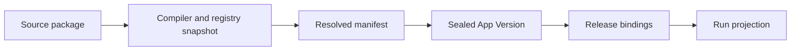

# Resolved App Manifest

Specification version: 0.1, revision 4
Schema ID: `urn:alpha:resolved-app-manifest:v0.1`
Status: Accepted design baseline
Last updated: 17 September 2026

Revision 4 resolves webhook payload normalization and at-least-once delivery semantics, narrows the v0 ingress profile to JSON `POST`, and clarifies bounded HTTP Action Profile candidates without introducing Workspace bindings into the App Version.

## Purpose

The Resolved App Manifest is the canonical, explicit, immutable execution declaration compiled from `app.yaml`.

It is the trust boundary between Builder-authored intent and platform-controlled validation, Release binding, and execution. The Builder does not author or edit it.

## Design principles

1. Source is concise; resolved behavior is explicit.
2. The compiler resolves stable interfaces and registry definitions, not Workspace-specific provider instances.
3. A Release binds the resolved requirements to Resources, Connections, providers, configuration, policies, Grants, schedules, and budgets.
4. Runtime consumes the resolved declaration and never invents an omitted default.
5. Every executable Entrypoint has a minimal, inspectable execution closure.
6. Identical inputs to the compiler produce identical canonical bytes.
7. The manifest contains no secret, mutable production value, timestamp, or random identity.

## Position in the lifecycle



`app.resolved.json` is part of the sealed App Version. Release bindings and Run-specific reductions are separate immutable records linked by digest.

## What resolution means

The compiler MUST resolve:

- every source default and fixed v0 policy;
- every logical reference and package path;
- exact App Contract revision and Platform SDK version;
- exact Component runtime profile and artifact;
- exact service-interface definition required by each Component;
- exact Capability, connector, webhook-verifier, and ingress-interface definitions;
- request and result schemas for Capabilities;
- authoritative effect classes, risk class, audit requirements, idempotency requirements, and minimum approval mode;
- Resource access modes and Context selectors used by each Entrypoint;
- complete per-Entrypoint execution closures;
- file digests for all referenced declarations and compiled artifacts.

The compiler MUST NOT resolve:

- Workspace, user, App, App Version, Release, Build, or Run identities;
- actual Resource or Connection identities;
- raw secrets or credential material;
- configuration values;
- enabled schedules or schedule values;
- webhook endpoint identities, effective verification profiles, or delivery state;
- approved Workspace-and-App-scoped HTTP Action Profile identities;
- effective Grants or user approval decisions;
- concrete cloud, model, browser, email, storage, or runner provider instances;
- runtime tokens, leases, endpoints, or network addresses;
- mutable cost, concurrency, or Workspace policy ceilings.

Those values belong to the Release Resolution Record or Run envelope.

## Top-level shape

```json
{
  "apiVersion": "alpha.platform.resolved/v0.1",
  "kind": "ResolvedAppManifest",
  "metadata": {},
  "resolution": {},
  "spec": {}
}
```

Unknown fields are rejected at every level.

## `metadata`

`metadata` is copied from the Source App Manifest after validation and normalization:

- `name`
- `displayName`
- `description`
- `labels`, materialized as an empty object when omitted

It remains portable and contains no platform identity.

## `resolution`

The resolution header records the deterministic inputs that shaped the output.

| Field | Meaning |
|---|---|
| `contract.apiVersion` | Source App Contract API version |
| `contract.revision` | Exact accepted specification revision |
| `compiler.id` | Stable compiler implementation identity |
| `compiler.version` | Exact compiler version |
| `compiler.digest` | Digest of the compiler distribution or image |
| `registry.snapshotId` | Immutable registry snapshot identity |
| `registry.digest` | Canonical digest of the registry snapshot |
| `source.manifestPath` | Always `app.yaml` in v0 |
| `source.manifestDigest` | Canonical parsed Source App Manifest digest |
| `source.fileSetDigest` | Canonical digest of sorted Builder-owned file descriptors |
| `sdk.requestedRange` | Source compatibility request |
| `sdk.resolvedVersion` | Exact SDK version selected by the compiler |
| `sdk.interface` | Exact SDK service interface |
| `sdk.definitionDigest` | Digest of the SDK interface definition |

No timestamp appears in this section. Build and App Version records carry creation time.

## File descriptors

Every referenced file or compiler artifact is represented by:

```json
{
  "path": "schemas/input.schema.json",
  "mediaType": "application/schema+json",
  "sizeBytes": 1234,
  "digest": "sha256:<64-lowercase-hex>"
}
```

Paths and bytes must match `package.index.json`. A resolved manifest may not reference a file absent from the package index.

## `spec.configuration`

`configuration` is always present.

- It is `null` when the source declares no configuration.
- Otherwise `schema` is a file descriptor.
- `uiSchema` and `defaults` are file descriptors or explicit `null`.

Only schemas and safe defaults are included. Actual values remain Release-bound.

## `spec.components`

Components are sorted by `id`. Every resolved Component contains:

| Field | Meaning |
|---|---|
| `id` | Stable source Component identity |
| `kind` | Accepted Component kind |
| `source` | Builder-owned source descriptor |
| `dependencyLock` | Lock descriptor or `null` |
| `artifact` | Platform-generated or normalized executable descriptor |
| `runtimeProfile` | Exact registry-owned runtime profile |
| `serviceRequirements` | Exact typed interfaces required at Release or Run time |

`runtimeProfile` contains `id`, `version`, `definitionDigest`, `language`, and `languageVersion`. Declarative Components may use `language: "declarative"`.

A service requirement contains:

```json
{
  "interface": "platform.runner.python/v0.1",
  "definitionDigest": "sha256:<digest>",
  "bindingPhase": "release",
  "required": true,
  "onUnavailable": "fail",
  "reason": "derived-from-component-kind"
}
```

This follows the Service Definition, Provider, Consumer separation used in the DeepSeek Harness architecture. The manifest pins the interface definition; the Release selects an allowed provider.

## `spec.surfaces`

Surfaces are sorted by `id`. All optional source arrays are materialized:

- `entrypointRefs`
- `resourceRefs`

Each Surface also records the exact resolved UI Component artifact and required App UI Bridge interface. It does not receive direct control-plane access.

## `spec.entrypoints`

Entrypoints are sorted by `id`. Each entry contains the complete normalized source behavior plus derived metadata.

### Materialized execution values

The following values are always explicit:

- `capabilities`, `resourceAccess`, and `context`, including empty arrays;
- `execution.timeoutSeconds`;
- `execution.retry.maxAttempts`, `strategy`, and `baseDelaySeconds` or explicit `null`;
- `execution.concurrency.mode` and `maxParallel` or explicit `null`;
- `execution.budgets.modelCalls`, `browserSeconds`, `capabilityCalls`, and `costMicrousd`, each an integer or `null`;
- `idempotency.mode` and `keyPointer` or `null`;
- `outcome.evaluatorRefs` and `humanReview`.

`null` means the App requests no App-specific ceiling; an effective Release or Run limit is still mandatory.

### Derived authority summary

`derived` contains:

- `effectClasses`, sorted and deduplicated;
- `riskClass`, the highest registry-derived risk used by the Entrypoint;
- `minimumApprovals`, the strictest minimum approval for each consequential Capability and whether it came from the source request, registry minimum, or both;
- `connectionRefs`, including indirect Connection requirements;
- `serviceInterfaces`, including runtime, Capability, Resource, and model interfaces.

The Builder never supplies these fields.

### Execution closure

`executionClosure` defines everything the Runner may materialize for this Entrypoint:

```json
{
  "componentRef": "monitor-worker",
  "artifactDigest": "sha256:<digest>",
  "fileDigests": ["sha256:<digest>"],
  "capabilityRefs": ["browser-read"],
  "resourceAccess": [
    {"resourceRef": "monitored-records", "modes": ["append", "read", "write"]}
  ],
  "connectionRefs": ["source-browser"],
  "contextRefs": [],
  "serviceInterfaces": ["platform.capability-broker/v0.1"]
}
```

Runtime may narrow this closure for a Run. It may not add undeclared files, Capabilities, Resources, Connections, Context, or services.

## `spec.triggers`

Triggers are sorted by `id` and always contain `enabled: false`.

A resolved schedule Trigger contains the source identity, Entrypoint reference, and exact settings-schema descriptor. Actual schedule values and activation belong to the Release.

A resolved webhook Trigger contains:

- source identity, purpose, Entrypoint reference, and exact external payload-schema descriptor;
- normalized delivery mode, optional declarative mapping descriptor, and target Entrypoint input-schema digest;
- normalized methods and accepted media types;
- logical verifier and Connection references;
- exact verifier definition version, digest, ingress interface, timestamp-validation behavior, delivery-identity mode, and supported source-constraint modes;
- normalized payload, rate, and deduplication limits;
- the exact ingress service-interface requirement and fixed `at-least-once` delivery semantics.

For `identity` normalization, the payload descriptor MUST equal the target Entrypoint input descriptor. For `declarative` normalization, the trusted compiler MUST prove that the non-executable mapping consumes the payload schema and produces the target input schema. The target MUST be a `job`, include `webhook` invocation, and use `occurrence-key` idempotency. The verifier Connection remains logical and is not part of the handler execution closure, because ingress—not generated code—uses it. The Release binds endpoint identity, Connection authorization, normalization, verifier policy, replay controls, and provider.

## `spec.resources`

Resources are sorted by `id`. Every Resource materializes:

- `scope: "app"`;
- `lifecycle: "retain"`;
- its exact schema descriptor or explicit `null`;
- `acceptedMediaTypes` as a sorted array;
- `maxFileSizeBytes` as an integer or `null`;
- the exact managed-Resource service interface definition required at Release time.

No managed Resource identity or database provider is included.

## `spec.connections`

Connections are sorted by `id`. Each declaration contains its normalized source fields and a registry block:

- exact connector definition version and digest;
- permitted scope-definition digest;
- required service interface;
- whether unconnected mode is supported;
- validated `onUnavailable` behavior.

No Workspace Connection identity or credential is included.

## `spec.capabilities`

Capabilities are sorted by `id`. Each contains the normalized source request plus immutable registry metadata:

```json
{
  "id": "email-send",
  "capability": "communication.email.send",
  "connectionRef": "work-email",
  "purpose": "Send only an approved message.",
  "constraints": {},
  "httpActionProfileCandidate": null,
  "registry": {
    "definitionVersion": "1.0.0",
    "definitionDigest": "sha256:<digest>",
    "requestSchemaDigest": "sha256:<digest>",
    "resultSchemaDigest": "sha256:<digest>",
    "effectClass": "external-communication",
    "riskClass": "high",
    "minimumApproval": "always",
    "idempotencyRequired": true,
    "auditEvents": ["capability.requested", "capability.completed"]
  }
}
```

The registry block is authoritative. Source `constraints` are validated against the pinned definition.

Every resolved Capability materializes `httpActionProfileCandidate` as either `null` or an object containing `candidateDigest` and `profileSchemaDigest`. Only the trusted compiler may emit a candidate, and only for a generic `http.request` effect whose destination, method, schemas, material targets, limits, Connection, and delivery-safety proposal can be normalized.

The candidate digest identifies the canonical authority-neutral candidate tuple. It is not approval and cannot be used by the Broker. A separately reviewed Workspace-and-App-scoped profile with the same candidate digest must be bound by the Release before profile-level first-use approval is available. Non-HTTP Capabilities and generic operations with unnormalizable effects materialize `null`.

## `spec.context`

Context declarations are sorted by `id`. Every item contains:

- `id`, `scope`, `selector`, `purpose`, and `required`;
- `maxAgeSeconds` as an integer or `null`;
- the exact Context read-interface definition digest.

Actual Context Sources and snapshots remain Release- and Run-bound.

## `spec.policies`

Policies are always present:

```json
{
  "audience": "workspace-members",
  "selfModification": "propose-only",
  "directNetwork": false,
  "approvalRequests": []
}
```

Approval requests are sorted by `capabilityRef`. Every resolved item includes `provenance: source-request`, `registry-minimum`, or `source-and-registry`. The compiler raises any request below the Capability registry minimum and records why; it may not silently change the user-facing access summary. Workspace and environment policy may raise it again at Release or Run time.

## `spec.observability`

Observability is always present with explicit arrays:

```json
{
  "mandatoryEvents": [
    "approval",
    "artifact",
    "authority",
    "capability",
    "cost",
    "error",
    "run-lifecycle"
  ],
  "evidence": {
    "capture": [],
    "redactPaths": []
  }
}
```

Mandatory events are compiler-owned and cannot be redacted away.

## `spec.tests`

Tests are sorted by `id`. Paths are replaced by file descriptors. Optional test fields are explicit `null`. The compiler records test definitions, not mutable results.

Validation results belong to the immutable `validation_set_id` referenced by the App Version record. This avoids making machine-specific logs part of the reproducible resolved manifest.

## `spec.summary`

The compiler adds a deterministic machine summary:

- `componentKinds`
- `entrypointKinds`
- `effectClasses`
- `highestRiskClass`
- `requiresConnections`
- `hasCustomInterface`
- `hasScheduledWork`
- `hasWebhookIngress`

The control plane uses this summary to construct plain-language access and publication views. It is not a substitute for full policy evaluation.

## Canonicalization

The compiler emits JSON only.

1. Strings are normalized to Unicode NFC before serialization.
2. Declaration collections are sorted by `id`.
3. Set-like arrays are deduplicated and sorted lexicographically.
4. Ordered arrays are permitted only where the specification explicitly assigns order; their source order is preserved.
5. Maps have no duplicate keys.
6. Numbers must be finite JSON numbers and contract integers must remain within the interoperable integer range.
7. The final document is serialized using RFC 8785 JSON Canonicalization Scheme.
8. `resolved_manifest_digest` is SHA-256 over those canonical UTF-8 bytes and is written to the App Version record, not into the manifest itself.

The persisted `app.resolved.json` bytes MUST already be canonical. Parsing and reserializing them under these rules must produce byte-for-byte identical output.

## Deterministic compilation

The complete compiler input tuple is:

```text
(source manifest data,
 Builder-owned file descriptors,
 compiler identity and version,
 registry snapshot,
 selected SDK version,
 component build profiles,
 locked dependency artifacts)
```

The tuple excludes Workspace bindings and policy overlays. Identical tuples MUST produce identical resolved bytes and Component artifacts.

If a registry definition or SDK resolution changes, the compiler creates a different resolved manifest and therefore a different App Version, even when `app.yaml` is unchanged.

## Release resolution

A Release Resolution Record combines this manifest with environment-specific bindings:

| Resolved requirement | Release binding |
|---|---|
| Resource declaration | Managed Resource identity and schema revision |
| Connection requirement | Workspace Connection identity |
| Capability definition | Provider, Grant, policy, and scoped token issuer |
| Context selector | Permitted Context Source |
| Runtime service interface | Provider implementation and deployment profile |
| Configuration schema | Configuration revision and encrypted secret references where applicable |
| Schedule template | Values, timezone, enabled state, and next occurrence |
| Webhook template | Opaque endpoint binding, verification profile, ingress provider, and activation state |
| HTTP Action Profile candidate | Approved Workspace-and-App-scoped profile revision with the same candidate digest |
| Requested budget | Effective Workspace and Release ceilings |

Release binding may narrow authority or disable optional behavior. It cannot add an undeclared Capability, Resource, Connection, Context selector, or network route.

## Validation

The compiler MUST reject a resolved manifest when:

- it does not validate against `app-resolved.schema.json`;
- any source or derived reference is unresolved;
- a file descriptor disagrees with `package.index.json`;
- a registry digest or definition version is unavailable;
- a Component artifact or execution closure is inconsistent;
- derived effects, risks, approvals, audit events, or idempotency are incomplete;
- a fixed v0 policy is absent or weakened;
- a Workspace-specific binding, secret, runtime endpoint, timestamp, or random identity appears;
- a webhook Trigger lacks exact verifier metadata or leaks an endpoint identity;
- an HTTP Action Profile candidate appears on an ineligible Capability or was not derived reproducibly;
- the bytes are not canonical;
- a clean recompilation produces different output.

## Standard errors

| Code | Meaning |
|---|---|
| `RM_SCHEMA_INVALID` | Resolved document fails structural validation |
| `RM_NONCANONICAL` | Persisted bytes are not canonical |
| `RM_SOURCE_MISMATCH` | Source digest does not match `app.yaml` |
| `RM_REGISTRY_MISMATCH` | Registry definition or digest cannot be reproduced |
| `RM_FILE_MISMATCH` | A referenced file is missing or has a different descriptor |
| `RM_DEFAULT_MISSING` | A source default was not materialized |
| `RM_DERIVATION_INCOMPLETE` | Required risk, effect, approval, audit, or service metadata is absent |
| `RM_CLOSURE_INVALID` | An execution closure is incomplete or broader than its Entrypoint |
| `RM_BINDING_LEAK` | Workspace-specific or secret data appears in the manifest |
| `RM_POLICY_WEAKENED` | A fixed or registry-minimum policy was reduced |
| `RM_TRIGGER_INVALID` | A resolved schedule or webhook Trigger is inconsistent with its Entrypoint or registry definition |
| `RM_NONDETERMINISTIC` | Equivalent clean compilation produces different bytes |

## Versioning and compatibility

- `alpha.platform.resolved/v0.1` versions resolved-manifest structure and semantics.
- The source contract API version and revision are recorded separately.
- Runtime accepts only schema versions and Component profiles it explicitly supports.
- A resolved-manifest format upgrade creates a new App Version; old versions remain immutable.
- Registry and SDK metadata are pinned by digest so later registry changes cannot reinterpret an existing App Version.

## Accepted decisions

1. Resolve stable service-interface definitions in the App Version, but bind concrete providers only in the Release.
2. Make per-Entrypoint execution closures first-class and use them to create minimum Run projections.
3. Keep validation results outside the reproducible manifest and reference them from the App Version record.
4. Use RFC 8785 plus SHA-256 for canonical resolved identity.
5. Treat any compiler, registry, SDK, build-profile, or locked-dependency change as a new App Version.

## External standard referenced

- [RFC 8785 JSON Canonicalization Scheme](https://www.rfc-editor.org/rfc/rfc8785.html)
